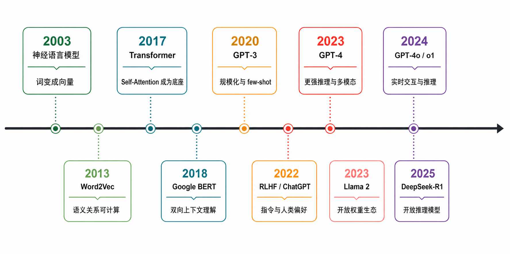
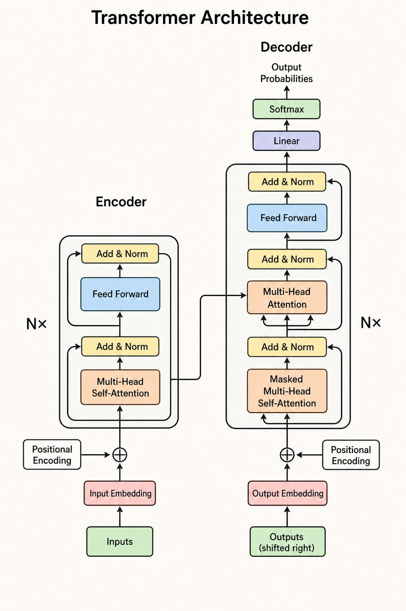
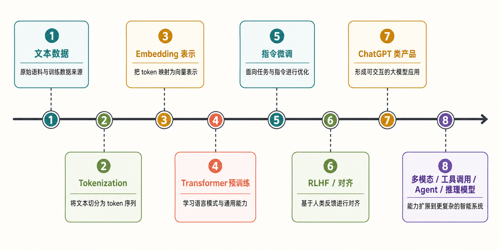

:::important[Problem]
ChatGPT、Claude、Gemini 等产品让 LLM 看起来像突然出现的聊天工具，但它其实是符号主义、统计学习、神经网络和规模化训练长期积累的结果。

**核心问题：机器智能如何从规则、数据与表示学习，一步步演化为今天的大语言模型和智能系统？**
:::

## 1. AI 的终极问题：机器如何获取智能？

AI 的长期目标可以概括为：让机器获得处理信息、理解世界、解决问题并采取行动的能力。不同历史阶段的研究重点不同，但大致可以归纳为三条路线。

### 1.1 三条发展路线

| 路线     | 智能从哪里来         | 典型方法                              | 这条路线带来的启发       |
| -------- | -------------------- | ------------------------------------- | ------------------------ |
| 符号主义 | 人工编写的规则与逻辑 | 搜索、逻辑推理、专家系统              | 机器可以按照明确规则推理 |
| 统计学习 | 数据中的统计规律     | 概率模型、统计学习、因果推理          | 机器可以从数据中归纳模式 |
| 神经网络 | 可学习的表示与参数   | 感知机、反向传播、CNN、LSTM、深度学习 | 机器可以自动提取特征     |

可以用三句话记住它们的区别：

- 符号主义：**按规则推理**。
- 统计学习：**从数据中找规律**。
- 神经网络：**自己学习特征和表示**。

:::note[三条路线如何汇合]
符号主义提供推理和规则的视角，统计学习提供从数据中归纳规律的方法，神经网络提供可学习的表示能力。现代 LLM 主要建立在统计学习和神经网络之上，同时也在通过工具调用、检索和 Agent 流程重新吸收规则与外部知识。
:::

### 1.2 LLM 为什么是多条路线的汇合

LLM 不是突然出现的单点技术，而是多条路线长期积累后的结果：

1. AI 研究提出了“机器如何获得智能”的根本问题。
2. 统计学习提供了从数据中建立模型的方法。
3. 神经网络提供了强大的表示学习能力。
4. 语言成为一个可规模化训练、又能直接与人交互的智能入口。

:::note[LLM 与 AGI 的边界]
LLM 只是从“语言”这条路径逼近智能，并不等于 AGI。视觉、记忆、行动、环境交互和世界模型等能力，可能同样重要。
:::

## 2. LLM 简史：大语言模型如何一步步发展起来

LLM 的发展可以按关键能力变化分成四个阶段。每个阶段都在解决前一阶段的瓶颈。

### 2.1 四个关键阶段

| 阶段             | 时间      | 关键变化                         | 代表节点                                  | 能力变化                     |
| ---------------- | --------- | -------------------------------- | ----------------------------------------- | ---------------------------- |
| 崛起前夜         | 2003–2017 | 从词向量走向 Attention           | 神经语言模型、Word2Vec、Seq2Seq           | 语言开始变成可计算的向量     |
| Transformer 革命 | 2017–2019 | Transformer 成为语言模型底座     | Transformer、GPT-1、BERT、GPT-2           | 预训练和上下文建模变得可扩展 |
| 规模化突破       | 2020–2022 | 参数、数据和算力持续扩大         | GPT-3、InstructGPT、GPT-3.5、ChatGPT      | 从补全文字走向完成任务       |
| 从模型到系统     | 2023–2025 | 多模态、长上下文、工具和推理融合 | GPT-4、Llama、Gemini、Claude、DeepSeek-R1 | LLM 成为智能应用的核心组件   |



_图 1：从神经语言模型、Word2Vec 到 Transformer、ChatGPT 和推理模型的关键节点。_

### 2.2 LLM 崛起的前夜：从词向量到 Transformer（2003–2017）

早期语言模型首先要解决的是：**机器如何表示一个词的含义？** 如果词只是离散的符号，模型就很难计算词与词之间的相似性。词向量把词映射到连续向量空间，使语义关系可以通过距离和方向近似表达。

| 时间 | 节点                | 解决的问题                               | 学习重点                       |
| ---- | ------------------- | ---------------------------------------- | ------------------------------ |
| 2003 | 神经概率语言模型    | 用神经网络学习词表示和语言概率           | 词可以被表示成向量             |
| 2013 | Word2Vec            | 让词向量能够大规模训练                   | 语义关系可以在向量空间中计算   |
| 2014 | Seq2Seq / Attention | 处理机器翻译等序列任务                   | 生成时动态关注输入的关键部分   |
| 2017 | Transformer         | 改善 RNN/LSTM 的顺序计算和长距离依赖问题 | 把 Self-Attention 放到架构中心 |

一个常见的直觉例子是：

```text
国王 - 男人 + 女人 ≈ 女王
```

这不是说模型真正理解了“性别”概念，而是说训练后向量空间中可能出现稳定的语义方向关系。

### 2.3 Transformer 革命与早期探索：GPT 与 BERT（2017–2019）

Transformer 的核心是 Self-Attention。它允许模型在处理一个 token 时，同时计算它与其他 token 的关系，不需要像 RNN 一样严格按顺序传递状态，因此更适合并行训练和扩大模型规模。



_图 2：经典 Transformer 的 Encoder–Decoder 结构，以及 Embedding、Attention、Feed Forward、Add & Norm 和输出层。_

| 节点        | 核心做法                              | 主要意义                     |
| ----------- | ------------------------------------- | ---------------------------- |
| Transformer | 使用 Self-Attention 建模 token 间关系 | 奠定现代 LLM 的架构基础      |
| GPT-1       | Transformer Decoder + 生成式预训练    | 证明“先预训练、再迁移”可行   |
| BERT        | Transformer Encoder + 双向上下文      | 强化语言理解任务的预训练范式 |
| GPT-2       | 扩大模型和数据规模                    | 展示更强的连贯生成和泛化能力 |
| T5          | 把不同 NLP 任务统一为文本到文本       | 统一任务输入输出形式         |

例如在句子“苹果发布了新手机，它的销量很好”中，模型需要判断“它”更可能指向“新手机”还是“苹果”。Attention 的作用之一，就是帮助模型建立这种上下文关联。

> 注意：上图展示的是原始 Transformer 的 Encoder–Decoder 结构。GPT 等现代生成式 LLM 通常采用 Decoder-only 结构，但 Self-Attention、残差连接、归一化和前馈网络等核心思想仍然延续下来。

### 2.4 规模化突破：GPT-3 到 ChatGPT（2020–2022）

GPT-3 展示了 Scaling 的力量：当模型参数、训练数据和计算量达到一定规模后，模型开始表现出少样本学习、任务迁移和更复杂的文本生成能力。

| 节点        | 关键技术                                     | 解决的问题                                       |
| ----------- | -------------------------------------------- | ------------------------------------------------ |
| GPT-3       | 大规模预训练、1750 亿参数、Few-shot Learning | 不必为每个任务单独训练模型，可以用提示词适配任务 |
| InstructGPT | 指令微调、RLHF                               | 让模型更理解用户意图，输出更符合人类偏好         |
| GPT-3.5     | 更强的对话能力和任务泛化                     | 从单轮生成走向多轮交互                           |
| ChatGPT     | 对话产品化、低门槛界面                       | 让普通用户能够自然使用 LLM                       |

这一阶段的关键转变是：

```text
语言续写器 → 指令跟随器 → 对话助手
```

### 2.5 从模型到系统：多模态、长上下文、Agent 与推理模型（2023–2025）

这一阶段的竞争重点不再只是参数规模，而是模型能否处理更多信息、保持更长上下文、调用外部工具并完成多步骤任务。

| 代表节点            | 能力方向                       | 解决的问题                       |
| ------------------- | ------------------------------ | -------------------------------- |
| GPT-4               | 更强的推理、代码和专业任务能力 | 提升复杂任务的稳定性             |
| Llama 2             | 开放权重与本地部署             | 降低私有化、微调和研究复现门槛   |
| Gemini              | 原生多模态                     | 统一处理文字、图像、音频和视频   |
| Claude 3            | 长上下文与视觉理解             | 支持长文档、合同和研究资料分析   |
| GPT-4o              | 文本、视觉、语音的实时交互     | 降低多段式语音链路的延迟和割裂感 |
| o1、DeepSeek-R1     | 推理时投入更多计算             | 改善数学、代码和科学推理能力     |
| Computer Use、Agent | 观察界面、调用工具、执行任务   | 让模型从“给建议”走向“做事情”     |

可以把这段演进理解为：

```text
文本生成模型 → 多模态模型 → 能调用工具的任务系统
```

## 3. LLM 整体流程：从数据到智能系统

一个 ChatGPT 类产品不是单独依靠某个模型完成的，而是一条从数据、表示、训练、对齐到产品化的工程链路。



_图 3：LLM 从文本数据、Tokenization、Embedding、预训练和对齐，走向可交互的模型产品。_

### 3.1 端到端流程

```text
文本数据
  ↓
清洗、过滤、去重与配比
  ↓
Tokenization：文本 → token 序列
  ↓
Embedding：token → 向量表示
  ↓
Transformer 预训练：预测下一个 token
  ↓
指令微调：学习按照指令完成任务
  ↓
对齐：让输出更符合人类偏好与安全要求
  ↓
推理服务 + 上下文管理 + RAG / Tools / Agent
```

### 3.2 各模块做什么

| 模块               | 核心目标                       | 典型技术                                 | 主要难点                             |
| ------------------ | ------------------------------ | ---------------------------------------- | ------------------------------------ |
| 文本数据           | 提供模型学习语言规律的材料     | 清洗、质量过滤、去重、数据配比           | 数据质量、版权、安全和有害内容       |
| Tokenization       | 把文本切成模型能处理的单位     | BPE、SentencePiece、Tokenizer 词表       | 多语言、长文本效率、特殊符号         |
| Embedding          | 把 token 映射为可计算的向量    | 词向量、位置编码、向量空间               | 保留语义、位置信息和上下文           |
| Transformer 预训练 | 学习语言模式和知识关联         | Self-Attention、Decoder-only、分布式训练 | 算力、训练稳定性、数据与模型规模匹配 |
| 指令微调           | 学会遵循人类指令               | SFT、指令数据、多任务样本                | 指令质量、任务覆盖和风格一致性       |
| 对齐               | 让输出更符合偏好和安全要求     | RLHF、奖励模型、PPO、DPO                 | 偏好定义、幻觉、过度对齐和安全风险   |
| 产品化             | 把模型变成可用的应用           | Prompt、上下文窗口、推理服务、路由       | 延迟、成本、稳定性和用户体验         |
| 能力扩展           | 增加感知、检索、行动和推理能力 | 多模态、RAG、Function Calling、Agent     | 长任务可靠性、工具错误、安全边界     |

### 3.3 需要建立的系统观

学习 LLM 时，不要只把它看成一个“参数很多的神经网络”。完整系统至少包含：

- **模型**：负责表示、预测和生成。
- **数据**：决定模型接触什么知识和表达方式。
- **训练流程**：决定模型如何获得能力、遵循指令和接受约束。
- **推理服务**：决定模型能否以合理的延迟和成本运行。
- **外部系统**：通过 RAG、工具、Agent 和多模态输入扩展模型能力。

## Summary

| 核心问题       | 需要记住的结论                                                                               |
| -------------- | -------------------------------------------------------------------------------------------- |
| AI 的主要路线  | 符号主义按规则推理，统计学习从数据找规律，神经网络学习表示和特征。                           |
| LLM 的关键演进 | 词向量让语言可计算，Attention 建模关系，Transformer 提供可扩展底座，规模化训练带来能力跃迁。 |
| LLM 的系统边界 | 完整系统还包括数据、训练、对齐、推理服务、检索、工具和多模态能力。                           |

```text
语言表示 → Transformer 预训练 → 指令与偏好对齐 → 推理服务与外部工具
```
