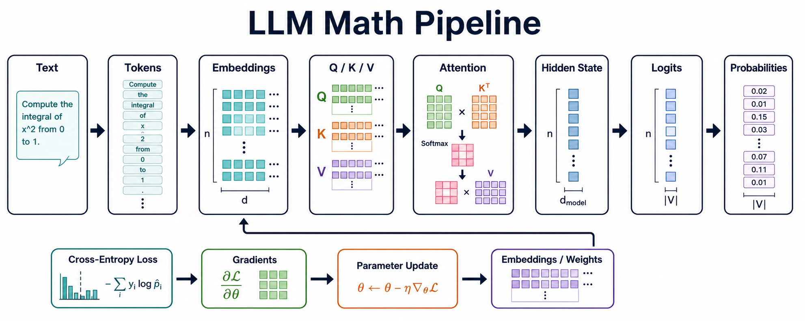
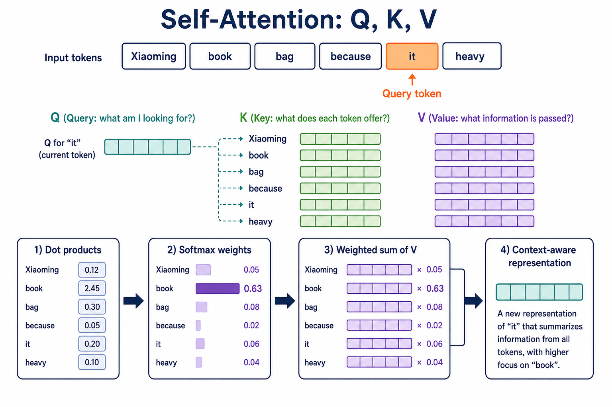
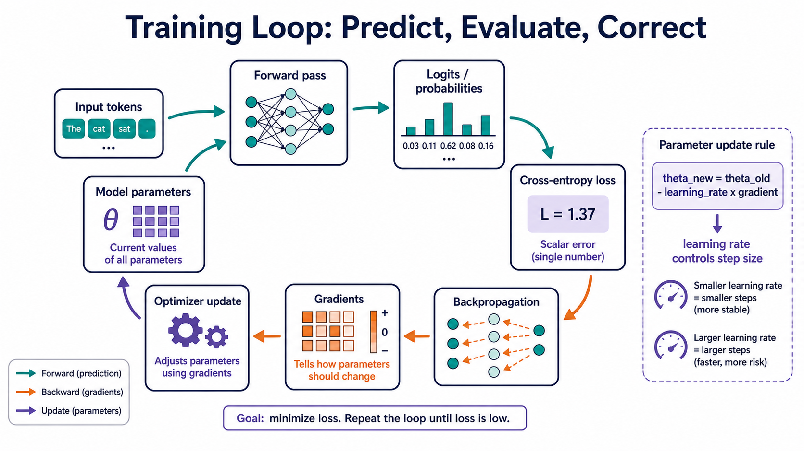

:::important[Problem]
LLM 看起来是在理解语言，但从机器的视角，它始终在完成“预测、评估、修正”：先把文字转换为数字，再计算关系和概率，最后根据错误更新参数。

**核心问题：语言如何变成可计算、可优化、可生成的数学对象，模型又如何在训练中逐步学会语言？**
:::

## 1. 语言问题如何转化为学习问题

自然语言的难点不在于字符数量，而在于含义会随着上下文、语序和意图变化。同一个“苹果”可以指水果，也可以指公司；“狗咬人”和“人咬狗”的词几乎相同，但关系完全相反。

| 语言现象 | 例子                | 模型需要处理的问题           |
| -------- | ------------------- | ---------------------------- |
| 一词多义 | 苹果、模型、银行    | 根据上下文判断词义           |
| 指代关系 | 它、这个、那个      | 找到代词指向的对象           |
| 语序变化 | 狗咬人 / 人咬狗     | 识别词之间的结构关系         |
| 同义表达 | 页面很卡 / 打开很慢 | 判断不同表达是否语义相近     |
| 隐含意图 | 页面有点慢          | 判断是在描述问题还是提出诉求 |

自然语言处理（NLP）的第一步，是把这些开放的语言问题转化为可以用数据训练的任务：

| 人类任务             | 机器学习任务 |
| -------------------- | ------------ |
| 判断评论好坏         | 文本分类     |
| 找出句子中的公司名   | 序列标注     |
| 判断两个问题是否同义 | 文本匹配     |
| 把中文转换成英文     | 序列生成     |
| 根据上文继续写作     | 语言建模     |

这带来一个重要转变：模型不再依赖大量人工编写的 if-else 规则，而是通过样本学习输入与输出之间的规律。后面的 Token、向量、神经网络和概率模型，都是为了让这个学习过程可以被计算。

## 2. 从文本到可计算表示

### 2.1 Token：模型处理语言的基本单位

模型不会直接处理一整段原始文本，而会先使用 tokenizer 把文本拆成 token。Token 可以是一个字、一个词、词的一部分或标点，具体切分方式取决于模型的词表和 tokenizer。

```text
我喜欢机器学习
        ↓ tokenizer
[我] [喜欢] [机器] [学习]
        ↓ token id
[101] [245] [830] [1024]
```

Token id 只是编号，并不携带足够的语义。模型还需要通过 Embedding 查表，把每个 id 映射成一个可学习的稠密向量：

```text
token id → Embedding table → token vector
```

### 2.2 One-hot、Embedding 与上下文表示

| 表示方式   | 主要特点                        | 局限或优势                                         |
| ---------- | ------------------------------- | -------------------------------------------------- |
| 编号       | 只标识 token 身份               | 数字大小没有语义含义                               |
| One-hot    | 只有一个位置为 1                | 稀疏、维度高，无法表达语义远近                     |
| 静态词向量 | 用稠密向量表示词                | 可以表达词级别的相似性，但同一个词通常只有一个向量 |
| 上下文表示 | 结合句子中的其他 token 生成表示 | 同一个 token 在不同上下文中可以有不同含义          |

例如，“猫”和“狗”都可能靠近“动物、宠物”这一语义区域，而“桌子”更靠近“家具”。这些向量不是人工标注出来的，而是在训练中通过上下文和预测任务逐渐学到的。

### 2.3 标量、向量、矩阵与张量

LLM 中的数学对象可以按维度这样理解：

| 对象 | 直觉                 | 在 LLM 中的例子          |
| ---- | -------------------- | ------------------------ |
| 标量 | 一个数字             | 一个 token 的 loss       |
| 向量 | 一串数字，表示一个点 | 一个 token 的 Embedding  |
| 矩阵 | 二维数字表，负责变换 | 权重矩阵、Q/K/V 投影矩阵 |
| 张量 | 更高维的数字容器     | 一个 batch 的隐藏状态    |

一次批量计算可以用一个三维张量表示：

```text
batch_size = 4
sequence_length = 128
hidden_dim = 768
hidden_states.shape = [4, 128, 768]
```

这里表示一次处理 4 个样本，每个样本包含 128 个 token，每个 token 用 768 维向量表示。向量描述一个 token，矩阵描述一次表示变换，张量则把多个样本和多个位置组织到一起。

词向量还不能单独表示顺序。“我喜欢你”和“你喜欢我”包含相同的词，但意思不同，因此模型还需要位置表示。位置编码解决的是“token 在哪里”的问题。

:::note[Token、Embedding 与上下文表示]
Token 是模型处理文本的离散单位，token id 只是词表中的编号；Embedding 把编号映射为可学习的稠密向量；经过上下文计算后，同一个 token 才可能在不同句子中形成不同的隐藏表示。三者分别对应“切分文本”“建立初始表示”和“结合语境更新表示”。
:::



_图 1：从文本、Token 和 Embedding，到 Q/K/V、概率、Loss 与参数更新的数学链路。_

## 3. 相似度与 Attention 的最小计算闭环

### 3.1 用相似度衡量 token 关系

向量化之后，模型可以用数学方式判断两个表示是否相关：

| 方法       | 核心思想                                   | 常见用途                           |
| ---------- | ------------------------------------------ | ---------------------------------- |
| 点积       | 对应维度相乘后求和，方向越一致分数通常越高 | Attention 中计算 Q 与 K 的匹配程度 |
| 余弦相似度 | 比较两个向量的夹角，重点关注方向           | 向量检索、RAG、语义搜索            |
| 欧氏距离   | 计算两个点之间的直线距离                   | 聚类和部分向量检索场景             |

复杂矩阵中的信息也可能集中在少数几个主要方向。SVD 将矩阵分解为多个更简单的矩阵，保留较大的奇异值可以得到低秩近似。这个直觉有助于理解模型压缩和 LoRA：不一定要更新完整的大矩阵，也可以用较小的低秩矩阵近似主要的参数变化。

### 3.2 Attention 在解决什么问题

考虑句子：

```text
小明把书放进书包，因为它太重了。
```

处理“它”时，模型需要判断应该重点参考“书”还是“书包”。Attention 的作用，就是让当前位置动态查看上下文，并为不同 token 分配不同权重。权重越高，表示当前位置从该 token 读取的信息越多。

### 3.3 Q、K、V：三种不同的视角

对输入表示 X 做三次线性投影：

```text
Q = XW_Q
K = XW_K
V = XW_V
```

| 符号       | 直觉                      | 要回答的问题               |
| ---------- | ------------------------- | -------------------------- |
| Q（Query） | 当前 token 的查询         | 我想找什么信息？           |
| K（Key）   | 每个 token 的匹配特征     | 我有什么特征可以被找到？   |
| V（Value） | 每个 token 实际携带的内容 | 如果关注我，应该传递什么？ |

Scaled dot-product attention 的核心公式是：

```text
Attention(Q, K, V) = softmax(QKᵀ / √dₖ)V
```

可以把它拆成三步：

1. QKᵀ：计算当前查询与各个 Key 的相关性分数。
2. softmax：把分数转换成非负且总和为 1 的权重。
3. 权重 × V：按权重汇总上下文内容，形成新的表示。

:::note[Attention 的最小计算闭环]
Attention 可以记成“匹配—归一化—读取”：先用 Q 和 K 的相似度判断应该关注谁，再用 Softmax 得到权重，最后按权重汇总 V。它的核心不是简单地把所有 token 平均，而是根据当前查询动态选择信息。
:::



_图 2：以“it”作为当前 token，经过 Q/K 匹配、Softmax 加权和 Value 汇总，得到上下文相关表示。_

图中的权重只是帮助理解计算过程的示例，不代表模型在所有语境下都会做出同样判断；Attention 权重也不能单独等同于完整的因果解释。

## 4. 概率：从上下文到下一个 token

### 4.1 语言模型预测的是分布

自回归语言模型在每个位置学习的是：

```text
P(xₜ | x₁, x₂, ..., xₜ₋₁)
```

也就是给定前文后，下一个 token 的概率。整段文本的概率可以分解为：

```text
P(x₁, ..., xₜ) = ∏ₜ P(xₜ | x₁, ..., xₜ₋₁)
```

例如输入“我早上喝了一杯”，模型可能给出：

| 候选 token | 概率 | 直觉                    |
| ---------- | ---: | ----------------------- |
| 咖啡       | 0.62 | 最可能                  |
| 水         | 0.18 | 合理                    |
| 茶         | 0.11 | 有可能                  |
| 牛奶       | 0.06 | 概率较低                |
| 其他       | 0.03 | 许多低概率 token 的合计 |

模型不是从数据库里取出唯一答案，而是先产生一组 logits，再用 Softmax 转换为概率分布：

```text
softmax(zᵢ) = exp(zᵢ) / Σⱼ exp(zⱼ)
```

### 4.2 上下文改变概率分布

同一个 token 的含义不是固定的，prompt 的作用之一就是改变上下文，从而改变后续 token 的概率：

| 上下文         | “苹果”更可能表示 |
| -------------- | ---------------- |
| 我削了一个苹果 | 水果             |
| 苹果发布了新品 | 公司             |
| 苹果股价上涨   | 公司             |
| 这个苹果很甜   | 水果             |

这不是模型先查到“苹果”的唯一释义，而是上下文让不同解释的概率发生变化。贝叶斯公式可以帮助建立这种“根据证据更新判断”的直觉：

```text
P(假设 | 证据) = P(证据 | 假设)P(假设) / P(证据)
```

这里的贝叶斯只是理解上下文更新的类比，不意味着普通 LLM 每一步都在显式执行完整的贝叶斯推断。

### 4.3 采样参数与不确定性

概率分布越集中，模型越倾向于稳定地选择同一个 token；分布越分散，多个答案都有机会被采样。

| 分布状态 | 常见表现                  | 适合场景               |
| -------- | ------------------------- | ---------------------- |
| 集中     | 输出稳定，首选 token 明显 | 数学题、格式明确的任务 |
| 分散     | 输出有多种合理路径        | 创意写作、开放式讨论   |
| 过于分散 | 方向不清晰，结果波动大    | prompt 模糊、约束不足  |

| 参数        | 作用                                   |
| ----------- | -------------------------------------- |
| Temperature | 调整分布的尖锐程度，通常越高越有随机性 |
| Top-k       | 只在概率最高的 k 个 token 中采样       |
| Top-p       | 在累计概率达到 p 的候选集合中采样      |

期望描述分布的中心趋势，方差描述结果的分散程度。它们不是直接决定文本答案的按钮，但可以帮助理解为什么事实明确的问题更稳定，而开放问题更容易出现不同回答。

### 4.4 交叉熵：衡量模型错了多少

假设真实的下一个 token 是“咖啡”，模型给它的概率只有 0.20。模型不仅需要知道“有没有猜中”，还需要知道给正确答案分配了多少信心。对单个样本，交叉熵可以写成：

```text
L = -Σᵢ yᵢ log(pᵢ) = -log p(真实 token | 上下文)
```

| 真实 token 的预测概率 | Loss 直觉 |
| --------------------: | --------- |
|                  0.90 | 很小      |
|                  0.60 | 较小      |
|                  0.20 | 较大      |
|                  0.01 | 非常大    |

因此，训练语言模型可以从两个等价角度理解：

- **最小化交叉熵**：让真实 token 的概率尽量高。
- **最大化似然**：让训练语料中的序列在模型看来越来越可能出现。

:::note[Loss 与梯度的分工]
Loss 用一个数衡量当前预测距离目标有多远；梯度记录每个参数改变时 Loss 会如何变化。反向传播负责计算梯度，优化器再利用梯度决定参数更新的方向和步长。
:::

## 5. 算法演进：从感知机到序列模型

### 5.1 感知机：最小的可学习模型

感知机可以看成一张会从数据中调整的打分表。它先对输入特征加权求和，再根据阈值做判断：

```text
score = wᵀx + b
ŷ = 1  (score > threshold)
```

它的重要性不在于结构复杂，而在于展示了机器学习的基本循环：

```text
预测 → 与答案比较 → 调整权重 → 再预测
```

感知机主要适合线性可分的问题。真实语言包含否定、语气反转、组合关系和长距离依赖，单个线性决策边界很难覆盖这些情况。

### 5.2 神经网络：通过多层学习表示

神经网络把多个可学习的变换连接起来，每一层都可以把输入变成更有用的中间表示：

```text
h = σ(Wx + b)
```

底层可能学习 token 形态和局部搭配，中间层组合短语和句法关系，更高层再形成语义、意图和任务模式。多层结构的价值，是把“手工设计特征”变成“从数据中学习表示”。

### 5.3 为什么需要序列模型

普通前馈网络并不天然知道 token 的顺序。“我不喜欢这个方案”和“我喜欢这个方案”只差一个“不”，但含义完全不同。因此，NLP 需要能处理顺序、上下文和长距离依赖的模型。

| 模型       | 主要解决的问题               | 优点                          | 主要局限                                          |
| ---------- | ---------------------------- | ----------------------------- | ------------------------------------------------- |
| CNN        | 捕捉相邻 token 的局部模式    | 擅长短语和 n-gram，计算可并行 | 远距离关系需要多层传递，不适合自然地逐 token 生成 |
| RNN        | 按顺序读取文本并维护隐藏状态 | 能表示顺序关系                | 训练难并行，长距离信息容易衰减                    |
| LSTM / GRU | 缓解 RNN 的遗忘问题          | 用门控决定保留或丢弃哪些信息  | 仍然偏顺序处理，难直接连接任意两个 token          |
| 双向 RNN   | 同时利用前文和后文           | 适合理解、分类和序列标注      | 依赖未来信息，不适合作为自回归生成结构            |

这条演进路线说明：模型一直在尝试更好地表示局部特征、顺序关系和上下文依赖。Transformer 进一步把“直接计算 token 间关系”变成了可扩展的核心机制。

## 6. 训练闭环：预测、评估、修正

### 6.1 前向传播与反向传播

训练一个语言模型时，每个 batch 都会经历以下步骤：

| 步骤       | 做什么                                | 得到什么       |
| ---------- | ------------------------------------- | -------------- |
| 前向传播   | 输入 token 经过模型得到 logits 和概率 | 预测结果       |
| 计算 Loss  | 将预测分布与真实 token 比较           | 一个标量错误值 |
| 反向传播   | 用链式法则把错误传回各层              | 每个参数的梯度 |
| 优化器更新 | 沿着降低 Loss 的方向修改参数          | 新的模型参数   |



_图 3：训练过程把预测、Loss、反向传播、梯度和参数更新连接成一个循环。_

### 6.2 导数、偏导数与梯度

| 概念   | 含义                         | 在 LLM 中的作用             |
| ------ | ---------------------------- | --------------------------- |
| 导数   | 一个变量变化时，函数如何变化 | 判断参数变动会不会影响 Loss |
| 偏导数 | 多个变量中只观察其中一个变量 | 计算某个参数对 Loss 的影响  |
| 梯度   | 所有偏导数组成的向量或张量   | 汇总参数的更新方向和大小    |

例如：

```text
f(x) = x²        →  f'(x) = 2x
L(w, b) = (wx + b - y)²
∇L = [∂L/∂w, ∂L/∂b]
```

梯度指向 Loss 上升最快的方向，因此负梯度是局部下降最快的方向。可以用一句话记忆：**Loss 告诉模型错了多少，梯度告诉模型往哪里改。**

反向传播依赖链式法则。如果 L 依赖 y，而 y 又依赖 x，那么：

```text
dL/dx = dL/dy × dy/dx
```

在神经网络中，误差信号会沿着“输出层 → 中间层 → Embedding 层”的路径传回去，从而计算每一层参数应该承担的影响。

### 6.3 梯度下降与优化器

最基础的参数更新公式是：

```text
θ_new = θ_old - η∇L(θ)
```

| 符号  | 含义                                                 |
| ----- | ---------------------------------------------------- |
| θ     | 模型参数，例如 Embedding、Attention 和前馈层中的权重 |
| L(θ)  | 当前参数下的 Loss                                    |
| ∇L(θ) | 每个参数对 Loss 的影响方向和大小                     |
| η     | 学习率，决定每一步更新的步长                         |

实际训练通常使用优化器，而不只是朴素的梯度下降：

| 优化器   | 数学直觉                   | 记忆方式                 |
| -------- | -------------------------- | ------------------------ |
| SGD      | 使用当前 batch 的梯度更新  | 看当前坡度走一步         |
| Momentum | 累积历史梯度方向           | 给更新增加惯性           |
| Adam     | 估计梯度的一阶和二阶统计量 | 为不同参数自适应调整步长 |

### 6.4 训练稳定性与正则化

| 问题       | 表现               | 常见原因               |
| ---------- | ------------------ | ---------------------- |
| 学习率太大 | Loss 震荡甚至爆炸  | 每一步跨得太远         |
| 学习率太小 | 收敛很慢           | 每一步变化太小         |
| 梯度爆炸   | 参数更新失控       | 梯度数值过大           |
| 梯度消失   | 前层几乎不再学习   | 梯度经过多层后变得很小 |
| 过拟合     | 训练集好，测试集差 | 模型记住噪声而不是规律 |

正则化会在训练误差之外加入复杂度惩罚：

```text
L_total = L_train + λR(θ)
```

其中 R(θ) 约束参数复杂度，λ 控制惩罚强度。凸优化、L2 正则、拉格朗日乘子和低秩近似，都可以帮助建立“目标函数 + 约束 + 可优化更新”的整体理解；实际 LLM 的目标函数通常非凸，因此这些概念更多是分析和设计优化方法的基础直觉。

## Summary

| 要回答的问题          | 数学工具                     | LLM 中的对应物                      |
| --------------------- | ---------------------------- | ----------------------------------- |
| 文字如何进入模型？    | Token、向量、矩阵、张量      | Tokenizer、Embedding、Hidden states |
| token 如何建立关系？  | 点积、相似度、矩阵乘法       | Attention、Q/K/V                    |
| 下一个 token 是什么？ | 条件概率、Softmax、采样      | Next-token prediction、decoding     |
| 预测错了多少？        | 交叉熵、最大似然             | Loss                                |
| 参数往哪里改？        | 导数、偏导数、梯度、链式法则 | Backpropagation                     |
| 如何持续变好？        | 梯度下降、优化器、正则化     | Training、fine-tuning               |

整章可以压缩成一条主线：

```text
文本
  ↓
Token 与向量
  ↓
相似度与 Attention
  ↓
下一个 token 的概率
  ↓
交叉熵 Loss
  ↓
梯度与反向传播
  ↓
优化器更新参数
  ↺ 重复训练
```
