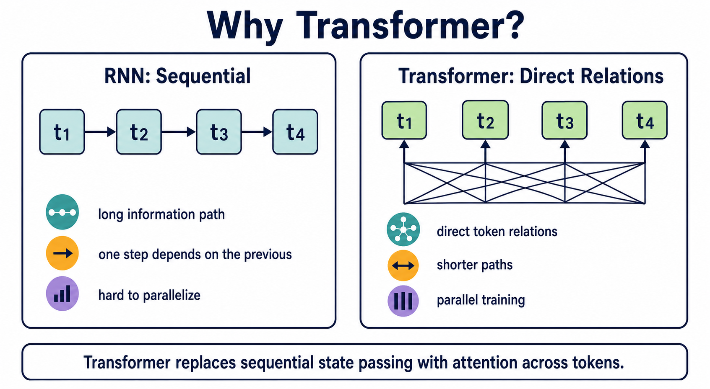
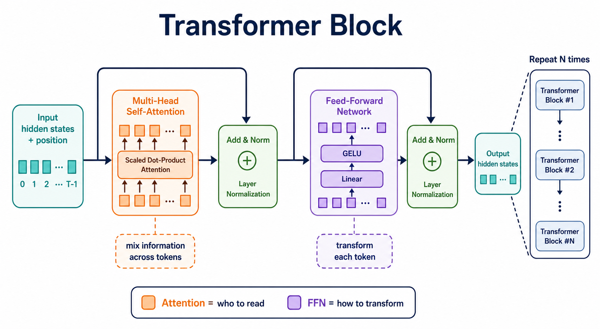
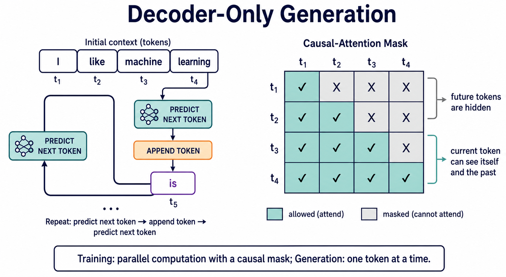

:::important[Problem]
RNN 能够处理序列，但逐步传递隐藏状态限制了并行训练，也拉长了远距离信息的传播路径。Transformer 用 Attention 重新组织序列计算，并成为现代 LLM 的核心架构。

**核心问题：为什么后来的主流大语言模型几乎都选择了 Transformer？**
:::

## 1. 为什么需要 Transformer？

### 1.1 RNN 的顺序瓶颈

RNN 读取文本时，会把当前 token 和前一个隐藏状态结合起来，再产生新的隐藏状态：

```text
hₜ = f(xₜ, hₜ₋₁)
```

这种方式能够表达顺序，但也带来三个结构性问题：

| 瓶颈       | 具体表现                            | 对大模型训练的影响 |
| ---------- | ----------------------------------- | ------------------ |
| 信息路径长 | 远处 token 的信息要逐步传到当前位置 | 长距离依赖容易衰减 |
| 计算有依赖 | 第 t 步必须等待第 t-1 步            | 难以充分并行       |
| 状态被压缩 | 历史内容不断汇总到隐藏状态          | 长文本细节可能丢失 |

例如，要根据句首的信息判断句尾的含义，RNN 需要让这条信息经过许多次状态传递。LSTM 和 GRU 用门控机制缓解了遗忘问题，但仍然保留顺序计算的限制。

Transformer 的核心改变是：让 token 直接通过 Attention 建立关系，而不是只依赖相邻的隐藏状态传递信息。

:::note[Transformer 的核心取舍]
Transformer 用更高的序列内计算和显存开销，换取了更短的信息路径与更强的训练并行性。它并非没有代价，而是在大规模 GPU 训练场景中，这种取舍通常比 RNN 的顺序依赖更有利于扩展。
:::



_图 1：RNN 依赖顺序状态传递；Transformer 可以在训练时并行计算 token 之间的关系。_

### 1.2 Transformer 改变了什么

| 维度       | RNN                        | Transformer                         |
| ---------- | -------------------------- | ----------------------------------- |
| 信息传递   | 沿序列逐步传递隐藏状态     | 通过 Attention 直接建立 token 关系  |
| 训练方式   | 前一步完成后才能计算下一步 | 同一序列的多个位置可以并行计算      |
| 长距离依赖 | 需要经过较长的状态链       | 相关 token 之间可以有更短的信息路径 |
| 扩展方式   | 顺序依赖限制硬件利用率     | 更适合 GPU 上的批量矩阵计算         |

这不是说 Transformer 在所有场景下都没有代价。Self-Attention 需要计算 token 两两之间的关系，序列变长时计算量和显存压力都会增加；但在大规模训练中，并行性和直接建模关系的收益更关键。

## 2. Attention、Self-Attention 与 Multi-Head Attention

### 2.1 Attention：当前 token 应该看谁

Attention 可以先理解成一次带权的信息读取：

1. 当前 token 提出查询。
2. 它与上下文中的候选信息进行匹配。
3. 匹配结果经过归一化得到权重。
4. 按权重汇总信息，生成新的表示。

例如在“苹果发布了新产品”中，处理“苹果”时，“发布”和“新产品”可能比其他 token 更能帮助判断它指的是公司。经过 Attention 后，“苹果”的表示就不再只由它自身决定，而会融合上下文。

这里重点关注这些计算如何被组织到架构中。

### 2.2 Self-Attention：在同一段输入内部建关系

Self-Attention 的关键是：Q、K、V 都来自同一段输入序列。

假设输入是：

```text
我  喜欢  机器  学习
```

序列中的每个 token 都可以和其他 token 计算关系。于是，“学习”的新表示可以吸收“机器”的信息，更接近“机器学习”这一整体概念；其他 token 也会同时得到自己的上下文表示。

| 阶段                   | token 表示的状态                        |
| ---------------------- | --------------------------------------- |
| 进入 Self-Attention 前 | 主要是 token 的初始表示                 |
| 完成 Self-Attention 后 | 融合了同一序列中相关 token 的上下文表示 |

Self-Attention 可以看成一张由模型训练出来的关系网。关系不是人工写死的，模型会在数据中逐渐学会哪些 token 更可能构成语法、指代、语义或主题上的联系。

### 2.3 Multi-Head Attention：从多个表示空间观察关系

单个 Attention 视角可能不足以表达复杂语言，因此 Transformer 会使用多个注意力头。每个头有独立的投影参数，可以在不同表示子空间中计算关系，最后再合并结果。

| 注意力头可能关注的模式 | 例子                       |
| ---------------------- | -------------------------- |
| 局部搭配               | 机器 + 学习、非常 + 好     |
| 句法关系               | 主语、谓语、宾语之间的联系 |
| 指代关系               | “它”与前文实体的联系       |
| 长距离依赖             | 句首概念对句尾预测的影响   |
| 语气或语义             | 否定、转折、情感和主题     |

这些头并不是人工指定的固定功能。表中的模式只是帮助理解，实际分工由训练过程形成。

可以用一句话区分：

- Self-Attention：一句话内部的 token 互相关注。
- Multi-Head Attention：用多个不同的表示视角重复这件事，再融合结果。

## 3. Transformer Block：可堆叠的计算单元

Attention 只解决“应该从哪里读取信息”。为了让表示继续变换、让深层网络稳定训练，Transformer 把多个组件组合成一个可以重复堆叠的 Block。

### 3.1 Block 的基本结构

一个 Block 可以用简化公式表示：

```text
h₁ = LayerNorm(h + MultiHeadAttention(h))
h₂ = LayerNorm(h₁ + FeedForward(h₁))
```

不同实现可能采用不同的归一化位置，但学习时可以先抓住两条主线：先通过 Attention 混合 token 间信息，再通过 FFN 加工每个 token 的表示。

| 组件                      | 主要作用                  | 直觉                 |
| ------------------------- | ------------------------- | -------------------- |
| Multi-Head Self-Attention | 建模 token 之间的关系     | 应该看谁             |
| Feed-Forward Network      | 对每个 token 做非线性变换 | 看完之后如何加工     |
| Residual Connection       | 将输入直接加回子层输出    | 在原表示上做增量修改 |
| LayerNorm                 | 稳定表示的数值范围        | 让深层计算更平稳     |



_图 2：一个 Transformer Block 先用多头注意力混合上下文，再用 FFN 逐 token 加工，并通过残差和归一化支持堆叠。_

### 3.2 Position：补充顺序信息

Self-Attention 擅长计算“谁和谁相关”，但如果没有额外的位置信息，它并不天然知道 token 的先后顺序。

```text
狗 咬 人
人 咬 狗
```

两句话包含相同的 token，但顺序改变后含义完全不同。因此，模型需要把位置信息加入输入表示，或在 Attention 计算中引入相对位置信息。

| 位置信息方式                      | 基本思路                         | 需要记住的重点                 |
| --------------------------------- | -------------------------------- | ------------------------------ |
| 绝对位置表示                      | 给第 1、2、3 个位置加入不同信息  | token 在序列中的具体位置       |
| 相对位置表示                      | 表示 token 之间的相对距离或方向  | token 彼此相隔多远             |
| Rotary Position Embedding（RoPE） | 用旋转方式将位置信息融入表示关系 | 现代生成式模型中常见的一类做法 |

位置编码不是为了让模型记住某个固定句子，而是让相同的词在不同位置和不同顺序中产生不同的计算结果。

### 3.3 Feed-Forward Network：逐 token 加工表示

Attention 会把不同 token 的信息混合起来，FFN 则通常对每个位置独立地做非线性变换：

```text
FFN(x) = W₂ σ(W₁x + b₁) + b₂
```

可以把二者的分工记成：

- Attention 负责跨 token 的信息交换。
- FFN 负责对每个 token 的新表示进行变换和提炼。

这也是为什么一个 Block 不能只有 Attention：模型不仅要“找到相关信息”，还要把信息加工成下一层可以继续使用的表示。

:::note[前馈网络 FFN]
前馈网络（Feed-Forward Network, FFN）是在 Attention 完成上下文信息聚合之后，对每个 token 的 hidden state 进行进一步特征变换的模块。经典 FFN 通常由两层线性变换和一个非线性激活函数组成：先把 hidden size 扩展到更高维度，再投影回原来的维度。由于升维再降维会引入大规模矩阵计算，FFN 往往占据 Transformer Block 中很大一部分参数和计算量。
:::

### 3.4 Residual 与 LayerNorm：让深层网络可训练

当 Block 反复堆叠时，如果每一层都完全覆盖上一层的表示，信息和梯度都可能难以稳定传递。

- **Residual Connection**：保留原输入，并让子层只学习需要补充的变化。
- **LayerNorm**：对每个位置的表示进行归一化，降低数值波动。

因此，一个 Block 的职责可以概括为：

```text
Attention：混合上下文
FFN：加工表示
Residual：保留信息通路
LayerNorm：稳定数值分布
```

多个 Block 连接起来后，token 表示会被逐层更新。底层可能更接近局部和句法模式，高层可能形成更抽象的语义和任务表示；这种层次不是人工硬编码的，而是在训练中形成的。

## 4. Decoder-only：训练与生成如何避免偷看答案

### 4.1 三类 Transformer 结构

Transformer 是一套架构，可以根据任务目标组合成不同形式：

| 结构            | 代表模型         | 可见上下文                      | 典型任务             |
| --------------- | ---------------- | ------------------------------- | -------------------- |
| Encoder-only    | BERT             | 通常可以看完整输入              | 分类、标注、表示学习 |
| Decoder-only    | GPT              | 只能看当前位置及之前的 token    | 文本、对话和代码生成 |
| Encoder-Decoder | T5、经典翻译模型 | Decoder 读取 Encoder 的输入表示 | 翻译、摘要、条件生成 |

现代生成式 LLM 主要采用 Decoder-only，因为它和“根据前文预测下一个 token”的目标天然匹配。

### 4.2 Causal Mask：遮住未来位置

在 Decoder-only 模型中，当前位置不能读取未来 token，否则训练时就相当于提前看到了答案。

设第 i 个位置只能关注第 i 个及其之前的位置，可以用一个下三角掩码表示：

```text
允许关注：j ≤ i
禁止关注：j > i

Mᵢⱼ = 0       if j ≤ i
Mᵢⱼ = −∞      if j > i

Attention = softmax((QKᵀ + M) / √dₖ)V
```

−∞ 的效果是让对应位置经过 Softmax 后权重接近 0。

:::note[Causal Mask]
Causal Mask 不是为了减少输入，而是为了约束信息可见性：位置 i 只能读取当前位置及之前的 token。这样训练时可以并行计算整段序列，同时保持 next-token prediction 的因果方向。
:::



_图 3：训练时用 Causal Mask 隐藏未来 token；生成时每次追加一个 token，再继续预测下一个 token。_

### 4.3 训练和生成的区别

| 阶段 | 计算方式                                                          | 是否能并行               |
| ---- | ----------------------------------------------------------------- | ------------------------ |
| 训练 | 输入整段序列，使用 Causal Mask 同时计算多个位置的 next-token 目标 | 可以在序列维度并行       |
| 生成 | 先预测一个 token，把它追加到上下文，再预测下一个 token            | 生成步骤之间需要顺序执行 |

这解释了一个容易混淆的地方：

- 生成过程是自回归的，一次产生一个 token。
- 训练过程可以并行，因为 Causal Mask 保证了每个位置不能看到自己的未来。

## 5. Transformer 的一次运行

把架构组件串起来，可以得到下面这条更聚焦于模型内部的路径：

```text
输入 token 的隐藏表示
        ↓ 加入位置信息
Multi-Head Self-Attention
        ↓ 残差连接 + LayerNorm
Feed-Forward Network
        ↓ 残差连接 + LayerNorm
重复 N 个 Transformer Block
        ↓
输出隐藏表示
        ↓
Linear head → logits → next-token probability
```

需要区分三种表示：

| 表示         | 含义                                    |
| ------------ | --------------------------------------- |
| 初始隐藏表示 | token 经过 Embedding 和位置处理后的输入 |
| 中间隐藏表示 | 经过若干 Block、逐层融合上下文后的表示  |
| 输出 logits  | 经过输出层映射到词表维度的分数          |

这条路径没有重新展开 Token、Embedding、Softmax 和概率的数学细节，只强调它们在架构中的位置：Transformer Block 负责不断更新隐藏表示，输出头再把最终表示转换成词表上的预测分数。

## 6. 为什么 Transformer 适合大模型

| 关键问题             | Transformer 的回答                        |
| -------------------- | ----------------------------------------- |
| 如何建立长距离关系？ | Attention 让相关 token 可以直接交互       |
| 如何提高训练吞吐？   | 训练阶段可以对同一序列并行计算            |
| 如何表达多种关系？   | Multi-Head Attention 从多个表示空间建模   |
| 如何增加模型能力？   | 重复堆叠 Transformer Block                |
| 如何支持生成？       | Decoder-only + Causal Mask 对齐自回归目标 |

**Transformer 的核心不是某一个孤立组件，而是这些组件之间的配合：**

```text
位置表示补充顺序
    + Attention 混合上下文
    + FFN 加工 token
    + Residual / LayerNorm 稳定深层训练
    + Block 堆叠扩大表示能力
    + Causal Mask 约束生成方向
```

## Summary

| 核心组件             | 作用                          | 记忆关键词       |
| -------------------- | ----------------------------- | ---------------- |
| Position             | 补充 token 的顺序信息         | 谁在什么位置     |
| Self-Attention       | 在序列内部动态聚合上下文      | 应该看谁         |
| FFN                  | 对每个 token 做非线性特征变换 | 看完之后如何加工 |
| Residual + LayerNorm | 保留信息通路并稳定深层训练    | 如何堆得更深     |
| Causal Mask          | 遮住未来 token                | 只能看过去       |

```text
位置表示 → Attention 混合上下文 → FFN 加工表示
       → 残差与归一化稳定训练 → Block 堆叠 → next-token 预测
```
