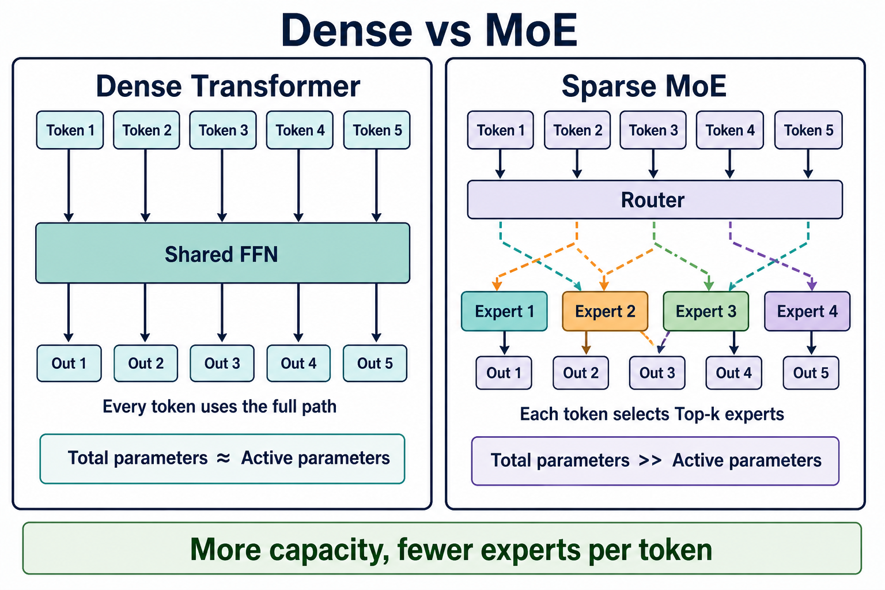
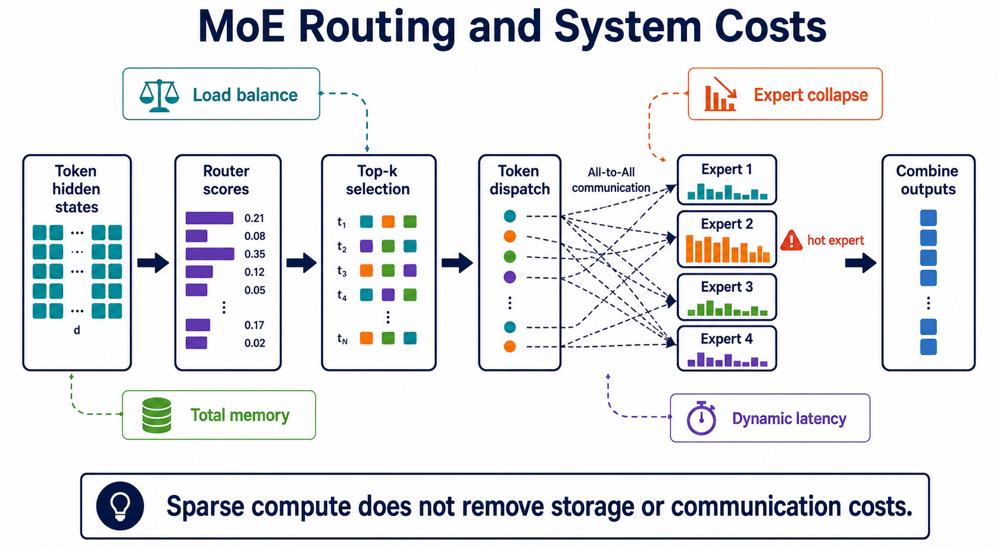

:::important[Problem]
Scaling Law 推动模型、数据和算力持续扩大，但 Dense 模型的容量增长会让每个 token 的训练与推理成本同步上升。MoE 尝试用稀疏激活拆开模型总容量和单 token 计算量之间的绑定。

**核心问题：能否让模型拥有更大的参数容量，却只为每个 token 激活其中一部分计算？**
:::

## 1. Scaling Law 带来的架构挑战

在其他条件相近时，增加模型参数、训练数据和计算量通常有助于降低训练损失、提升模型能力。这种规模化规律推动了模型不断变大，但“把所有部分都一起变大”会形成明显的成本压力。

| 扩展方向           | 能力收益                   | 直接代价                         |
| ------------------ | -------------------------- | -------------------------------- |
| 增加模型宽度       | 每层可以表示更多特征       | 矩阵计算量和参数量增加           |
| 增加模型深度       | 可以进行更多层次的特征变换 | 训练时间、显存和优化难度增加     |
| 增加上下文长度     | 可以处理更长的输入         | Attention 和 KV Cache 的成本增加 |
| 增加训练数据与步数 | 学到更多语言和任务规律     | 数据处理、算力和训练时间增加     |

因此，架构设计中出现了一个核心矛盾：

```text
希望模型拥有更多参数和更强容量
                ↓
不希望每个 token 都承担全部参数的计算成本
```

Dense 和 MoE 的区别，本质上就是对这个矛盾采取了不同策略：Dense 让所有 token 经过同一套完整参数；MoE 让不同 token 只使用其中一部分专家。

## 2. Dense Transformer：全量计算

### 2.1 每个 token 经过同一条路径

Dense 模型的每个 Transformer Block 都使用一套共享的 Attention 和 FFN。无论输入 token 是什么，它们都会经过相同的主要计算路径：

```text
token hidden state
        ↓
Self-Attention
        ↓
共享的 FFN
        ↓
下一个 Transformer Block
```

Attention 负责在 token 之间交换上下文信息，FFN 负责对每个 token 的表示进行非线性特征变换。在 Dense 结构中，FFN 不会根据 token 的内容选择不同分支，所有 token 都使用同一组 FFN 参数。

:::note[Dense 的参数与计算关系]
在主要计算路径上，Dense 模型的 Total Parameters 和 Active Parameters 大致相等：模型有多少参数，单个 token 通常就需要使用多少参数参与计算。这让 Dense 的成本更容易估算，但模型容量变大时，计算和显存压力也会同步上升。
:::

### 2.2 Dense 的优点与限制

| 维度     | Dense 的表现                              |
| -------- | ----------------------------------------- |
| 结构     | 单一路径，组件少，容易理解和调试          |
| 训练     | 并行计算方式成熟，训练稳定性相对容易控制  |
| 推理     | 延迟和吞吐更容易预测，服务优化经验丰富    |
| 参数利用 | 每个 token 都使用完整模型容量             |
| 主要限制 | 增加容量通常会直接增加每个 token 的计算量 |

Dense 不是“过时的结构”，而是一个稳定、通用、工程成本较低的基线。很多任务并不需要专家路由带来的额外复杂度，尤其是在模型规模、部署资源或服务延迟受到限制时。

## 3. MoE：稀疏激活

### 3.1 用多个专家替换共享 FFN

Mixture of Experts（MoE）通常不会把整个 Transformer 替换成多个独立模型，而是把 Block 中的共享 FFN 替换为多个结构相似、参数独立的 Expert：

```text
hidden state
     ↓
Router：判断 token 更适合哪些专家
     ↓
Top-k：只选择少数专家
     ↓
Expert 1 / Expert 2 / ... / Expert N
     ↓
按路由权重合并输出
```

每个 Expert 通常可以看成一套独立的 FFN。Attention、残差连接、归一化和其他共享部分仍然可以保持不变。这样，模型可以积累更多专家参数，但单个 token 只访问其中少数几个专家。

### 3.2 Router、Top-k 与加权聚合

设输入 token 的隐藏状态为 x，Router 先计算每个专家的分数：

```text
g(x) = softmax(Wᵣx)
```

然后选择分数最高的 k 个专家：

```text
S = TopK(g(x))
```

最后把被选中的专家输出按路由权重加权求和：

```text
y = Σᵢ∈S gᵢ(x) Eᵢ(x)
```

例如，一个包含 8 个专家、每个 token 选择 2 个专家的模型，可以拥有 8 份专家参数，但每个 token 只进行其中 2 份专家计算。

:::note[Router 与 Top-k]
Router 决定“这个 token 应该交给谁处理”，Top-k 决定“实际激活多少专家”。k 越小，单 token 的计算量通常越低；但 k 太小可能限制信息表达，路由也更容易出现专家之间的负载不均。
:::

### 3.3 Total Parameters 与 Active Parameters

MoE 最容易被误解的地方，是把“每次只激活少数参数”理解成“模型只需要存储少数参数”。

| 概念              | Dense                     | MoE                             |
| ----------------- | ------------------------- | ------------------------------- |
| Total Parameters  | 参与计算的全部模型参数    | 所有共享参数和所有专家参数      |
| Active Parameters | 单个 token 实际使用的参数 | 共享部分加被选中的少数专家      |
| 单 token 计算     | 通常随模型容量同步增长    | 可以低于同等总容量的 Dense 模型 |
| 权重存储          | 保存一套完整参数          | 仍需保存或访问所有专家权重      |

:::note[Total Parameters 与 Active Parameters]
MoE 的核心优势是 Total Parameters 可以远大于 Active Parameters：模型拥有更大的总容量，但每个 token 只支付部分专家的计算成本。Active Parameters 变少并不意味着总显存、模型文件大小和分布式通信需求也按同样比例变少。
:::



_图 1：Dense 让所有 token 经过共享 FFN；MoE 通过 Router 只激活部分专家。_

## 4. MoE 的训练与系统挑战

MoE 把计算稀疏化之后，新的瓶颈从“所有参数都计算”转移到“如何正确、均衡、高效地调度专家”。

### 4.1 路由不稳定与专家塌缩

训练初期，Router 还没有学会合理分配 token，可能出现以下情况：

| 问题       | 现象                                     | 可能后果                         |
| ---------- | ---------------------------------------- | -------------------------------- |
| 负载不均衡 | 少数专家收到大量 token，其他专家几乎空闲 | 热门专家成为吞吐瓶颈             |
| 专家塌缩   | 多数 token 长期被送到相同专家            | 其他专家没有充分训练             |
| 路由抖动   | 相似 token 在不同训练步骤间频繁换专家    | 训练不稳定，专家难以形成分工     |
| 容量溢出   | 某个专家收到的 token 超过处理上限        | token 被丢弃、截断或改送其他路径 |

常见的缓解方法包括辅助负载均衡损失、限制每个专家的容量、给路由加入噪声，以及保留共享专家处理所有 token 的一部分信息。

### 4.2 显存：计算稀疏不等于存储稀疏

MoE 的所有专家权重仍然需要被保存、加载或分片放置。训练时还要考虑优化器状态、梯度和激活值，因此单卡显存往往无法容纳完整模型。

| 资源             | MoE 需要关注的问题            | 常见手段                     |
| ---------------- | ----------------------------- | ---------------------------- |
| 权重             | 专家总参数量很大              | Expert Parallelism、参数分片 |
| 梯度与优化器状态 | 训练副本进一步放大显存        | ZeRO、FSDP                   |
| 激活值           | 长序列和大 batch 会增加保存量 | Activation Checkpointing     |
| 数值存储         | 权重和激活占用空间大          | BF16、FP8、量化              |

### 4.3 通信：token 需要被派往远端专家

在多 GPU 或多节点训练中，不同专家通常分布在不同设备上。Router 做完选择后，token 需要被发送到对应设备，专家计算完成后再把结果发回原位置。这类数据交换通常被称为 All-to-All。

```text
本地 token
    ↓
Router 选择专家
    ↓
All-to-All：把 token 发到专家所在设备
    ↓
各设备执行本地 Expert
    ↓
All-to-All：把结果发回原 token 位置
    ↓
按权重合并
```

:::note[MoE 的系统代价]
MoE 减少的是部分计算，不会自动消除通信和调度成本。专家分布、All-to-All、动态 token 数量和负载不均衡，都可能让 GPU 等待通信或等待热门专家，从而抵消理论上的稀疏计算收益。
:::

### 4.4 推理时的延迟与吞吐

推理服务还要处理动态路由带来的不确定性：

- 不同 token 可能被分配到不同设备，增加跨设备通信。
- 热门专家可能先达到容量上限，形成尾部延迟。
- 小 batch 场景下，每个专家收到的 token 很少，矩阵计算效率下降。
- 连续批处理、KV Cache 和动态序列长度会让调度更加复杂。

因此，评估 MoE 时，~~只比较 FLOPs~~已经不足，还要同时观察显存、通信量、设备利用率、吞吐和 P99 延迟。



_图 2：MoE 从 Router、Top-k 到专家计算的路径，以及负载均衡、All-to-All 和动态延迟带来的系统代价。_

## 5. Dense 与 MoE 如何选择

| 选择维度      | Dense                        | MoE                                  |
| ------------- | ---------------------------- | ------------------------------------ |
| 模型容量      | 受单路径计算成本约束         | 可以用更多专家扩大总容量             |
| 单 token 计算 | 与整体模型容量关系紧密       | 主要取决于激活专家数量               |
| 权重存储      | 相对直接                     | 所有专家权重都需要管理               |
| 通信需求      | 结构简单，通常较低           | 可能需要频繁 All-to-All              |
| 训练稳定性    | 路径固定，问题较少           | 需要处理路由和负载均衡               |
| 推理延迟      | 更容易预测                   | 可能出现动态负载和尾延迟             |
| 工程复杂度    | 较低，适合作为基线           | 较高，需要并行和调度优化             |
| 适合场景      | 资源有限、延迟敏感、通用部署 | 追求大容量，且拥有成熟分布式基础设施 |

可以用下面的判断顺序做架构选择：

1. 先确定目标是降低单 token 计算，还是扩大模型总容量。
2. 再确认系统是否能承受专家权重、分片和 All-to-All 通信。
3. 最后根据真实 batch、序列长度和延迟目标评估，而不是只看参数量或理论 FLOPs。

## 6. 从单一架构走向混合架构

Dense 和 MoE 并不是只能二选一。实际系统可以把两者的优势组合起来：

| 混合思路                      | 作用                                         |
| ----------------------------- | -------------------------------------------- |
| 共享层 + MoE 层               | 让基础能力保持稳定，同时在部分层增加容量     |
| 共享专家 + 路由专家           | 共享专家处理通用模式，路由专家处理差异化模式 |
| 细粒度专家                    | 把专家拆得更细，让路由拥有更灵活的组合方式   |
| 动态计算深度                  | 简单 token 少算几层，复杂 token 使用更多计算 |
| Expert Parallelism + 专家复制 | 在显存、通信和热点之间做运行时折中           |

设计趋势可以概括为：

```text
所有 token 使用全部参数
        ↓
所有 token 使用固定的共享路径
        ↓
不同 token 选择不同专家
        ↓
根据 token 难度动态分配计算
```

这类设计的共同目标是：把有限的计算预算更多地投入到真正需要复杂表示的 token 上，同时保持模型整体容量和能力。

## Summary

| 核心知识          | 一句话总结                                                         |
| ----------------- | ------------------------------------------------------------------ |
| Dense             | 所有 token 经过同一套完整参数，结构简单、成本可预测。              |
| MoE               | 用 Router 为 token 选择少数 Expert，扩大总参数而控制部分激活计算。 |
| Active Parameters | 单 token 实际参与计算的参数，不等于模型需要存储的总参数。          |
| Router            | 负责专家选择；Top-k 控制每个 token 激活的专家数量。                |
| MoE 难点          | 路由稳定性、专家负载、显存、All-to-All 通信和推理尾延迟。          |
| 架构选择          | Dense 重工程稳定性，MoE 重模型容量与稀疏计算效率。                 |

```text
Dense：所有 token → 共享 FFN
MoE：  token → Router → Top-k Experts → 加权合并
```

**成功使用 MoE 的关键**，不只是让专家数量变多，而是让路由分工有效，并让分布式系统能够以足够低的通信和调度成本执行这种稀疏计算。
