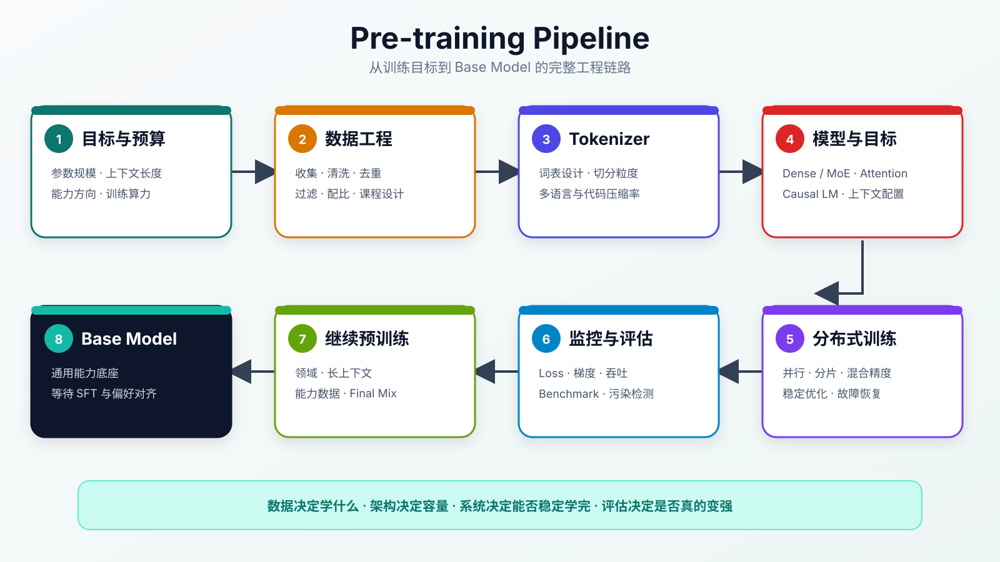
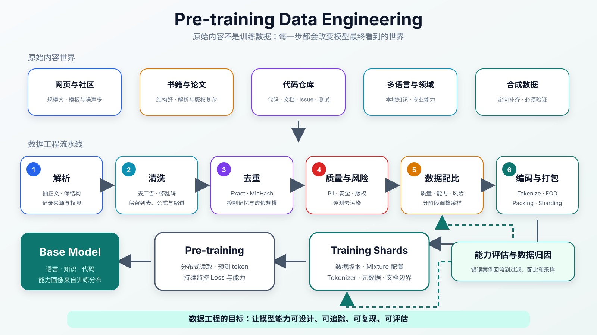
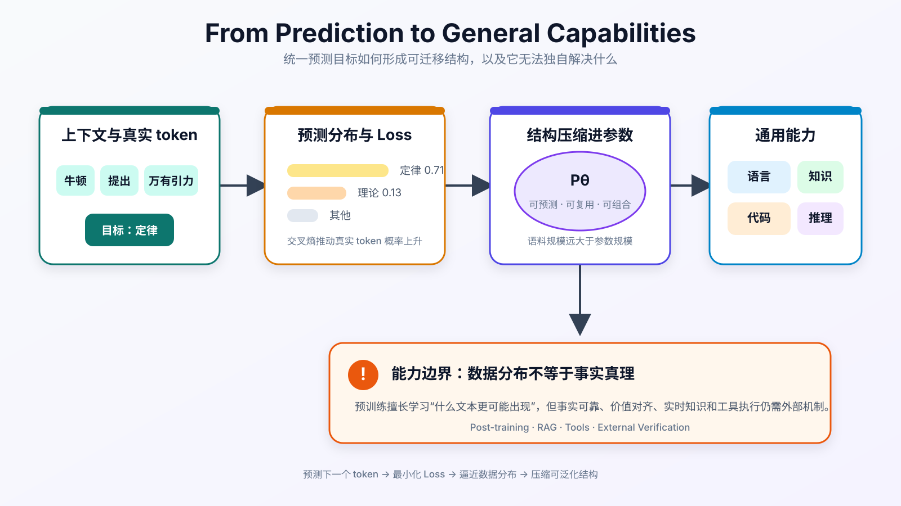

:::important[Problem]
Transformer 提供了可扩展的结构，但语言、知识、代码和推理能力并不会由架构自动产生。它们主要来自模型在经过筛选和配比的海量数据上进行的预训练，而预训练的表面任务只是预测下一个 token。

**核心问题：简单的预测目标如何从经过数据工程加工的训练分布中形成通用能力，并在数据、模型与算力约束下产出可靠的 Base Model？**
:::

## 1. 预训练在 LLM 训练体系中的位置

预训练是在指令微调、偏好对齐和具体业务适配之前，使用大规模文本、代码、数学、多语言等数据训练通用能力的阶段。它产出的通常是 **Base Model（基座模型）**，而不是可以直接承担所有对话任务的完整助手。

| 阶段                                 | 主要目标                               | 典型产物                                                            |
| ------------------------------------ | -------------------------------------- | ------------------------------------------------------------------- |
| Pre-training（预训练）               | 学习语言、知识、代码和可迁移结构       | Base Model                                                          |
| Continued Pre-training（继续预训练） | 用领域、长上下文或能力数据继续塑造基座 | 领域或增强型 Base Model                                             |
| Post-training（后训练）              | 学习指令遵循、人类偏好和安全边界       | Instruct / Chat Model                                               |
| 应用增强                             | 补充实时知识、工具执行和外部验证       | RAG（检索增强生成）、Tools（工具调用）、Agent（任务执行智能体）系统 |

:::note[预训练与后训练]
预训练主要决定模型能够学到多少通用结构和知识，后训练主要决定这些能力如何被调用和表达。后训练可以改善指令遵循与安全性，但不能轻易补回预训练阶段没有形成的基础能力。
:::

## 2. 从下一个 token 预测到自监督学习

### 2.1 训练目标

对 Decoder-only（仅使用解码器的架构）模型，预训练的基本任务是：给定当前位置之前的上下文，预测真实的下一个 token。

设 token 序列为 $x=(x_1,x_2,\ldots,x_T)$，模型把整段序列的概率拆成一系列条件概率：

$$
P_\theta(x)=\prod_{t=1}^{T}P_\theta(x_t\mid x_{<t})
$$

训练时最小化负对数似然：

$$
\mathcal{L}(\theta)
=-\sum_{t=1}^{T}\log P_\theta(x_t\mid x_{<t})
$$

第 02 章已经介绍了 Softmax、交叉熵和梯度，这里只需要建立它们与预训练的对应关系：

```text
上下文
  ↓
Transformer 输出词表 logits
  ↓
Softmax 得到下一个 token 的概率
  ↓
交叉熵衡量预测分布与真实 token 的差距
  ↓
反向传播与优化器更新参数
```

### 2.2 为什么属于自监督学习

传统有监督学习依赖人工提供标签；自监督学习则直接从原始数据中构造输入和目标。

例如，句子“深度学习改变了自然语言处理”可以自动拆成多条训练样本：

| 输入上下文        | 训练目标 |
| ----------------- | -------- |
| 深度              | 学习     |
| 深度 学习         | 改变     |
| 深度 学习 改变    | 了       |
| 深度 学习 改变 了 | 自然     |

**标签来自数据自身的后续 token**，因此模型可以利用远超人工标注规模的网页、书籍、论文、代码和多语言语料。

### 2.3 简单目标为什么能形成通用能力

真实数据中的 token 并不是随机排列的。为了持续提高预测准确率，模型必须学习有助于预测的隐藏结构：

| 表面预测任务       | 模型需要学习的结构                 |
| ------------------ | ---------------------------------- |
| 预测语句的后续内容 | 词法、语法、语义和上下文关系       |
| 预测事实性描述     | 实体、属性、时间、地点和常识关系   |
| 预测下一行代码     | 变量作用域、控制流、API 和程序结构 |
| 预测数学推导       | 符号规则、约束关系和常见推导模式   |
| 预测长文后续       | 篇章结构、主题一致性和长期依赖     |

next-token prediction 不是直接为每一种能力设计单独模块，而是用统一预测压力迫使模型提取可复用结构。

## 3. 工业级预训练流程

工业级预训练是一条从目标、数据、模型和训练系统走向基座模型的完整链路。



_图 1：预训练从目标与预算开始，经过数据工程、模型配置、分布式优化和持续评估，最终产出可供后训练使用的 Base Model。_

### 3.1 目标、数据与模型配置

| 环节      | 需要决定什么                             | 直接影响                     |
| --------- | ---------------------------------------- | ---------------------------- |
| 目标设定  | 参数规模、算力预算、上下文长度和能力方向 | 项目边界和资源投入           |
| 数据收集  | 通用文本、代码、数学、多语言和长文档来源 | 模型可以接触的知识与任务分布 |
| 数据清洗  | 去重、质量、安全、隐私和评测集污染过滤   | 学习信号的可信度             |
| 数据配比  | 各类数据的采样比例与训练阶段             | 模型最终的能力结构           |
| Tokenizer | 词表大小、切分方式和多语言压缩率         | 序列长度与训练效率           |
| 架构配置  | Dense/MoE、Attention、上下文和参数规模   | 模型容量、显存与计算成本     |
| 训练目标  | Causal LM 或其他辅助目标                 | 模型从数据中接收的学习压力   |

数据并不是越多越好。重复、低质、错误或被污染的数据会被模型稳定吸收，因此 **数据质量和数据配比会直接塑造模型能力**。

### 3.2 分布式训练与数值稳定

单张 GPU 通常无法同时容纳大模型权重、梯度、优化器状态和长序列激活值，因此需要组合多种并行与内存优化方法：

| 问题               | 常见方法                                    | 作用                       |
| ------------------ | ------------------------------------------- | -------------------------- |
| 数据量过大         | Data Parallel                               | 不同设备处理不同 batch     |
| 单卡放不下模型     | Tensor / Pipeline Parallel                  | 拆分层内矩阵或模型层       |
| 参数状态占用过高   | ZeRO / FSDP                                 | 分片权重、梯度和优化器状态 |
| 长序列激活值过多   | Sequence Parallel、Activation Checkpointing | 拆分序列或用重算换显存     |
| 训练速度和数值范围 | BF16、FP8、混合精度                         | 降低存储和计算成本         |
| 通信成为瓶颈       | 通信计算重叠                                | 减少设备等待时间           |

:::note[训练稳定性]
大规模训练中的 loss spike、梯度爆炸或异常 batch 可能影响整个集群。常见保护措施包括 learning-rate warmup、cosine decay、gradient clipping、异常数据检测，以及从健康 Checkpoint（训练快照）回滚。
:::

### 3.3 监控、Checkpoint 与 Base Model

训练过程不能只等待最终 Loss。系统需要持续监控：

| 指标                       | 回答的问题                                 |
| -------------------------- | ------------------------------------------ |
| Training / Validation Loss | 模型是否持续学习，是否出现过拟合或异常     |
| Gradient Norm              | 梯度是否爆炸、消失或发生数值异常           |
| Tokens/s、GPU 利用率       | 集群是否有效工作，通信是否成为瓶颈         |
| 能力 Benchmark（基准评测） | 数学、代码、知识和语言能力是否按目标增长   |
| 污染与安全评估             | 分数是否来自数据泄漏，输出是否存在明显风险 |

Checkpoint 需要保存模型参数、优化器状态、学习率状态和训练进度。它既用于故障恢复，也用于比较不同训练阶段并选择合适的基座版本。

完成通用预训练后，还可以进行 Continued Pre-training：使用领域数据、长上下文数据或特定能力数据继续训练，再进入正式的指令微调和偏好对齐。

## 4. 数据来源与有效 token

预训练数据不是一个装满文本的文件夹，而是由不同来源、语言、领域和质量组成的 Corpus（语料库）。数据处理通常以 Document（文档单元）为基础，最终再转换成 token 序列进入训练。

### 4.1 模型学习的是数据分布

自回归目标要求模型拟合训练语料中的统计规律。因此，Data Distribution（数据分布）会决定模型经常看到什么、很少看到什么以及哪些模式被反复强化。

| 数据情况                     | 可能形成的能力或问题                 |
| ---------------------------- | ------------------------------------ |
| 高质量教材、论文和技术文档多 | 概念表达、知识密度和结构化推理更强   |
| 代码、Issue、文档和测试多    | 更熟悉程序结构、API、调试与约束      |
| 高质量中文或低资源语言少     | 对应语言的表达和事实覆盖较弱         |
| 长文档少                     | 长上下文中容易丢失主题和约束         |
| 广告、模板和采集页过多       | 输出容易啰嗦、重复并带有低质网页风格 |
| 评测题和答案进入训练集       | Benchmark 分数虚高，不能反映真实泛化 |

两个参数规模相近的模型可能表现出不同的代码、数学、语言和领域能力，差异不一定来自架构，也可能来自数据来源、过滤规则与配比。

### 4.2 数据规模不等于有效数据量

Effective Tokens（有效 token）是高质量、多样、低重复、低污染并且符合能力目标的训练 token。

| 内容                 | 能产生 token 吗 | 学习价值                   |
| -------------------- | --------------- | -------------------------- |
| 完整教材中的准确解释 | 能              | 高，包含稳定知识与论证结构 |
| 重复广告和模板页     | 能              | 低，浪费算力并放大低质表达 |
| 乱码或解析失败内容   | 能              | 很低，向模型注入无意义模式 |
| 泄露的评测题答案     | 能              | 会污染评估并增加记忆风险   |

**预训练真正需要最大化的不是原始 token 数量，而是有效 token 的数量和覆盖。** 因此数据报告不能只记录总量，还要记录来源、语言、领域、质量、重复率和污染风险。

### 4.3 预训练数据从哪里来

| 数据来源         | 主要价值                        | 典型风险                          |
| ---------------- | ------------------------------- | --------------------------------- |
| 网页             | 规模大、覆盖广、更新快          | 广告、模板、转载、隐私与版权复杂  |
| 书籍与教程       | 长文结构、系统知识和稳定表达    | 授权要求高，领域覆盖有限          |
| 论文与技术报告   | 专业知识密度高、结构严谨        | PDF、公式、表格和引用解析困难     |
| 代码仓库         | 编程模式、API、测试和问题修复   | Fork 重复、许可证、密钥和生成代码 |
| 百科与问答社区   | 实体知识以及天然的问题—答案结构 | 覆盖偏差、质量波动和内容过时      |
| 多语言与领域数据 | 跨语言、本地知识和专业能力      | 数据稀缺、合规和专业质量判断困难  |
| 合成数据         | 可针对模型短板定向生成          | 错误放大、风格收缩和分布失真      |

网页数据的第一步不是直接“清洗字符串”，而是从 HTML 中抽取正文；代码数据除了源文件，还应保留路径、语言、注释、测试与许可证；书籍、论文和规范文档则需要尽量保留章节层级与引用关系。

## 5. 预训练数据工程流水线

从原始内容到训练样本，需要经过解析、清洗、去重、过滤、配比、Tokenization（分词编码）和 Packing（样本拼接）。每一步都会改变模型最终看到的数据分布。



_图 2：原始网页、书籍、论文和代码经过解析、清洗、去重、质量与风险过滤，再按能力目标配比，最终编码并打包成可追踪的训练分片。_

### 5.1 抓取与解析：抽正文并保留结构

解析阶段需要把不同来源转换成统一文档，同时保留可追踪的元数据。

| 数据类型   | 应该移除                           | 应该保留                             |
| ---------- | ---------------------------------- | ------------------------------------ |
| 网页       | 导航、广告、脚本、页脚和推荐模块   | 标题、正文、列表、链接来源和时间     |
| PDF / 论文 | 页眉页脚、扫描噪声和错误换行       | 章节、公式、表格、引用和页码         |
| 代码       | 构建产物、压缩文件和低价值生成文件 | 路径、语言、缩进、注释、测试和许可证 |
| 企业文档   | 无权限内容、过期副本和敏感字段     | 权限、版本、来源和业务结构           |

<details>
<summary>清洗文档的元数据示例</summary>

```json
{
	"id": "web_20250601_xxx",
	"source": "web",
	"language": "zh",
	"domain": "technical_blog",
	"quality_score": 0.91,
	"license": "unknown",
	"pii_flags": [],
	"token_count_estimate": 2048
}
```

</details>

清洗不是把文本变成没有格式的一长串字符。标题、段落、列表、表格、数学公式和代码缩进都是模型学习结构的重要信号，过度规范化会破坏这些信息。

### 5.2 去重：删除虚假的数据规模

互联网中的转载、镜像、模板页和代码 Fork 会让同一内容出现很多次。Deduplication（去重）通常分为三层：

| 层次     | 常见方法                                           | 处理对象                             |
| -------- | -------------------------------------------------- | ------------------------------------ |
| 精确去重 | MD5、SHA 或 BLAKE3 Hash                            | 完全相同的文档或片段                 |
| 近似去重 | SimHash（相似指纹）、MinHash + LSH（局部敏感哈希） | 有少量增删、广告或格式变化的转载内容 |
| 语义去重 | Embedding + ANN（近邻检索）聚类                    | 表述不同但语义高度重复的内容         |

MinHash 会用一组哈希签名近似文档集合的 Jaccard 相似度，再通过 LSH 快速找到候选重复簇。发现重复簇后也不能随机删除，通常应保留来源更可信、正文更完整、时间更新且元数据更清楚的版本。

去重可以减少无效计算、样本记忆和某些来源被过度放大，但阈值过严也可能删除真正不同的内容。

### 5.3 质量、安全、隐私与版权过滤

过滤通常需要组合规则、模型分类器和人工抽检：

| 信号或风险                   | 可能的问题                   | 处理方式                             |
| ---------------------------- | ---------------------------- | ------------------------------------ |
| 文档过短、链接或重复片段过多 | 导航、模板或采集页           | 长度、字符和 n-gram 规则             |
| 困惑度或字符分布异常         | 乱码、解析失败或模板化内容   | 统计过滤和质量分类器                 |
| PII（个人可识别信息）        | 电话、邮箱、证件号等隐私泄露 | 正则、实体识别、脱敏和审计           |
| 代码密钥与内部地址           | 凭据或企业信息泄露           | Secret Scanner（密钥扫描器）         |
| 有害内容                     | 模型学习危险或低质模式       | 安全分类器、规则和抽检               |
| 许可证与版权                 | 数据使用范围不明确           | 来源白名单、License 元数据和风险策略 |
| Benchmark 污染               | 评估分数偏离真实泛化能力     | 题目匹配、来源排除和时间切分         |

:::note[过滤不是越严格越好]
只保留“像百科”的文本会损失口语、社区知识和真实用户表达；只保留高分文档也可能误伤低资源语言和专业领域。目标是在**干净、多样、真实和合规**之间取得平衡。
:::

### 5.4 从文档到训练分片

数据通常会保留三个层次：

| 层次       | 常见格式                                  | 主要用途                         |
| ---------- | ----------------------------------------- | -------------------------------- |
| 原始归档层 | WARC、PDF、HTML、Git Archive              | 保存原始证据，便于重新解析和审计 |
| 清洗文档层 | JSONL、Parquet、Arrow                     | 过滤、去重、统计、配比和版本管理 |
| 训练样本层 | Tokenized Binary、`.bin/.idx`、WebDataset | 高吞吐读取、随机访问和分布式采样 |

进入训练前的数据流可以概括为：

```text
文档文本
  → Tokenizer
  → Token IDs
  → 添加 EOD（文档结束标记）
  → 切分或 Packing
  → 固定长度序列
  → Shard（训练分片）
```

Packing 可以把多个短文档拼到接近上下文长度，提高 GPU 利用率；但文档之间需要明确边界，代码、数学和真实长文档还可能需要单独处理，避免结构被普通网页样本冲淡。

## 6. 数据配比：设计模型的能力形状

Data Mixture（数据配比）不是复制原始互联网的比例，而是根据质量、能力目标和风险重新设计模型的学习分布。

### 6.1 不同数据影响不同能力

| 数据类型   | 配比过低                 | 配比过高                       |
| ---------- | ------------------------ | ------------------------------ |
| 通用网页   | 知识面窄、表达不自然     | 噪声和低质表达增加             |
| 书籍与教程 | 长文组织和系统讲解能力弱 | 风格可能过于书面               |
| 代码       | 编程和结构化能力弱       | 自然语言中可能混入代码式表达   |
| 数学与推理 | 多步推导能力弱           | 低质量数据会放大伪推理         |
| 多语言     | 非英语能力和本地知识不足 | 低质量语言数据会放大噪声       |
| 长文档     | 长上下文中容易丢失信息   | Packing 和训练成本上升         |
| 领域数据   | 专业回答空泛             | 可能损害通用能力或引入合规风险 |
| 合成数据   | 难以定向补齐稀缺能力     | 风格收缩和错误自我强化         |

预训练还可以分阶段调整配比：早期强调覆盖和多样性，中期增加高质量知识、代码、数学和长文档，后期使用更困难、质量更高且与能力目标相关的数据进行打磨。

### 6.2 上采样、下采样与配置管理

Upsampling（上采样）让重要但稀缺的数据在训练中出现更多次；Downsampling（下采样）降低规模巨大但价值较低的数据占比。采样权重可以抽象为：

$$
w_i
\propto s_i\times q_i\times a_i\times r_i
$$

其中 $s_i$ 表示原始规模，$q_i$ 表示质量，$a_i$ 表示能力目标权重，$r_i$ 表示风险控制后的保留权重。

配比应写入带版本的配置，而不是只存在于经验中：

```yaml
dataset_mixture:
  web_general: 0.45
  books_and_tutorials: 0.15
  code: 0.15
  math_reasoning: 0.08
  multilingual: 0.08
  long_context: 0.05
  domain_and_synthetic: 0.04
```

这些数字只是说明配置方式，不代表某个真实模型的训练比例。团队需要记录每类数据的版本、过滤阈值、采样权重和适用训练阶段。

### 6.3 数据消融：验证配比是否真的有效

Data Ablation（数据消融）是在其他训练条件基本一致时，移除或改变某类数据，再观察目标能力和其他能力如何变化。

例如提高数学数据比例后，需要同时检查：数学评测是否提升、通用问答和代码能力是否下降、提升来自质量还是数量，以及评测集是否被污染。没有消融和对照实验，配比调整很容易变成只追逐某个 Benchmark 的经验优化。

## 7. 可信、可扩展与可复现的数据

### 7.1 评测污染：模型是真的会，还是看过答案

Data Contamination（数据污染）是训练数据包含评测题、答案或高度相似内容，导致 Benchmark 分数不能代表对新问题的泛化能力。

| 去污染层次  | 做法                               |
| ----------- | ---------------------------------- |
| 精确匹配    | 搜索完整题目和答案文本             |
| n-gram 匹配 | 检测局部复制和题目解析泄露         |
| 近似匹配    | 检测改写、转载和格式变化的相似样本 |
| 来源排除    | 排除评测仓库、数据集镜像和题库站点 |
| 时间切分    | 使用训练截止时间之后产生的新评测   |
| 私有评测    | 保留未公开集合验证真实泛化能力     |

去污染不是为了让分数降低，而是为了让能力评估可信。

### 7.2 合成数据：生成不是关键，验证才是

Synthetic Data（合成数据）由模型、规则、程序或人机协作生成，适合补齐自然数据稀缺、昂贵或不够结构化的部分。

| 数据类型       | 主要验证方式                         |
| -------------- | ------------------------------------ |
| 数学           | 规则、符号计算、答案一致性和交叉验证 |
| 代码           | 编译、静态检查、单元测试和运行结果   |
| 知识问答       | 检索证据、来源引用和事实一致性       |
| 长文问答       | 答案可在原文定位，引用位置可追踪     |
| 安全或领域数据 | 策略规则、红队、专家审核和来源追溯   |

健康的数据飞轮应该是：

```text
生成候选 → 自动或人工验证 → 筛选高价值样本 → 进入训练 → 评估新模型
```

~~让模型无限生成，再用生成结果继续训练~~可能放大错误、缩窄表达风格并降低数据多样性。

### 7.3 长上下文数据：重点是结构而不是长度

第 10 章已经从模型和系统角度解释长上下文。本节只关注数据：把无关短文简单 Packing 到一起，可以提高训练效率，却不能自动教会模型理解长结构。

有效长文档需要保留标题层级、段落、列表、表格、代码路径、引用、脚注和文档边界，并包含真实的远距离依赖，例如前文定义后文使用、多个代码文件相互调用、合同条款前后约束以及论文方法与实验对应。

### 7.4 数据治理与评估回流

Data Governance（数据治理）让团队能够回答：一次训练使用了哪些数据源和版本、采用了什么清洗与过滤规则、Tokenizer 和配比配置是什么、是否排除了评测集，以及哪些数据被上采样或下采样。

训练后的能力和失败案例还要回流到数据侧：

```text
训练结果
  → 能力评测
  → 错误分析
  → 数据归因
  → 调整解析、过滤、配比或采样
  → 下一轮训练
```

没有版本、元数据、质量报告和回流记录，团队无法解释模型为什么变好或变差，也很难复现实验。

## 8. 参数、数据与算力的平衡

Scaling Laws 说明模型性能会随参数量、训练 token 数和计算量产生可预测的变化，但固定算力下不能只扩大参数而忽略数据。

设模型参数量为 $N$，训练 token 数为 $D$，训练算力预算为 $C$。Compute-optimal 关注的是：

```text
给定 C
  ↓
如何平衡 N 与 D
  ↓
让有限算力获得尽可能低的验证 Loss
```

Chinchilla 一类研究修正了~~参数越大就一定越好~~的简单直觉：参数规模需要与足够多、足够高质量的训练 token 匹配。参数过大而数据不足会导致训练不充分；数据很多但模型容量太小，也难以吸收其中的结构。

:::note[Compute-optimal 依赖有效数据]
训练 token 数 $D$ 只有在数据质量和多样性可接受时才有意义。重复、污染或低质量 token 虽然会消耗算力，却不能等价替代有效数据。
:::

## 9. 预训练的本质与能力边界

### 9.1 从分布拟合到结构压缩

交叉熵可以写成：

$$
H(P_{\text{data}},P_\theta)
=H(P_{\text{data}})
+D_{\mathrm{KL}}(P_{\text{data}}\parallel P_\theta)
$$

$H(P_{\text{data}})$ 由真实数据决定，模型能够优化的是分布差距 $D_{\mathrm{KL}}$。因此，预训练可以理解为：

```text
预测真实 token
  ↓
最小化交叉熵
  ↓
让模型分布逼近训练数据分布
  ↓
把可预测、可复用的结构压缩进参数
```



_图 3：统一的预测目标促使模型压缩语法、知识、代码和推理结构，但数据分布并不等于事实真理。_

### 9.2 能力形成不是突然出现一个模块

模型参数远小于完整训练语料，不可能以最简单的形式逐字保存所有样本。为了在有限参数中降低大量样本的预测误差，模型会倾向于提取更短、更抽象、更可组合的表示。

当数据足够广、模型容量足够大、优化足够充分时，这些表示可以迁移到新上下文中，表现为 few-shot、in-context learning、代码生成或组合推理能力。这里的“涌现”更适合理解为 **可泛化结构逐步形成后的外在表现**，而不是某个智能模块突然被激活。

:::note[分布不等于真理]
Loss 下降说明模型更擅长拟合训练数据中的 token 分布，不代表输出一定符合现实。预训练提供语言、知识和推理底座；事实可靠性、价值对齐、实时知识、工具执行与安全边界仍需要后训练、RAG、工具调用和外部验证。
:::

## 10. 预训练中的关键权衡

| 权衡                   | 需要避免的误解                         |
| ---------------------- | -------------------------------------- |
| 数据规模 vs 有效 token | 原始 token 更多不代表学习价值更高      |
| 清洗强度 vs 数据多样性 | 过度过滤可能破坏结构并缩窄语言分布     |
| 数据配比 vs 能力偏科   | 提高一类数据可能挤占其他能力的学习份额 |
| 合成规模 vs 验证能力   | 生成速度超过验证能力会放大错误         |
| 模型容量 vs 训练成本   | 参数更多会增加训练、存储和推理压力     |
| 稳定性 vs 训练效率     | 更激进的精度和并行策略可能放大数值风险 |
| 长上下文 vs 系统成本   | 能放入更长输入不等于能有效利用全部内容 |
| Benchmark vs 真实能力  | 高分可能受到数据污染或任务覆盖偏差影响 |
| 流畅生成 vs 事实可靠   | 更像训练语料的输出不一定更真实         |

未来的预训练会更强调高质量数据与课程设计、长上下文继续训练、原生多模态，以及训练和推理的协同优化。MoE、FP8 和更复杂的并行策略只是其中一部分，真正决定结果的是数据、架构、优化和系统工程能否形成稳定闭环。

## Summary

| 核心知识        | 需要记住的内容                                                      |
| --------------- | ------------------------------------------------------------------- |
| 训练目标        | Decoder-only LLM 根据左侧上下文预测下一个 token                     |
| 自监督          | 训练目标来自原始序列自身，不需要逐条人工标注                        |
| 能力来源        | 为降低预测误差，模型需要学习语法、知识、代码和可迁移结构            |
| 工业流程        | 目标、数据、Tokenizer、架构、分布式训练、评估和 Checkpoint 缺一不可 |
| 有效 token      | 数据需要高质量、多样、低重复、低污染并符合能力目标                  |
| 数据流水线      | 解析、清洗、去重、过滤、编码和 Packing 共同决定训练输入             |
| 数据配比        | 上下采样和分阶段 Mixture 会塑造模型的能力画像                       |
| 可信数据        | 去污染、合成数据验证、版本治理和数据消融保证能力可解释              |
| Compute-optimal | 给定算力下需要平衡参数量与训练 token 数，而不是只堆参数             |
| 数学本质        | 最小化交叉熵，使模型分布逼近训练数据分布                            |
| 能力边界        | 拟合数据分布不等于掌握事实真理，仍需后训练和外部系统补足            |
