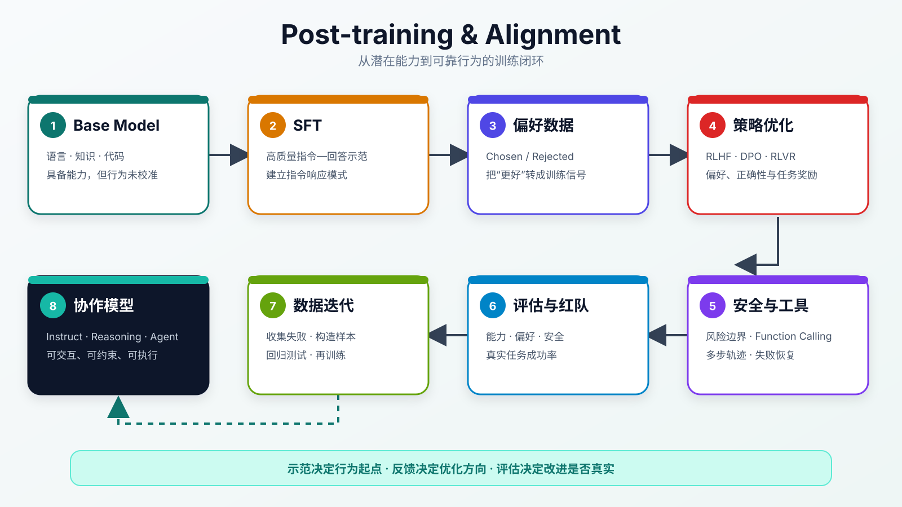

:::important[Problem]
预训练让 Base Model 获得了语言、知识、代码和推理能力，但它本质上仍在预测下一个 token，并不天然理解指令、偏好、安全边界与工具使用方式。

**核心问题：如何把模型的潜在能力塑造成稳定、可靠、可控的助手行为？**
:::

## 1. 后训练解决什么问题

后训练（Post-training）是在预训练模型之上，继续使用指令数据、偏好数据、安全数据、可验证反馈和工具轨迹，对模型的**输出行为**进行定向塑形。

| 维度     | 预训练                       | 后训练                                    |
| -------- | ---------------------------- | ----------------------------------------- |
| 核心目标 | 学习数据分布，形成通用能力   | 在目标和约束下组织、调用能力              |
| 主要数据 | 大规模文本、代码和多模态数据 | 指令、偏好、安全、推理与工具轨迹          |
| 监督信号 | 下一个 token                 | 示范答案、偏好排序、奖励与验证器          |
| 典型产物 | Base Model                   | Instruct / Chat / Reasoning / Agent Model |
| 主要风险 | 数据污染、训练不稳、知识错误 | Reward hacking、过度拒答、能力退化        |

:::note[能力与行为]
预训练主要决定模型**会什么**，后训练主要决定模型**如何使用这些能力**。后训练不是简单增加一层规则，而是在重新调整模型面对指令和约束时的输出概率。
:::

## 2. 后训练的完整流程

后训练不是一次微调，而是由数据构建、行为学习、偏好优化、安全训练和持续评估组成的迭代流程。



_图 1：Base Model 先通过 SFT 建立指令响应模式，再利用偏好或可验证反馈优化行为，并通过安全、工具训练和评估闭环形成可用模型。_

| 阶段            | 主要任务                                 | 关键产物             |
| --------------- | ---------------------------------------- | -------------------- |
| Checkpoint 选择 | 综合能力、稳定性和安全风险选择预训练模型 | 后训练起点           |
| 指令数据构建    | 准备高质量 prompt-response 示范          | SFT 数据集           |
| SFT             | 学习遵循指令和组织答案                   | Instruct Model       |
| 偏好数据构建    | 比较同一问题的多个候选回答               | chosen / rejected 对 |
| 偏好优化        | 用 RLHF、DPO 等提高优质回答概率          | Aligned Model        |
| RLVR            | 用答案、测试或环境结果强化任务成功率     | Reasoning Model      |
| 安全与工具训练  | 学习风险边界、工具调用和失败恢复         | 可控的协作模型       |
| 评估与迭代      | 自动评测、人工评测、红队与真实任务测试   | 新数据与改进版本     |

## 3. SFT：从续写到指令跟随

SFT（Supervised Fine-Tuning，监督微调）使用高质量的指令—回答样本，教模型识别任务、遵守格式并以助手角色组织输出。

给定指令 $x$ 和目标回答 $y=(y_1,ldots,y_T)$，SFT 仍然使用 token 级交叉熵：

$$
\mathcal{L}_{\mathrm{SFT}}
=-\sum_{t=1}^{T}\log \pi_\theta(y_t\mid x,y_{<t})
$$

它与预训练的计算形式相似，但训练分布发生了变化：模型只在 Assistant 回答部分学习如何响应用户指令。

```text
用户指令
  ↓
识别任务与约束
  ↓
调用已有能力
  ↓
按照示范方式组织答案
```

SFT 主要学习以下行为：

| 行为     | 示例                                |
| -------- | ----------------------------------- |
| 指令识别 | 区分解释、翻译、总结、编码等任务    |
| 格式遵循 | 按 JSON、表格、步骤或指定长度输出   |
| 角色稳定 | 区分 User、Assistant 和 System 消息 |
| 回答组织 | 先给结论，再补充必要说明            |
| 多轮衔接 | 根据对话历史处理省略信息和上下文    |

:::note[SFT 不是重新预训练]
~~把所有知识重新写进 SFT 数据~~既昂贵又容易让模型过拟合固定表达。SFT 的重点是把预训练中已有的能力映射到清晰、稳定的指令响应方式；数据质量通常比单纯增加样本数量更重要。
:::

## 4. 偏好对齐：把“更好”变成训练信号

SFT 可以教模型模仿示范，却不能完整定义“哪个回答更好”。对于开放问题，人们通常更容易比较两个回答，而不是写出一个绝对评分函数。

一条偏好数据通常包含：

```text
Prompt:    同一个用户问题
Chosen:    更准确、清晰、有帮助的回答
Rejected:  相对较差或不符合约束的回答
```

### 4.1 Reward Model

Reward Model（奖励模型）把人类或 AI 的成对偏好近似为一个标量分数。对于 chosen 回答 $y_c$ 和 rejected 回答 $y_r$，可以使用 Bradley–Terry 模型表示偏好概率：

$$
P(y_c \succ y_r\mid x)
=\sigma\left(r_\phi(x,y_c)-r_\phi(x,y_r)\right)
$$

训练目标是让 chosen 的奖励高于 rejected：

$$
\mathcal{L}_{\mathrm{RM}}
=-\log \sigma\left(r_\phi(x,y_c)-r_\phi(x,y_r)\right)
$$

:::note[奖励只是代理目标]
Reward Model 学到的是标注数据中的偏好近似，不是真实世界中“好回答”的完整定义。如果奖励模型存在偏差，策略模型就可能学会迎合评分规则，而不是真正提高答案质量。
:::

### 4.2 RLHF

RLHF（Reinforcement Learning from Human Feedback）先训练 Reward Model，再使用 PPO 等强化学习算法优化语言模型。其目标可以概括为：

$$
\max_\theta\;
\mathbb{E}_{y\sim\pi_\theta(\cdot\mid x)}[r_\phi(x,y)]
-\beta D_{\mathrm{KL}}\left(\pi_\theta\parallel\pi_{\mathrm{ref}}\right)
$$

其中：

- $r_\phi(x,y)$ 鼓励模型生成更符合偏好的回答；
- $\pi_{\mathrm{ref}}$ 通常是 SFT 模型；
- KL 项限制策略模型偏离参考模型过远；
- $\beta$ 控制偏好优化与模型稳定性之间的平衡。

没有 KL 约束时，模型可能为了提高奖励而牺牲语言质量、事实性或输出多样性，形成 **Reward hacking**。

### 4.3 DPO

DPO（Direct Preference Optimization）不显式训练 Reward Model，也不需要在线运行 PPO，而是直接利用 chosen / rejected 数据调整策略模型。

其核心目标是：相对于参考模型，提高 chosen 回答的概率优势，降低 rejected 回答的概率优势。

$$
\mathcal{L}_{\mathrm{DPO}}
=-\mathbb{E}\log\sigma\left(
\beta\left[
\log\frac{\pi_\theta(y_c\mid x)}{\pi_{\mathrm{ref}}(y_c\mid x)}
-\log\frac{\pi_\theta(y_r\mid x)}{\pi_{\mathrm{ref}}(y_r\mid x)}
\right]\right)
$$

| 方法 | 训练信号                 | 优点                       | 主要限制                   |
| ---- | ------------------------ | -------------------------- | -------------------------- |
| SFT  | 标准示范答案             | 简单稳定，适合建立指令模式 | 只能模仿已有示范           |
| RLHF | Reward Model 的标量奖励  | 可以探索并直接优化奖励     | 系统复杂，训练稳定性要求高 |
| DPO  | chosen / rejected 偏好对 | 流程更简单，无需显式 PPO   | 强依赖偏好数据覆盖和质量   |

## 5. RLVR：从偏好正确到结果正确

RLHF 和 DPO 主要优化“人们更偏好哪个回答”，而 RLVR（Reinforcement Learning with Verifiable Rewards）使用可以自动验证的结果作为奖励，更直接地优化任务成功率。

| 任务     | 可验证反馈                       |
| -------- | -------------------------------- |
| 数学     | 最终答案是否正确                 |
| 代码     | 编译、静态检查或单元测试是否通过 |
| 工具调用 | 工具名称、参数和执行结果是否正确 |
| 检索问答 | 回答是否得到给定证据支持         |
| 环境任务 | 是否完成目标状态或满足约束       |

```text
生成候选解法 → 执行验证器 → 得到奖励 → 更新策略 → 再次采样
```

**可验证奖励把训练目标从“回答看起来更好”推进到“任务是否真正完成”**。它特别适合数学、代码和规则明确的推理任务，但对于创作、价值判断和开放讨论，仍然很难得到完整可靠的自动奖励。

## 6. 安全对齐与工具训练

### 6.1 安全对齐

安全对齐要让模型识别风险、遵守边界，并在拒绝危险请求时尽可能提供安全替代方案。常见数据和机制包括：

| 方法       | 作用                                     |
| ---------- | ---------------------------------------- |
| Safety SFT | 学习风险识别、拒答和安全替代回答         |
| 红队数据   | 暴露越狱、提示注入和隐蔽风险场景         |
| RLAIF      | 使用原则或 AI Feedback 扩展偏好信号      |
| 安全分类器 | 在模型输入或输出之外增加风险检测         |
| 分级策略   | 根据风险等级选择正常回答、限制回答或拒绝 |

安全性与可用性需要共同评估。~~对所有敏感词一律拒答~~会造成过度对齐；只追求少拒答又可能扩大真实风险。

### 6.2 工具与 Agent 训练

工具训练让模型不只生成答案，还能根据任务选择工具、构造参数、读取结果并继续决策。

```text
理解目标
  ↓
判断是否需要工具
  ↓
选择工具并生成参数
  ↓
观察执行结果
  ↓
修正计划或输出最终答案
```

训练数据不能只有成功案例，还应包含参数错误、工具失败、结果为空和需要重试的轨迹，否则模型可能会调用工具，却无法稳定完成多步任务。

## 7. 后训练的工程挑战

后训练优化的是多维行为，准确、有用、安全、简洁、诚实与可执行之间经常互相牵制。

| 挑战           | 典型表现                           | 应对思路                                        |
| -------------- | ---------------------------------- | ----------------------------------------------- |
| 数据质量       | 模型模仿模板化、冗长或错误表达     | 人工精选、合成数据筛选、去重和难度分层          |
| 偏好不一致     | 不同标注者对“更好”的判断冲突       | 明确规范、多标注投票、按场景建模                |
| Reward hacking | 奖励上升，但真实质量下降           | KL 约束、多维奖励、红队和真实任务验证           |
| 过度对齐       | 合理问题也被拒绝                   | 风险分级、精细拒答和安全替代回答                |
| 能力退化       | 对齐后通用、代码或多语言能力下降   | 混合通用数据、能力回归测试、选择合适 Checkpoint |
| 评估失真       | Benchmark 提升但用户体验变差       | 动态评测、盲测、私有集合和任务成功率            |
| 工具不稳定     | 参数错误、状态丢失、失败后无法恢复 | 多步轨迹、错误案例和环境反馈训练                |

:::note[不能只看单一分数]
后训练中的一次优化可能改善偏好分数，却损害事实性、安全性或基础能力。因此每个新 Checkpoint 都需要进行多维回归评估，而不能只根据 Reward 或单个 Benchmark 决定是否上线。
:::

## 8. 从行为对齐走向任务对齐

后训练方法的发展可以归纳为三条主线：

| 主线     | 目标                           | 代表方法                        |
| -------- | ------------------------------ | ------------------------------- |
| 行为对齐 | 听懂指令并生成符合偏好的回答   | SFT、RLHF、DPO                  |
| 安全对齐 | 识别风险并保持合理边界         | Safety SFT、红队、RLAIF、分类器 |
| 能力强化 | 提高推理、代码和工具任务成功率 | RLVR、过程反馈、环境交互        |

未来后训练会从单轮回答扩展到长程任务：模型需要规划、调用工具、观察环境、验证结果并在失败后修正策略。训练过程也会形成持续反馈闭环：

```text
发现失败 → 构造数据 → 训练改进 → 多维评估 → 稳定上线 → 收集新失败
```

闭环速度很重要，但每一轮仍需检查数据污染、奖励偏差、能力退化和安全回归，否则模型可能只是更快地学习了错误目标。

## Summary

| 核心知识     | 需要记住的内容                                      |
| ------------ | --------------------------------------------------- |
| 后训练定位   | 把预训练形成的潜在能力塑造成稳定、可控的行为        |
| SFT          | 用高质量示范建立指令理解、角色和输出格式            |
| 偏好数据     | 用 chosen / rejected 表达难以直接写成规则的质量判断 |
| Reward Model | 把偏好近似为奖励，但奖励不等于真实质量              |
| RLHF         | 在奖励最大化与不偏离参考模型之间取得平衡            |
| DPO          | 直接使用偏好对优化策略，流程比经典 RLHF 更简单      |
| RLVR         | 用可验证反馈直接强化数学、代码和任务成功率          |
| 安全与工具   | 学会风险边界、工具选择、参数生成和失败恢复          |
| 工程核心     | 数据、奖励、评估和线上反馈必须形成多维闭环          |
