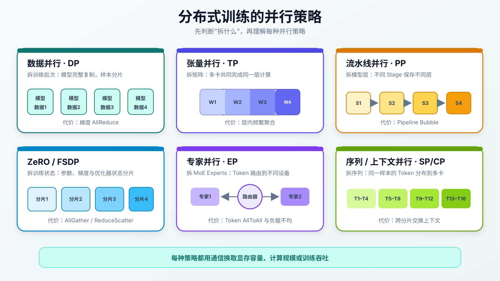
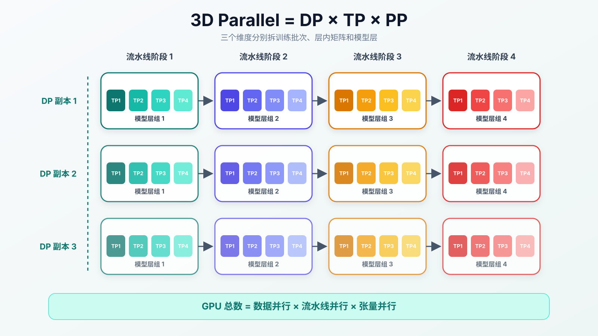

:::important[Problem]
大模型训练中的参数、梯度、优化器状态和激活值往往无法放入单张 GPU，单卡算力也无法在合理时间内处理海量 token；扩展到集群后，通信、空等和故障又会成为新的瓶颈。

**核心问题：如何拆分数据、模型和训练状态，让大量 GPU 能够长期、高效、可恢复地完成同一次优化？**
:::

## 1. 为什么必须进行分布式训练

第 05 章已经介绍了分布式训练在预训练流程中的位置。本章不再重复训练目标，而是具体分析模型如何被拆到多张 GPU 上。

### 1.1 训练显存不只有模型权重

以 70B 参数的 Dense 模型为例，仅 BF16 权重就大约需要：

$$
70\times 10^9\ \text{parameters}\times 2\ \text{bytes}
\approx 140\ \text{GB}
$$

使用 Adam 类优化器训练时，显存还可能包含 BF16 权重、梯度、FP32 master weights（用于稳定更新的主权重副本），以及一阶、二阶动量：

| 状态           | 常见精度    | 每参数字节数 |
| -------------- | ----------- | -----------: |
| 模型权重       | BF16 / FP16 |            2 |
| 梯度           | BF16 / FP16 |            2 |
| Master weights | FP32        |            4 |
| Adam 一阶动量  | FP32        |            4 |
| Adam 二阶动量  | FP32        |            4 |
| 合计           | —           |        约 16 |

因此，不计激活值和临时缓冲区，70B 模型的训练状态就可能达到：

$$
70\times 10^9\times 16\ \text{bytes}\approx 1.12\ \text{TB}
$$

:::note[16 bytes 只是量级估算]
实际显存取决于精度、优化器实现、是否保留 master weights、梯度格式和分片方式。这个估算的作用是说明：训练显存远大于推理时只保存模型权重的显存。
:::

激活值则主要受 batch size（一次训练包含的样本数量）、序列长度、隐藏维度、层数和是否保存中间结果影响。长上下文训练中，即使参数已经分片，激活值仍可能成为主要瓶颈。

### 1.2 计算量与训练时间

对 Dense Decoder-only Transformer，训练计算量可以粗略估算为：

$$
C_{\mathrm{train}}\approx 6ND
$$

其中 $N$ 是参数量，$D$ 是训练 token 数。这个公式只用于估算量级，没有完整计入 Attention、激活重算、通信和其他系统开销。

分布式训练因此需要同时解决：

| 目标     | 对应问题                                                |
| -------- | ------------------------------------------------------- |
| 放得下   | 参数、梯度、优化器状态和激活如何分片                    |
| 算得快   | 如何让多张 GPU 并行执行有效计算                         |
| 同步快   | 如何降低梯度、参数、激活和 token 的通信成本             |
| 利用率高 | 如何减少数据等待、流水线气泡和慢节点拖延                |
| 跑得稳   | 如何处理数值异常、硬件故障和 Checkpoint（训练快照）恢复 |

## 2. 并行策略到底在拆什么

分布式训练中的术语很多，但区分它们最直接的方法是看**拆分对象**：每张 GPU 究竟保存完整副本，还是只保存完整对象的一个分片。



_图 1：不同并行策略分别拆分 batch、层内矩阵、模型层、训练状态、MoE 专家或序列维度。_

| 策略                                 | 拆分对象                    | 主要解决的问题                | 主要通信                                |
| ------------------------------------ | --------------------------- | ----------------------------- | --------------------------------------- |
| Data Parallel（DP）                  | batch                       | 提高样本吞吐                  | AllReduce（汇总后同步给所有卡）         |
| Tensor Parallel（TP）                | 单层矩阵                    | 单层参数或计算放不下          | AllReduce / AllGather（收集所有分片）   |
| Pipeline Parallel（PP）              | 模型层                      | 模型太深、整模放不下          | 相邻 Stage（流水线阶段）的点对点通信    |
| ZeRO / FSDP                          | 参数、梯度、优化器状态      | 数据并行副本的状态冗余        | AllGather / ReduceScatter（汇总后分片） |
| Expert Parallel（EP）                | MoE Experts                 | 专家总参数量过大              | AllToAll（各卡互相交换数据）            |
| Sequence / Context Parallel（SP/CP） | sequence length（序列长度） | 长上下文激活与 Attention 压力 | 序列维通信                              |

## 3. 数据并行：拆分 batch

数据并行让每张 GPU 保存相同的 Replica（完整模型副本），但处理不同的数据分片。每张卡独立完成前向和反向传播，再同步梯度并执行一致的参数更新。

```text
GPU 0：完整模型副本 + 数据分片 0 ─┐
GPU 1：完整模型副本 + 数据分片 1 ─┼─ 汇总梯度 → 同步更新
GPU 2：完整模型副本 + 数据分片 2 ─┤
GPU 3：完整模型副本 + 数据分片 3 ─┘
```

全局 batch size 通常满足：

$$
B_{\mathrm{global}}
=B_{\mathrm{micro}}\times N_{\mathrm{DP}}\times N_{\mathrm{accum}}
$$

其中 $N_{\mathrm{DP}}$ 是数据并行副本数，$N_{\mathrm{accum}}$ 是梯度累积步数。梯度累积表示先连续计算多个 Micro-batch（从 Batch 中切出的微批次）的梯度，再统一更新一次参数。

**DP 提升的是吞吐，不会减少每张卡保存完整模型和训练状态的显存。** 当模型本身放不下时，需要进一步引入 TP、PP 或状态分片。

## 4. 模型并行：拆分矩阵与模型层

### 4.1 张量并行

张量并行把同一层内的大矩阵切成多个分片，交给多张 GPU 共同计算。以线性层 $Y=XW$ 为例，可以沿输出维度拆分权重：

$$
W=[W_1,W_2,\ldots,W_p]
$$

各 GPU 分别计算：

$$
Y_i=XW_i
$$

再通过拼接或集合通信得到完整输出：

$$
Y=[Y_1,Y_2,\ldots,Y_p]
$$

Transformer 中的 Attention 投影和 FFN 大矩阵通常可以成对设计为列并行与行并行，以减少不必要的中间聚合。

:::note[TP 为什么通常放在节点内]
TP 几乎每层都会发生通信，对延迟和带宽非常敏感。因此 TP Group 通常优先使用同一节点内由 NVLink / NVSwitch 连接的 GPU，而不是跨越较慢的节点间网络。
:::

### 4.2 流水线并行

流水线并行按层切分模型。例如，一个 32 层模型可以拆成 4 个 Stage，每个 Stage 保存 8 层，相邻 Stage 之间传递激活值和梯度。

如果整个 Batch 一次通过流水线，其他 Stage 会长时间等待。常见做法是把 Batch 再拆成多个 Micro-batch，使不同 Stage 同时处理不同 Micro-batch。例如，Stage 1 正在处理第 3 个 Micro-batch 时，Stage 2 可以同时处理第 2 个，Stage 3 处理第 1 个。

在最简单的流水线模型中，$p$ 个 Stage 处理 $m$ 个 micro-batch 时，理想利用率可以近似理解为：

$$
U_{\mathrm{pipeline}}\approx\frac{m}{m+p-1}
$$

这里的 Bubble（流水线气泡）是指部分 Stage 没有任务、只能等待的空闲时间。增加 Micro-batch 数可以降低填充和排空带来的 Bubble，但也会增加调度复杂度和激活管理压力。实际系统还会使用 1F1B（一次前向后安排一次反向）和 Interleaved Pipeline（每张卡承担多个交错层段）缩小空闲区间。

## 5. ZeRO / FSDP：拆分训练状态

普通 DP 的每张卡都保存完整参数、梯度和优化器状态，显存冗余与 DP 副本数成正比。ZeRO 和 FSDP 的核心思想是：**把完整训练状态切成多个 Shard（分片），每张卡长期只保存其中一片，需要计算时再临时聚合。**

| 分片阶段                 | 分片对象                                  | 相比普通 DP 的变化       |
| ------------------------ | ----------------------------------------- | ------------------------ |
| ZeRO-1                   | Optimizer states（优化器状态）            | 分摊 Adam 一阶、二阶动量 |
| ZeRO-2                   | Optimizer states + gradients              | 进一步分摊梯度           |
| ZeRO-3 / FSDP Full Shard | Optimizer states + gradients + parameters | 参数也只保存一个分片     |

FSDP / ZeRO-3 的典型层级流程是：

```text
参数分片
  ↓ AllGather
临时得到当前层完整参数
  ↓ Forward / Backward
得到完整梯度
  ↓ ReduceScatter
每张卡只保留自己的梯度分片
```

参数用完后可以立即释放完整副本，降低峰值显存；代价是频繁的 AllGather 和 ReduceScatter。预取、通信计算重叠和合理的分片粒度会直接影响性能。

:::note[ZeRO/FSDP 与 TP 不同]
TP 把一次层内计算拆到多张卡共同完成；ZeRO/FSDP 主要消除训练状态的冗余保存。二者解决的问题不同，也可以组合使用。
:::

## 6. 专家并行与序列并行

### 6.1 专家并行

第 04 章已经介绍了 MoE 的路由与负载均衡，这里只关注它的系统行为：不同 GPU 保存不同 Experts（专家模块），Router（路由器）把 token 发送到目标专家，计算后再把结果发回原位置。

```text
Tokens → Router → AllToAll Dispatch → Experts → AllToAll Combine → Hidden States
```

EP 的主要压力不是矩阵计算本身，而是 token 跨设备移动形成的 AllToAll 通信。这里的 Dispatch 表示把 token 分发给目标专家，Combine 表示把专家结果送回 token 原来的位置。热门专家、容量溢出和跨节点 Expert 放置都会影响整体吞吐。

### 6.2 序列与上下文并行

SP / CP 沿 sequence length 拆分同一个长序列，使多张 GPU 分担激活值和 Attention 计算。与 DP 不同，它们处理的不是不同样本，而是**同一个样本的不同 token 区间**。

由于 Attention 需要建立跨 token 关系，序列切开后仍必须交换 Key、Value 或中间结果。上下文越长，显存收益越重要，通信调度也越复杂。

## 7. 集合通信与集群拓扑

模型被拆开后，通信成为计算图的一部分。下面这些操作不是文件传输，而是 GPU 之间交换训练张量的不同方式。

| 通信操作                     | 直观含义                                     | 常见场景                   |
| ---------------------------- | -------------------------------------------- | -------------------------- |
| AllReduce                    | 各卡数据先相加或求平均，每张卡都获得完整结果 | DP 梯度同步、部分 TP 聚合  |
| AllGather                    | 收集每张卡的分片，让每张卡暂时获得完整张量   | FSDP 参数聚合、TP 输出拼接 |
| ReduceScatter                | 先汇总所有卡的数据，再把结果切成分片发回各卡 | FSDP 梯度分片              |
| AllToAll                     | 每张卡分别向所有其他卡发送不同的数据         | MoE token 分发与结果回收   |
| Point-to-Point（点对点通信） | 在两个相邻设备之间传递数据                   | PP Stage 间激活和梯度      |

并行组需要匹配硬件拓扑：

- **高频、低延迟通信**的 TP 通常放在节点内；
- PP 主要与相邻 Stage 通信，可以跨节点组织；
- DP 通信数据量大，但频率通常低于层内 TP；
- EP 的 AllToAll 对网络拓扑和负载均衡都很敏感。

~~只看 GPU 数量，不看互联拓扑~~无法判断训练系统是否高效。通信量、带宽、延迟与并行组放置必须共同设计。

## 8. 3D Parallel（3D 并行）与 Hybrid Parallel（混合并行）

单一并行方式通常只能解决一种瓶颈。工业训练会组合多种策略，其中经典的 3D Parallel 是：

$$
N_{\mathrm{GPU}}=N_{\mathrm{DP}}\times N_{\mathrm{TP}}\times N_{\mathrm{PP}}
$$



_图 2：每个流水线阶段（Pipeline Stage）内使用 TP 拆分层内矩阵，完整流水线再由多个 DP 副本（Replica）处理不同 Batch。_

例如：

```text
Tensor Parallel   = 8
Pipeline Parallel = 8
Data Parallel     = 32
Total GPUs        = 8 × 8 × 32 = 2048
```

这表示每个 Stage 使用 8 张 GPU 进行 TP，8 个 Stage 组成一个完整模型，再复制 32 组完整 Pipeline 处理不同 Batch 分片。可以把它想象成：**8 人共同完成一章，8 个小组依次完成整本书，再复制 32 条相同的生产线同时处理不同订单。**

更广义的 Hybrid Parallel 还可能叠加：

$$
\mathrm{DP}\times\mathrm{TP}\times\mathrm{PP}
\times\mathrm{EP}\times\mathrm{SP/CP}
$$

ZeRO/FSDP 则可以继续在适合的并行组内分片训练状态。并行度并不是越高越好；每增加一个维度，都会引入新的通信、调度和负载均衡成本。

## 9. 一次训练 Step 如何协同

一次分布式训练 Step 是数据流、计算流、通信流和状态流的组合：

```text
数据读取与样本拼接（DataLoader / Packing）
  ↓
前向传播（Forward）+ 激活保存
  ↓
计算损失值（Loss）
  ↓
反向传播（Backward）+ 激活重计算
  ↓
梯度、参数、激活或 Token 通信
  ↓
优化器更新参数（Optimizer Step）
  ↓
监控 / Checkpoint / 下一批数据
```

训练系统需要尽可能重叠这些工作，例如在一层反向计算时同步上一层梯度，在 GPU 计算时预取下一层参数，在训练继续运行时异步写入 Checkpoint。

## 10. 显存、效率与稳定性优化

### 10.1 显存与计算权衡

| 方法                                   | 节省什么                            | 付出的代价                     |
| -------------------------------------- | ----------------------------------- | ------------------------------ |
| Mixed Precision（混合精度）            | 权重、激活和通信字节                | 数值范围与稳定性管理           |
| Activation Checkpointing（激活重计算） | 不保存全部中间激活                  | 反向传播时重新执行部分前向传播 |
| Gradient Accumulation（梯度累积）      | 用较小 Micro-batch 模拟大 Batch     | 更新频率下降，单步时间增加     |
| ZeRO / FSDP                            | 参数、梯度和优化器状态冗余          | 参数聚合与梯度切分通信         |
| FlashAttention                         | Attention 中间张量与显存访问        | 需要适配内核和硬件             |
| CPU / NVMe Offload（卸载）             | 把部分训练状态暂存到 CPU 内存或硬盘 | 设备传输可能成为瓶颈           |

### 10.2 关注有效吞吐

峰值算力不等于训练效率。模型 FLOPs 利用率（MFU）可以粗略表示为：

$$
\mathrm{MFU}
=\frac{\text{实际模型计算 FLOPs/s}}
{\text{GPU 理论峰值 FLOPs/s}\times N_{\mathrm{GPU}}}
$$

长期训练更应该关注：

$$
\text{有效吞吐}
=\frac{\text{完成有效优化的 token 数}}
{\text{总墙钟时间}}
$$

:::note[单步最快不等于训练最快]
如果一个配置单步很快，却频繁出现 OOM（显存不足）、Loss spike（损失值突然升高）、慢节点、Checkpoint 阻塞或故障回滚，那么它的长期有效吞吐可能更低。工业训练优化的是稳定运行数周后的总完成时间。
:::

### 10.3 常见工程故障

| 问题                | 影响                       | 常见措施                                                             |
| ------------------- | -------------------------- | -------------------------------------------------------------------- |
| 通信瓶颈            | GPU 等待集合通信           | 拓扑感知分组、NCCL（NVIDIA 多 GPU 通信库）调优、通信计算重叠         |
| Pipeline Bubble     | Stage 在填充和排空阶段空闲 | 更多 micro-batch、1F1B、Interleaved Pipeline                         |
| Straggler（慢节点） | 最慢节点拖住同步训练       | 健康检查、节点隔离、负载均衡                                         |
| Loss spike          | 数值异常破坏训练状态       | Warmup（学习率预热）、Gradient Clipping（梯度裁剪）、异常 batch 检测 |
| Checkpoint 过慢     | 大量 GPU 等待存储          | 分片保存、异步写入、增量 Checkpoint                                  |
| 节点故障            | 整个并行组中断             | 自动重启、数据进度恢复、弹性调度                                     |
| MoE 负载不均        | 少数 Expert 成为热点       | 负载均衡、Capacity 管理、合理 Expert 放置                            |

Warmup 表示训练初期逐步提高学习率，避免一开始更新过猛；Gradient Clipping 表示限制过大的梯度，减少参数更新突然失控的风险。

## 11. 训练系统的组织方式

常见框架分别从不同层面组织分布式训练：

| 系统               | 主要能力                                    |
| ------------------ | ------------------------------------------- |
| Megatron-LM        | Tensor、Pipeline、Data、Sequence 等多维并行 |
| DeepSpeed          | ZeRO、混合并行、Offload 与训练系统优化      |
| PyTorch FSDP       | PyTorch 原生的参数、梯度和优化器状态分片    |
| Megatron-DeepSpeed | 组合 Megatron 模型并行与 DeepSpeed 状态分片 |

框架本身不会自动给出最佳方案。最终配置仍取决于模型结构、序列长度、GPU 显存、节点内互联、节点间网络、存储系统和目标 batch size。

## Summary

| 核心知识    | 需要记住的内容                                                     |
| ----------- | ------------------------------------------------------------------ |
| 训练瓶颈    | 权重只是显存的一部分，还要考虑梯度、优化器状态和激活               |
| DP          | 拆 batch、提升吞吐，但不能解决整模放不下                           |
| TP          | 拆层内矩阵，通信频繁，通常优先放在高速节点内互联上                 |
| PP          | 拆模型层，通过 micro-batch 降低 Pipeline Bubble                    |
| ZeRO / FSDP | 分片参数、梯度与优化器状态，减少数据并行冗余                       |
| EP          | 拆 MoE Experts，关键瓶颈是 AllToAll 和负载均衡                     |
| SP / CP     | 拆长序列，降低激活与 Attention 的单卡压力                          |
| 3D Parallel | 用 DP × TP × PP 同时拆 batch、矩阵和模型层                         |
| 集合通信    | AllReduce、AllGather、ReduceScatter、AllToAll 是并行计算图的一部分 |
| 工程目标    | 优化长期有效吞吐，而不是只追求单个 Step 最快                       |
