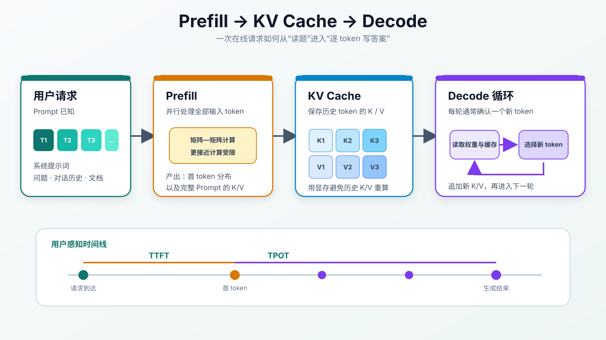
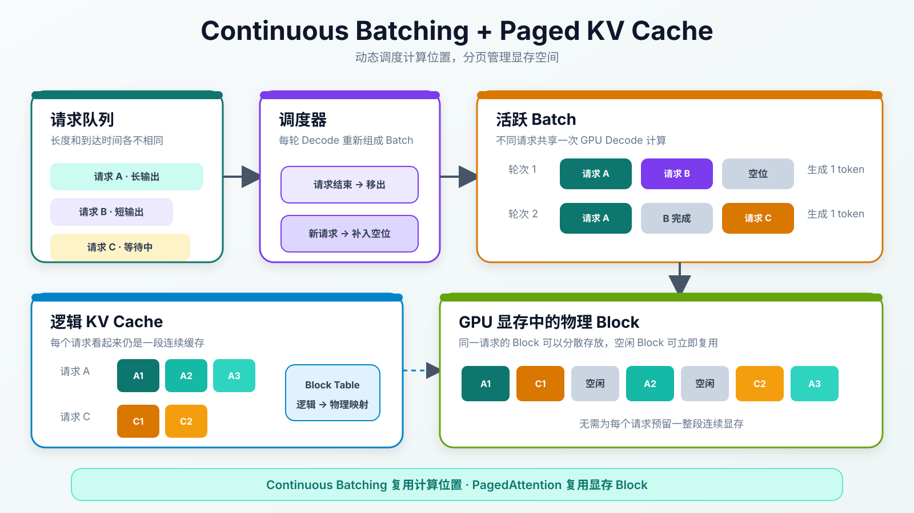

:::important[Problem]
模型训练完成后，参数虽然不再更新，但每个请求仍要逐 token 生成答案；长上下文、高并发和不同输出长度会同时增加计算、显存与调度压力。

**核心问题：如何让固定的大模型在真实流量下兼顾首 token 延迟、生成速度、系统吞吐与服务成本？**
:::

## 1. 从训练切换到推理

推理服务（Inference Serving）负责把训练好的模型作为在线服务运行，它不同于模型解决复杂问题时表现出的推理能力（Reasoning）。训练阶段会通过反向传播更新参数；推理阶段的参数 $\theta$ 已经固定，只执行前向计算。

给定 Context（模型当前能看到的全部 token，包括 Prompt——用户输入的 token 序列——和已经生成的内容）：

$$
f_\theta(\text{context})
\rightarrow P(\text{next token}\mid\text{context})
$$

解码策略（从概率分布中选择具体 token 的规则）选出一个 token，把它追加到 Context，再进行下一次前向计算：

```text
当前上下文
  ↓
模型输出下一个 token 的概率
  ↓
解码策略选择一个 token
  ↓
把新 token 加入上下文
  ↓
继续循环，直到结束
```

**大模型采用自回归生成（根据已有 token 逐个预测下一个 token），不是一次性写出完整答案。** 这意味着生成 500 个 token，通常至少需要数百轮连续 Decode（逐 token 生成）调度。

### 1.1 服务指标

| 指标                         | 回答的问题               | 主要影响因素                                                      |
| ---------------------------- | ------------------------ | ----------------------------------------------------------------- |
| TTFT（首 token 延迟）        | 多久出现第一个 token？   | 排队时间、Prompt 长度、Prefill（输入处理）速度                    |
| TPOT / ITL（token 间隔）     | 后续 token 间隔多久？    | Decode 速度、Batch（批量请求）调度、KV Cache（历史 K/V 缓存）读取 |
| End-to-End Latency（总延迟） | 整个请求多久完成？       | TTFT、输出长度和每 token 速度                                     |
| Throughput（吞吐量）         | 单位时间生成多少 token？ | Batch、GPU 利用率和调度效率                                       |
| Concurrency（并发量）        | 能同时处理多少请求？     | 显存容量、KV Cache 和服务策略                                     |

若输出长度为 $N_{\mathrm{out}}$，可以粗略理解：

$$
T_{\mathrm{total}}
\approx \mathrm{TTFT}
+(N_{\mathrm{out}}-1)\times \mathrm{TPOT}
$$

这个近似忽略了网络传输和调度波动，但能帮助区分“第一个 token 慢”和“后续生成慢”。

## 2. Prefill 与 Decode

一次生成请求包含计算特征完全不同的两个阶段：Prefill 和 Decode。



_图 1：Prefill 并行读取整个 Prompt 并建立 KV Cache；Decode 每轮生成一个新 token，并持续读取和追加缓存。_

| 对比             | Prefill            | Decode                   |
| ---------------- | ------------------ | ------------------------ |
| 任务             | 处理完整 Prompt    | 逐个生成输出 token       |
| 每次处理的 token | 多个已知输入 token | 通常只有最新的一个 token |
| 并行性           | 高，适合大矩阵计算 | 自回归依赖强，轮次串行   |
| 常见瓶颈         | GPU 计算能力       | 显存带宽和 KV Cache 读取 |
| 直接影响         | TTFT               | TPOT / ITL               |
| 直观理解         | 读题               | 写答案                   |

### 2.1 Prefill：先读完输入

Prompt 中所有 token 已知，因此模型可以并行处理整段输入，计算各层 Attention、FFN 和 Hidden States，并建立后续要使用的 KV Cache。

```text
Prompt 越长
  → Prefill 计算越多
  → KV Cache 初始长度越大
  → TTFT 通常越高
```

Prefill 主要进行矩阵—矩阵计算，通常更接近 Compute-bound（计算受限）：GPU 的计算单元是否足够快会显著影响性能。

### 2.2 Decode：逐 token 生成

第 $t+1$ 个 token 依赖第 $t$ 个 token，因此不能把整个答案提前并行算出：

```text
token 1 → token 2 → token 3 → … → token n
```

Decode 每轮计算量相对较小，却要反复读取模型权重和不断增长的 KV Cache，因此通常更接近 Memory-bound（显存带宽受限）。GPU 计算单元可能没有完全占满，但速度仍受显存带宽限制。

:::note[为什么 Prefill 快而 Decode 看起来慢]
Prefill 可以让大量输入 token 同时参与矩阵计算；Decode 存在严格的前后依赖，每一轮通常只确认一个新 token。二者不能只用相同的 FLOPs 指标比较。
:::

## 3. KV Cache：用显存换计算

在 Transformer 的 Attention 中，当前 token 需要使用所有历史 token 的 Key 和 Value。若每轮 Decode 都重新计算历史 K/V，会产生大量重复工作。

KV Cache 会保存历史 token 在每一层的 K/V：

```text
没有 KV Cache：每生成一个 token，都重算全部历史 K/V

使用 KV Cache：只计算新 token 的 K/V，历史 K/V 直接读取
```

KV Cache 大小可以粗略估算为：

$$
M_{\mathrm{KV}}
\approx 2LTH_{\mathrm{KV}}d_{\mathrm{head}}bB
$$

其中：

| 符号                | 含义                        |
| ------------------- | --------------------------- |
| $2$                 | Key 和 Value 两组缓存       |
| $L$                 | Transformer 层数            |
| $T$                 | 每个请求的 Context token 数 |
| $H_{\mathrm{KV}}$   | KV Head 数量                |
| $d_{\mathrm{head}}$ | 每个 Head 的维度            |
| $b$                 | 每个数值占用的字节数        |
| $B$                 | 同时缓存的请求数量          |

公式表明，Context 更长、输出更长或并发更高，都会线性增加 KV Cache。GQA / MQA（减少 KV Head 数量的 Attention 形式）通过减少 KV Head 数量降低缓存压力。

| 场景       | KV Cache 为什么增大              |
| ---------- | -------------------------------- |
| 长 Prompt  | Prefill 后已经保存大量历史 token |
| 长输出     | 每生成一个 token 都要追加 K/V    |
| 高并发     | 每个请求都有独立缓存             |
| 多轮对话   | 历史消息持续进入 Context         |
| 多候选生成 | 多条生成路径可能保存各自缓存     |

常见优化包括 KV Cache 量化、Prefix Cache（前缀缓存）、PagedAttention（分页式缓存管理）、选择性保留和 Chunked Prefill（分块处理长 Prompt）。

## 4. Batching：让 GPU 同时处理更多请求

单个 Decode 请求每轮只计算一个 token，矩阵规模较小。把多个请求合成 Batch，可以增加并行工作量，提高 GPU 利用率。

| 调度方式                           | 做法                             | 主要问题或优势                  |
| ---------------------------------- | -------------------------------- | ------------------------------- |
| Static Batching（静态批处理）      | 等固定数量请求到齐后一起执行     | 实现简单，但在线等待时间较长    |
| Dynamic Batching（动态批处理）     | 在很短的时间窗口内合并请求       | 兼顾一定延迟和吞吐              |
| Continuous Batching（连续批处理）  | 每轮 Decode 都允许请求加入或离开 | 更适合长度不同的流式请求        |
| In-flight Batching（运行中批处理） | 运行中的 Batch 动态增删请求      | 与 Continuous Batching 思想接近 |

### 4.1 为什么静态 Batch 会浪费

假设三个请求分别生成 10、50、100 个 token。短请求完成后，如果它占用的位置不能立即复用，就必须等待最长请求结束。

Continuous Batching 按 Decode 轮次重新调度：

```text
请求完成 → 释放计算位置和 KV Cache
新请求到达 → 在下一轮调度中补入
```

它提高了吞吐，但调度器必须同时考虑请求优先级、剩余显存、Prompt 长度、输出长度和服务等级目标。

:::note[吞吐与延迟的权衡]
等待更多请求组成大 Batch，通常能提高吞吐，却可能增加单个请求的排队时间。在线系统不能只追求最大 Batch，而要根据 TTFT、TPOT 和成本目标动态调整。
:::

## 5. PagedAttention：分页管理 KV Cache

不同请求的长度不同，KV Cache 还会动态增长和释放。如果要求每个请求占用一整段连续显存，容易产生碎片：剩余显存总量足够，但没有一段足够大的连续空间。

PagedAttention 借鉴操作系统分页：

- 逻辑上，一个请求的 KV Cache 仍然连续；
- 物理上，缓存被切成固定大小的 Block（缓存块）；
- 不同 Block 可以分散存放在显存中；
- Block Table（块映射表）负责从逻辑位置找到物理 Block。



_图 2：调度器在 Decode 轮次之间加入或移除请求；KV Cache Manager 用固定大小的 Block 分配和回收显存。_

PagedAttention 的主要价值是：

| 能力          | 作用                             |
| ------------- | -------------------------------- |
| 非连续分配    | 减少寻找大块连续显存的困难       |
| 按 Block 增长 | 请求生成新 token 时逐步扩展缓存  |
| 快速回收      | 请求结束后立即释放对应 Block     |
| 前缀共享      | 多候选或相同前缀可以复用部分缓存 |
| 更高并发      | 降低碎片和预留造成的显存浪费     |

:::note[PagedAttention 不会减少每个 token 的理论 K/V 数量]
它主要改善 KV Cache 的**分配和管理效率**。若要进一步缩小缓存本身，还需要 GQA/MQA、KV 量化、压缩或选择性保留等方法。
:::

## 6. Speculative Decoding：让大模型一次确认多个 token

普通 Decode 每轮通常只确认一个 token。Speculative Decoding（投机解码）使用较小的 Draft Model（草稿模型）先生成多个候选，再由 Target Model（目标大模型）并行验证：

```text
Draft Model 快速生成候选 token
  ↓
Target Model 一次验证多个候选
  ↓
接受连续正确的 token
  ↓
遇到拒绝位置时回退并重新生成
```

若 Draft Model 与 Target Model 的输出分布接近，大模型一次前向可以接受多个 token，从而减少串行 Decode 轮次。

| 因素             | 影响                                 |
| ---------------- | ------------------------------------ |
| Draft Model 质量 | 越接近目标模型，候选接受率通常越高   |
| Draft Model 成本 | 草稿生成本身也消耗算力和显存         |
| 任务分布         | 创造性强或输出不稳定时接受率可能下降 |
| 验证实现         | 需要额外的缓存和调度逻辑             |

投机解码不是免费加速，而是用便宜模型和更复杂的系统换取更少的大模型串行步骤。

## 7. 量化与低精度推理

量化用更少的 bit 表示权重、激活或 KV Cache，以降低显存占用和数据搬运量。

| 精度                 | 典型特点                             |
| -------------------- | ------------------------------------ |
| BF16 / FP16          | 精度稳定，常见部署基线               |
| FP8                  | 显存和吞吐更优，需要硬件与算子支持   |
| INT8                 | 常见部署量化，通常较容易控制质量损失 |
| INT4 / GPTQ / AWQ    | 显存节省明显，但校准和质量风险更高   |
| KV Cache INT8 / INT4 | 直接降低长上下文与高并发缓存压力     |

量化的收益不仅是“模型文件变小”，还包括：每轮 Decode 需要从显存读取的权重和缓存字节减少，因此单位 token 成本可能下降。

~~位数越低一定越好~~并不成立。最终方案需要同时评估模型质量、硬件内核支持、吞吐、延迟和显存收益。

## 8. 多 GPU 推理与 Prefill/Decode 分离

当单卡放不下模型时，推理可以复用第 07 章的 Tensor Parallel（张量并行）、Pipeline Parallel（流水线并行）或 Expert Parallel（专家并行）。区别是推理不保存梯度和优化器状态，重点转向权重读取、KV Cache、请求调度与通信延迟。

Prefill 和 Decode 的资源特征不同，还可以进行阶段分离：

| 阶段    | 主要特征                               | 优化方向                              |
| ------- | -------------------------------------- | ------------------------------------- |
| Prefill | Compute-bound，大量输入 token 并行计算 | 更强计算吞吐、Chunked Prefill         |
| Decode  | Memory-bound，频繁读取权重与 KV Cache  | 更高显存带宽、更好的 Batch 与缓存管理 |

分离部署可以为两阶段独立扩缩容和调度，但需要在节点之间传输 KV Cache，也增加了路由、容错和资源管理复杂度。

## 9. 一个完整推理服务包含什么

成熟推理系统不只是一个加载模型的 HTTP Server（HTTP 服务程序），而是多个模块的协同：

```text
API Gateway（接口网关）
  ↓
Tokenizer（分词器）/ Request Queue（请求队列）
  ↓
Scheduler（调度器）───────────────┐
  ↓                      │
Model Executor（模型执行器）←→ KV Cache Manager（缓存管理器）
  ↓                      │
Sampling（采样）/ Stop Rules（停止规则）───┘
  ↓
Streaming Response（流式响应）+ Metrics（监控指标）
```

| 模块             | 主要职责                                            |
| ---------------- | --------------------------------------------------- |
| API Gateway      | 鉴权、限流、路由和请求协议                          |
| Tokenizer        | 文本与 token 之间转换                               |
| Request Queue    | 保存等待执行的请求                                  |
| Scheduler        | 组成 Batch，控制优先级与显存预算                    |
| Model Executor   | 执行 Prefill 和 Decode                              |
| KV Cache Manager | 分配、增长、复用和回收缓存                          |
| Sampler          | Temperature、Top-k、Top-p（常见采样参数）和停止条件 |
| Streaming Layer  | 把生成 token 持续返回用户                           |
| Metrics          | 记录 TTFT、TPOT、吞吐、错误和 GPU 状态              |

## 10. 常见推理框架的定位

| 框架             | 主要定位                  | 常见能力                                              |
| ---------------- | ------------------------- | ----------------------------------------------------- |
| vLLM             | 高吞吐在线服务            | PagedAttention、Continuous Batching                   |
| TensorRT-LLM     | NVIDIA GPU 性能优化       | Kernel Fusion（算子融合）、低精度、In-flight Batching |
| SGLang           | 复杂生成与 Agent Runtime  | RadixAttention（前缀复用机制）、结构化生成、并发调度  |
| Hugging Face TGI | Hugging Face 模型服务生态 | Continuous Batching、Tensor Parallel                  |
| llama.cpp        | 本地与低成本推理          | GGUF（模型文件格式）、CPU/GPU 混合、INT4/INT8         |

框架没有绝对最优，需要根据硬件、模型结构、并发、上下文长度、延迟目标和运维能力选择。

## 11. 推理服务的核心权衡

| 权衡                          | 需要理解的关系                              |
| ----------------------------- | ------------------------------------------- |
| 吞吐 vs 延迟                  | 更大的 Batch 提高利用率，也可能增加等待时间 |
| 长上下文 vs TTFT              | Prompt 越长，Prefill 计算通常越多           |
| 并发 vs 显存                  | 每个活跃请求都需要 KV Cache                 |
| 输出长度 vs 总延迟            | 自回归 Decode 步数随输出 token 增加         |
| 低精度 vs 质量                | 显存和吞吐收益可能伴随数值误差              |
| 投机速度 vs 系统复杂度        | Draft Model 和验证逻辑会增加资源与调度成本  |
| 单请求速度 vs 单位 token 成本 | 极低延迟配置未必拥有最佳整体吞吐            |

推理服务真正优化的不是某一个孤立指标，而是在服务等级目标下，以可接受成本稳定地交付足够多的有效 token。

## Summary

| 核心知识             | 需要记住的内容                                                |
| -------------------- | ------------------------------------------------------------- |
| 自回归生成           | 模型每轮预测一个新 token，再更新 Context                      |
| Prefill              | 并行处理 Prompt 并建立 KV Cache，主要影响 TTFT                |
| Decode               | 逐 token 生成并读取历史缓存，主要影响 TPOT                    |
| KV Cache             | 用显存保存历史 K/V，避免每轮重复计算                          |
| Continuous Batching  | Decode 过程中动态加入和移除请求，提高 GPU 利用率              |
| PagedAttention       | 用固定 Block 管理非连续 KV Cache，降低显存碎片与预留浪费      |
| Speculative Decoding | 用 Draft Model 提议候选，让 Target Model 一次验证多个 token   |
| 量化                 | 用更低精度减少权重和缓存的显存与带宽成本                      |
| 服务指标             | TTFT 衡量首 token，TPOT 衡量后续速度，Throughput 衡量整体效率 |
| 系统目标             | 在延迟、吞吐、显存、质量和成本之间取得平衡                    |
