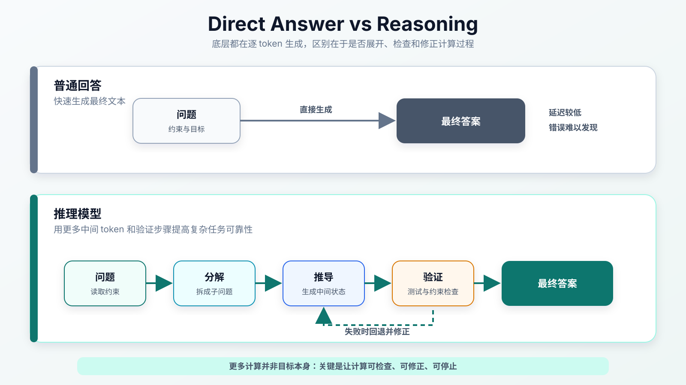
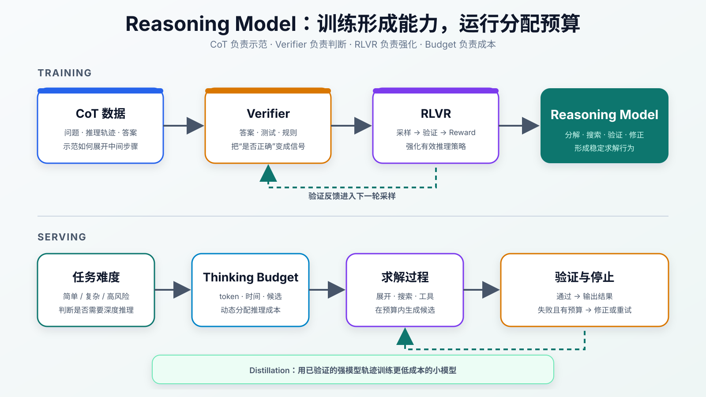

:::important[Problem]
普通 Chat Model（对话模型）可以快速生成流畅答案，但在数学、代码、逻辑和规划等多步任务中，一个中间错误就可能沿生成过程不断放大，最终得到“表达完整但结论错误”的回答。

**核心问题：如何让模型在复杂任务中先分解、推导和验证，再用可控的计算成本输出更可靠的结果？**
:::

## 1. 推理模型解决什么问题

第 08 章的 Inference Serving（推理服务）关注如何更快、更便宜地运行模型；本章的 Reasoning（复杂问题求解能力）关注模型如何组织计算过程。两者都可译为“推理”，但解决的问题不同：

| 对比     | Inference Serving        | Reasoning Model                        |
| -------- | ------------------------ | -------------------------------------- |
| 关注对象 | 服务系统                 | 模型能力                               |
| 核心问题 | token 如何生成得更快     | 复杂问题如何求解得更可靠               |
| 主要指标 | TTFT、TPOT、吞吐和成本   | 正确率、约束满足率和任务成功率         |
| 典型方法 | KV Cache、Batching、量化 | 思维链、结果验证、可验证奖励和推理预算 |

普通回答模式倾向于从问题直接生成答案；推理模型则会展开中间状态：

```text
问题
  → 理解约束
  → 分解目标
  → 推导中间步骤
  → 检查或验证
  → 修正错误
  → 最终答案
```

这类过程更适合**无法一步得到结论、必须保持多项约束、结果能够检查**的任务：

| 任务                    | 为什么需要推理                       |
| ----------------------- | ------------------------------------ |
| 数学                    | 公式变换和中间结论必须成立           |
| 代码                    | 需要满足需求、边界条件和可运行性     |
| 逻辑                    | 前提、中间状态与结论必须一致         |
| Agent（任务执行智能体） | 需要计划、执行、观察并调整动作       |
| 科研分析                | 需要整合证据、检查反例并表达不确定性 |



_图 1：普通回答追求尽快生成结果；推理模型使用更多中间 token、验证和修正步骤换取复杂任务的可靠性。_

## 2. 底层机制没有改变：仍然预测下一个 token

推理模型仍是自回归语言模型。给定问题 $x$ 和输出序列 $y=(y_1,\ldots,y_T)$：

$$
P(y\mid x)
=\prod_{t=1}^{T}P(y_t\mid x,y_{<t})
$$

它没有脱离“预测下一个 token”的机制，变化在于**生成过程如何被组织**：一部分 token 不再只服务于最终表达，而是承担问题分解、候选探索、约束检查和错误修正。

这种做法称为 Test-time Compute Scaling（增加模型求解时的计算量）：对困难问题投入更多推理 token、候选尝试、验证次数和运行时间，以换取更高成功率。

可以把额外计算粗略分成：

$$
C_{\mathrm{reasoning}}
\approx C_{\mathrm{tokens}}+C_{\mathrm{search}}+C_{\mathrm{verify}}
$$

| 计算来源                       | 作用                                   |
| ------------------------------ | -------------------------------------- |
| Reasoning tokens（推理 token） | 记录分解、推导和修正产生的中间状态     |
| Search（候选搜索）             | 尝试不同解法，避免被第一条错误路径锁定 |
| Verification（结果验证）       | 用规则、测试或工具判断候选是否满足约束 |

:::note[Test-time Compute 的边界]
~~生成过程越长，答案就一定越正确~~并不成立。额外计算只有被有效的推理策略和验证机制使用时才有价值；无目标地重复分析只会增加延迟和成本。
:::

## 3. 推理能力如何形成

Prompt（输入提示）可以临时诱导模型展示步骤，但稳定的推理能力通常来自后训练、可验证反馈和推理时策略的共同作用。



_图 2：思维链数据提供推理示范，验证器和可验证奖励强化学习把正确结果转成训练信号；部署时再由动态推理预算控制计算投入，蒸馏用于降低模型成本。_

### 3.1 CoT（思维链）：把复杂问题展开成中间步骤

CoT 的完整名称是 Chain-of-Thought。它让模型先生成中间推理步骤，再给出最终答案：

```text
问题 → 分析步骤 → 中间结论 → 最终答案
```

它降低了复杂任务“一步到位”的难度，但会写出完整步骤不等于步骤正确：

- 推理链可能自洽，但事实或计算错误；
- 前面一个错误可能污染后续所有步骤；
- 更长的推理链会增加新的出错位置；
- 完整暴露中间过程可能带来安全、隐私和可控性风险。

因此，**CoT 解决的是“如何展开”，不是“如何保证正确”**。

### 3.2 Verifier（验证器）：检查结果是否满足约束

Verifier 不评价语言是否流畅，而是判断答案或过程是否满足任务约束。

| 任务     | 可使用的验证方式             |
| -------- | ---------------------------- |
| 数学     | 最终答案匹配、公式和约束检查 |
| 代码     | 编译、静态分析和单元测试     |
| 逻辑     | 检查是否违反前提或规则       |
| 工具调用 | 检查 API、参数与执行结果     |
| 检索问答 | 检查答案是否得到证据支持     |

验证器可以用于筛选训练数据、构造奖励，也可以在模型运行时检查候选答案并触发重试。

:::note[验证器的边界]
验证器只能保证它实际检查的条件。单元测试通过不代表程序没有其他缺陷；最终答案正确也不代表中间推理完全可靠。验证覆盖范围本身也是系统设计的一部分。
:::

### 3.3 RLVR（可验证奖励强化学习）：把正确结果变成训练信号

第 06 章已经介绍过 RLVR 的训练逻辑，本章只关注它与推理模型的关系：如果结果可以自动判断，就能把验证结果转成 Reward（奖励），强化更有效的推理策略。最简单的二值奖励可以表示为：

$$
r(x,y)=
\begin{cases}
1, & V(x,y)=\text{pass}\\
0, & V(x,y)=\text{fail}
\end{cases}
$$

```text
采样解法 → 执行 Verifier → 获得 Reward → 更新模型 → 再次采样
```

RLVR 不只是让模型模仿一条固定推理轨迹，而是让它通过尝试和反馈提高任务成功率。它适合数学、代码和规则明确的任务；开放写作、价值判断等任务很难获得同样可靠的自动奖励。

### 3.4 Reasoning Distillation（推理蒸馏）：把能力迁移给小模型

Reasoning Distillation 使用强模型生成的高质量推理轨迹训练较小模型：

1. 强推理模型生成候选轨迹；
2. Verifier 或测试器筛选正确样本；
3. 小模型学习这些问题—轨迹—答案数据；
4. 评估小模型能否在新问题上保持推理能力。

蒸馏可以降低部署成本，但小模型模仿了推理轨迹，不代表它完整继承了强模型的搜索、纠错和泛化能力。

### 3.5 Thinking Budget（推理预算）：按问题难度分配计算

Thinking Budget 控制一次请求最多使用多少推理 token、时间、候选和验证步骤。

| 任务情况           | 合理策略                   |
| ------------------ | -------------------------- |
| 简单事实或格式转换 | 快速回答，减少额外推理     |
| 数学证明或代码修复 | 增加推导、工具和验证步骤   |
| 约束很多的长任务   | 分阶段规划，并持续检查状态 |
| 预算即将耗尽       | 优先验证关键结论并及时停止 |

固定使用最长推理会造成 Overthinking（过度思考）。更合理的目标是：**简单问题少想，困难问题多想，并在收益不足时停止。**

## 4. 五种机制分别解决什么问题

| 机制            | 核心作用                 | 不能单独解决的问题       |
| --------------- | ------------------------ | ------------------------ |
| CoT             | 展开中间步骤             | 步骤是否正确             |
| Verifier        | 判断结果或约束是否通过   | 未覆盖条件和开放任务质量 |
| RLVR            | 把可验证反馈转成推理能力 | 无法可靠验证的任务       |
| Distillation    | 降低推理模型的部署成本   | 完整继承强模型能力       |
| Thinking Budget | 控制推理时延迟与成本     | 推理策略本身是否有效     |

这五种机制不是互相替代，而是形成分工：**CoT 负责展开，Verifier 负责检查，RLVR 负责学习，Distillation 负责迁移，Thinking Budget 负责成本控制。**

## 5. 代表性实践

| 模型或路线       | 关键设计                                        | 说明的问题                             |
| ---------------- | ----------------------------------------------- | -------------------------------------- |
| OpenAI o 系列    | Reasoning 与更高 Test-time Compute              | 推理时计算成为能力扩展的新维度         |
| DeepSeek-R1-Zero | 不使用 SFT（监督微调）冷启动，直接进行大规模 RL | 可验证奖励可以诱导反思、回溯和修正行为 |
| DeepSeek-R1      | Cold Start（冷启动）数据、多阶段 RL 和蒸馏      | 纯 RL 之外仍需要可读性和综合能力训练   |
| Qwen3            | Thinking / Non-thinking 统一与动态预算          | 推理能力开始与成本控制结合             |
| R1 Distill       | 用强模型轨迹训练较小模型                        | 推理能力可以部分迁移到低成本模型       |

这些路线共同指向三类目标：增强数学、代码和逻辑能力；通过预算和蒸馏控制成本；把推理扩展到工具调用和 Agent 任务。

## 6. 推理模型的挑战与权衡

| 挑战                       | 典型表现                       | 应对方向                       |
| -------------------------- | ------------------------------ | ------------------------------ |
| 过度思考                   | 简单问题也生成很长过程         | 动态预算、快慢模式和提前停止   |
| 推理幻觉                   | 推理链严密，但事实或计算错误   | Verifier、工具、检索和结果校验 |
| Reward Hacking（奖励投机） | 钻评分规则漏洞而未真正解决问题 | 多维奖励、过程监督和红队评测   |
| 训练成本                   | 长轨迹、验证数据和 RL 开销大   | 数据筛选、蒸馏和高效采样       |
| 推理成本                   | Thinking tokens 增加延迟和费用 | 分层路由、预算控制和早停       |
| 可控性                     | 中间过程不可预测或暴露敏感信息 | 隐式推理、输出摘要和边界控制   |
| 安全风险                   | 更强规划能力也可用于危险任务   | 安全奖励、风险分类和场景化拒答 |

推理模型的核心不是单纯“想得更久”，而是决定**什么时候需要推理、推理到什么程度、如何验证以及何时停止**。

## 7. 从推理到行动

推理能力会从纯文本链路继续扩展到工具和环境交互：

```text
Goal
  → Think
  → Act
  → Observe
  → Verify
  → Revise
  → Result
```

Agentic Reasoning（面向行动的推理）要求模型在多步任务中持续判断下一步动作、观察执行结果、验证目标是否完成，并在失败时修正计划。它不是生成更长的 CoT，而是把推理变成**可执行、可观察、可验证的闭环**。

## Summary

| 核心知识          | 需要记住的内容                                         |
| ----------------- | ------------------------------------------------------ |
| 推理模型定位      | 用更多计算展开、验证和修正复杂任务，而不是优化服务吞吐 |
| 底层机制          | 仍然自回归预测下一个 token，变化在生成过程的组织方式   |
| Test-time Compute | 用更多 token、搜索和验证换取更高任务成功率             |
| CoT               | 展开中间步骤，但长推理链不等于正确推理                 |
| Verifier          | 检查答案或过程是否满足可验证条件                       |
| RLVR              | 用可验证奖励强化有效的推理策略                         |
| Distillation      | 将强模型的推理轨迹迁移给较小模型                       |
| Thinking Budget   | 根据任务难度动态控制推理成本                           |
| 主要风险          | 过度思考、推理幻觉、奖励投机、成本、可控性与安全       |
| 演进方向          | 从文本思维链走向可执行、可观察、可验证的 Agent 闭环    |
