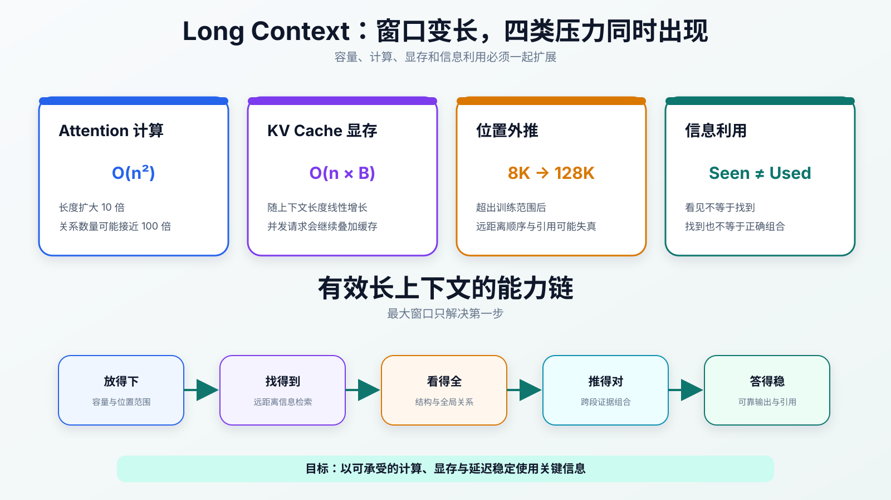
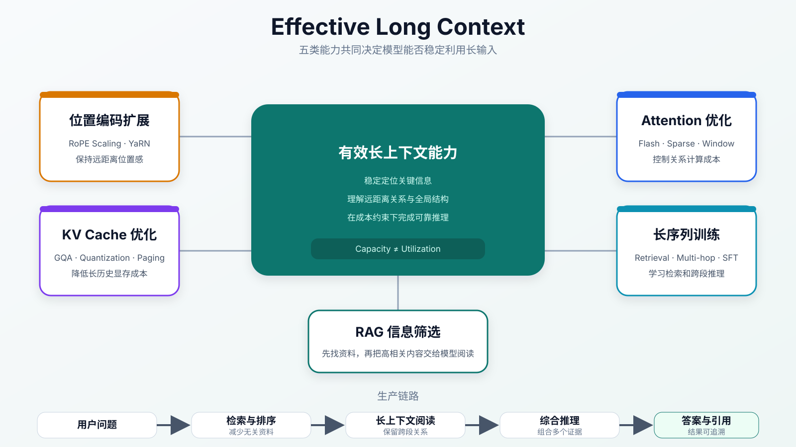

:::important[Problem]
论文、代码仓库、长期对话和 Agent（任务执行智能体）轨迹可能包含数万到数百万个 token。扩大输入窗口虽然能容纳更多信息，却会同时增加 Attention（注意力）计算、KV Cache（历史 K/V 缓存）显存和位置外推压力，模型还可能找不到或错误组合关键信息。

**核心问题：如何让模型不只“放得下”长输入，还能以可承受的成本找得到、看得全、推得对并答得稳？**
:::

## 1. 长上下文改变了什么

Context Window（上下文窗口）是模型一次请求中能够看到的 token 范围，包括系统提示、用户输入、文档、对话历史、工具结果以及已经生成的内容。

设上下文序列为：

$$
X=(x_1,x_2,\ldots,x_n)
$$

语言模型仍然根据当前上下文预测下一个 token：

$$
P(x_{n+1}\mid x_1,x_2,\ldots,x_n)
$$

窗口变长后，模型能够从处理一个短问题扩展到处理一组完整资料：

| 场景         | 短上下文的限制                      | 长上下文带来的变化           |
| ------------ | ----------------------------------- | ---------------------------- |
| 长文档问答   | 只能输入摘要或局部片段              | 阅读完整论文、合同或报告     |
| 代码仓库分析 | 只能检查少量文件                    | 综合模块、调用链、配置与测试 |
| 多轮对话     | 较早约束容易离开窗口                | 保留更长的意图和任务状态     |
| Agent 任务   | 中间动作和错误记录容易丢失          | 维持计划、工具结果和修正轨迹 |
| 多模态任务   | 图像、音频或视频 token 很快占满窗口 | 处理更完整的跨模态信息流     |

**最大上下文长度只表示“最多能输入多少”，不表示模型能够同等有效地使用每个位置的信息。** 真正的长上下文能力由模型结构、训练数据、推理系统和评估方式共同决定。

## 2. 长上下文的四类瓶颈



_图 1：序列变长会同时放大 Attention、KV Cache、位置外推和信息利用问题；窗口容量只是有效长上下文的起点。_

### 2.1 Attention：关系数量近似二次增长

标准 Self-Attention（自注意力）会计算 token 之间的两两关系。长度为 $n$、单个注意力头维度为 $d$ 时，主要计算量近似为：

$$
O(n^2d)
$$

忽略维度和常数，仅比较 $n^2$ 关系数量：

| 上下文长度 |          关系数量量级 | 相对 4K 的倍率 |
| ---------: | --------------------: | -------------: |
|         4K |    约 $1.7\times10^7$ |           1 倍 |
|        32K |    约 $1.1\times10^9$ |          64 倍 |
|       128K | 约 $1.7\times10^{10}$ |        1024 倍 |
|         1M |          约 $10^{12}$ |    约 6.6 万倍 |

上下文扩大 10 倍时，全量 Attention 的关系数量可能接近扩大 100 倍。

:::note[FlashAttention 解决什么]
FlashAttention（减少 Attention 显存读写的高效实现）通过分块计算和更好的 IO 调度降低显存访问与中间结果开销，但它没有从理论上消除标准全量 Attention 的 $O(n^2)$ 关系数量。
:::

### 2.2 KV Cache：显存随上下文和并发增长

第 08 章已经解释了 KV Cache 的结构。对于长上下文，本章只关注它的增长关系：

$$
M_{\mathrm{KV}}
\propto L\times n\times H_{\mathrm{KV}}
\times d_{\mathrm{head}}\times b\times B
$$

其中 $n$ 是上下文长度，$B$ 是并发请求数。上下文变长会线性扩大单请求缓存；并发增加时，每个活跃请求又需要维护自己的历史 K/V。

因此，长上下文服务常出现这样的矛盾：**单个请求可以运行，但多个长请求同时到达后发生显存不足或排队。**

### 2.3 位置编码：超过训练长度后能否保持位置感

模型不仅要看到 token，还要知道顺序和距离。RoPE（旋转位置编码）等方法通常在有限长度的数据上训练；如果模型训练时主要见过 8K 序列，运行时直接输入 128K，就会遇到 Position Extrapolation（位置外推）问题。

可能出现的现象包括：

- 远距离引用关系变得不稳定；
- 靠后位置的理解质量下降；
- 文档章节顺序或依赖关系混乱；
- 输入能够被接收，但回答质量明显退化。

### 2.4 信息利用：看见不等于找到和理解

窗口变大并不会自动提高信息利用率。模型可能：

- 更关注开头和结尾，忽略中间位置；
- 找不到已经放入上下文的关键事实；
- 混淆相似、重复或冲突的信息；
- 理解单个片段，却无法组合全局结论；
- 在长生成过程中忘记前面的格式和业务约束。

因此，长上下文能力需要依次满足：

```text
放得下 → 找得到 → 看得全 → 推得对 → 答得稳
```

## 3. 五类核心技术方案

长上下文不是某一个参数或算子的能力，而是五类技术共同作用的结果。



_图 2：位置编码扩大可理解范围，Attention 和 KV Cache 优化控制系统成本，长序列训练提高信息利用率，检索系统在输入前筛选有效资料。_

### 3.1 位置编码扩展

位置编码扩展的目标不是简单允许更大的位置编号，而是让模型在远距离位置上仍能保持稳定的顺序和相对距离表示。

| 方法                              | 核心思路                                         | 需要注意的边界                         |
| --------------------------------- | ------------------------------------------------ | -------------------------------------- |
| RoPE Scaling（RoPE 缩放）         | 调整位置或频率尺度，将较短训练范围扩展到更长序列 | 扩展过大可能损害短程或长程关系         |
| NTK-aware Scaling（频率感知缩放） | 更细致地调整不同维度的 RoPE 频率                 | 仍需通过长文本任务验证效果             |
| YaRN（平滑位置扩展方法）          | 组合插值、频率调整和训练策略，减轻长度扩展退化   | 参数配置与训练长度相关                 |
| ALiBi（线性位置偏置）             | 在 Attention Score 中加入随距离变化的偏置        | 位置机制与 RoPE 不同，不能直接等价替换 |

~~配置文件允许 128K 输入~~不代表模型已经获得稳定的 128K 理解能力。位置扩展通常还需要继续训练和长上下文评估。

### 3.2 Attention 优化

不同方法分别从“实现更高效”“减少关系数量”和“拆到多卡”三个方向降低长序列成本：

| 方法                                                         | 如何降低压力                              | 主要代价或限制               |
| ------------------------------------------------------------ | ----------------------------------------- | ---------------------------- |
| FlashAttention                                               | 保留全量 Attention，优化分块计算与显存 IO | 理论关系数量仍是二次增长     |
| Sparse Attention（稀疏注意力）                               | 只计算部分重要位置之间的关系              | 稀疏模式可能漏掉关键关系     |
| Sliding Window Attention（滑动窗口注意力）                   | 每个 token 主要关注附近窗口               | 远距离信息需要额外传递机制   |
| Global + Local Attention（全局与局部注意力）                 | 少量位置负责全局汇聚，其余位置关注局部    | 需要设计哪些位置承担全局角色 |
| Block Attention（分块注意力）                                | 按块组织长序列关系与计算                  | 块之间的信息交换仍需设计     |
| Context Parallel（上下文并行）/ Ring Attention（环形注意力） | 沿序列维度把同一个长样本拆到多张 GPU      | 增加跨卡通信与调度复杂度     |

Attention 优化不存在统一最优方案。局部注意力更便宜，但可能损失全局关系；全量注意力信息完整，却更消耗计算和显存。

### 3.3 KV Cache 优化

第 08 章已经详细介绍了 PagedAttention 等机制。面向长上下文时，可以按“缩小缓存、复用缓存、改善管理、避免阻塞”理解：

| 方法                                   | 对长上下文的作用                                  |
| -------------------------------------- | ------------------------------------------------- |
| GQA / MQA（减少 KV Head 的 Attention） | 减少每个 token 需要保存的 K/V 数量                |
| KV Cache Quantization（缓存量化）      | 用 INT8、INT4 等低精度减少单个数值占用            |
| PagedAttention（分页式缓存管理）       | 减少动态增长缓存造成的显存碎片                    |
| Prefix Cache（前缀缓存）               | 复用相同系统提示、文档前缀或对话历史              |
| Chunked Prefill（分块输入处理）        | 避免一个超长 Prompt（输入提示）长时间阻塞其他请求 |
| KV Cache Compression（缓存压缩）       | 筛选、聚合或压缩历史 token 的缓存表示             |

这些方法解决的问题不同：PagedAttention 改善分配效率，却不会减少理论 K/V 数量；量化和压缩可以缩小缓存，但可能引入精度损失。

### 3.4 长上下文训练

只在运行时扩大窗口并不够。模型需要通过长序列数据学习远距离检索、干扰过滤、跨段推理和全局一致性。

| 训练方式                             | 学习目标                                 |
| ------------------------------------ | ---------------------------------------- |
| 长序列继续预训练                     | 适应更长的 token 分布和位置范围          |
| 真实长文档                           | 学习论文、代码、合同和报告的整体结构     |
| Needle in a Haystack（大海捞针任务） | 从大量干扰信息中定位一条关键事实         |
| Multi-hop Reasoning（多跳推理）      | 组合多个远距离片段得到答案               |
| 长上下文 SFT（监督微调）             | 按指令完成长文档问答、代码分析和对话总结 |

:::note[长训练数据不等于短文本拼接]
把许多互不相关的短样本拼成一个长序列，只能增加 token 数量。有效训练数据还要包含远距离依赖、相似内容干扰、跨段证据和需要保持全局一致的任务目标。
:::

### 3.5 长上下文与 RAG（检索增强生成）

RAG 的完整名称是 Retrieval-Augmented Generation。它与长上下文不是替代关系：

| 能力     | 长上下文                     | RAG                            |
| -------- | ---------------------------- | ------------------------------ |
| 主要问题 | 模型一次能够综合阅读多少信息 | 应该从知识库中选择哪些信息     |
| 优势     | 保留更完整的材料和跨段关系   | 减少噪声、成本低、知识更新灵活 |
| 风险     | 输入越长，成本和干扰越大     | 检索遗漏后，模型看不到关键证据 |

更合理的链路是：

```text
用户问题
  → RAG 检索、过滤和排序资料
  → 把高相关材料放入长上下文
  → 模型跨材料推理
  → 输出答案、引用和不确定性
```

**RAG 负责找资料，长上下文负责读资料。** 把知识库全部塞入窗口既昂贵，也可能让无关内容掩盖真正证据。

## 4. 如何评估长上下文能力

最大支持 token 数只是容量指标。评估必须同时覆盖能力和系统成本：

| 评估维度       | 核心问题                     | 示例                                                               |
| -------------- | ---------------------------- | ------------------------------------------------------------------ |
| 信息检索       | 能否在不同位置找到关键事实   | 多针检索、相似干扰和不同深度位置                                   |
| 长文档理解     | 能否理解章节、约束和整体结论 | 论文、合同、财报和代码仓库问答                                     |
| 跨段推理       | 能否组合多个远距离证据       | 多文档、多时间点和多跳问题                                         |
| 抗干扰与可追溯 | 能否区分重复、冲突和无关信息 | 引用证据、报告冲突和表达不确定性                                   |
| 系统成本       | 长请求能否在生产环境运行     | TTFT（首 token 延迟）、TPOT（token 间隔）、KV 显存、并发和单次成本 |

评估时还需要改变关键信息的位置、上下文长度、干扰数量和问题类型，避免模型只适应固定模板。

:::note[漏掉关键细节比直接失败更危险]
合同问答漏掉免责条款、代码分析漏掉异常分支时，模型仍可能生成流畅结论。因此长上下文评估应要求答案携带引用或证据位置，便于检查模型实际使用了哪些内容。
:::

## 5. 长上下文不等于长期记忆

Context 是当前请求中模型能够看到的信息；请求结束后，模型不会自动把所有内容永久保存。不断追加历史记录还会增加成本、噪声和冲突。

更完整的 Agent 信息系统通常会分层：

```text
短期上下文：当前请求与最近交互
工作记忆：任务计划、中间状态和待验证结论
长期记忆：稳定的用户偏好、项目事实和历史结论
外部知识库：可检索、可更新、可追溯的资料
```

长上下文负责一次读取更多信息；记忆系统还必须决定**写入什么、何时检索、如何更新、发生冲突时相信什么以及何时删除**。

## 6. 长上下文的核心权衡

| 权衡                       | 需要理解的关系                    |
| -------------------------- | --------------------------------- |
| 窗口长度 vs Attention 成本 | 全量关系数量随长度近似二次增长    |
| 上下文长度 vs KV 显存      | 单请求缓存随 token 数近似线性增长 |
| 输入完整性 vs 信息噪声     | 材料更多不代表有效证据比例更高    |
| 局部效率 vs 全局关系       | 稀疏或滑动窗口可能遗漏远距离依赖  |
| 检索精度 vs 阅读范围       | RAG 先筛选，长上下文再综合阅读    |
| 最大容量 vs 有效利用       | 能接收输入不代表能稳定定位和推理  |

长上下文优化的目标不是机械增加 token 上限，而是用可接受的计算、显存和延迟，稳定利用真正与任务相关的信息。

## Summary

| 核心知识       | 需要记住的内容                                         |
| -------------- | ------------------------------------------------------ |
| 长上下文定位   | 让模型从短问答扩展到完整资料和复杂任务处理             |
| Attention 成本 | 标准全量 Attention 的关系数量随长度近似二次增长        |
| KV Cache       | 单请求缓存随上下文增长，并与并发共同占用显存           |
| 位置外推       | 位置编码必须在超过训练长度后仍保持稳定位置感           |
| 有效利用       | 长上下文需要做到放得下、找得到、看得全、推得对、答得稳 |
| Attention 优化 | 在全量高效计算、稀疏关系和多卡拆分之间权衡             |
| 长序列训练     | 通过真实长文档、远距检索和多跳推理学习使用长信息       |
| RAG 组合       | RAG 负责找资料，长上下文负责综合阅读资料               |
| 评估           | 同时检查检索、理解、推理、抗干扰、证据和系统成本       |
| 记忆边界       | 长窗口是当前可见信息，不等于持久、可管理的长期记忆     |
