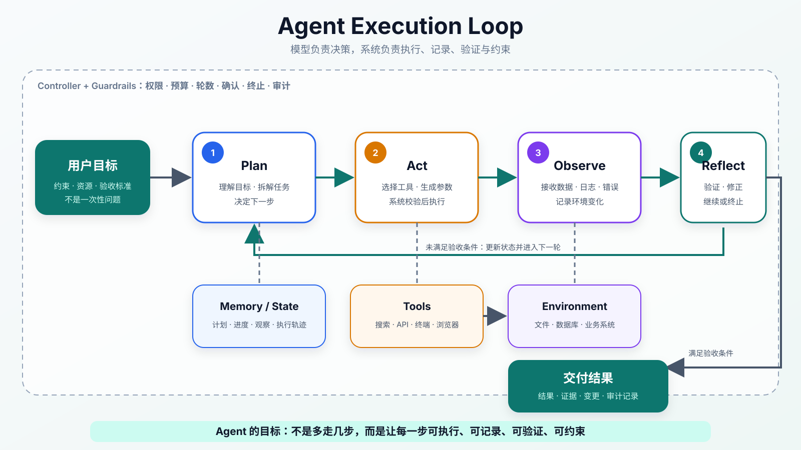

:::important[Problem]
普通 LLM 可以解释问题、生成文本和提出建议，但它不会天然访问数据库、运行代码、保存任务进度，也无法仅凭一句“已经完成”证明真实任务确实成功。复杂任务还需要连续执行多个动作，并根据环境反馈及时修正。

**核心问题：如何把 LLM 放入一个有工具、有状态、有反馈、有权限边界的执行闭环，让它能够围绕目标持续行动，同时保证每一步可控、可验证、可恢复？**
:::

## 1. Agent 是什么

Agent（任务执行智能体）不是一个独立模型，也不是一段固定 Prompt（提示词），而是以 LLM 为决策核心的任务执行系统。

| 对比             | 普通 LLM 应用          | Agent 应用                         |
| ---------------- | ---------------------- | ---------------------------------- |
| 输入             | 一个问题或指令         | 一个需要完成的目标                 |
| 主要过程         | 根据已有上下文生成回答 | 规划、调用工具、观察结果并继续决策 |
| 与外部环境的关系 | 通常只读取当前输入     | 可以通过受控工具读取或改变外部状态 |
| 状态             | 一次请求结束后通常停止 | 显式记录计划、进度、观察和失败     |
| 输出             | 一段文本               | 执行动作后的结果、证据和过程记录   |
| 成功标准         | 回答看起来合理         | 任务的验收条件被真实满足           |

普通问答和 Agent 的最小流程分别是：

```text
普通 LLM：用户问题 → 模型回答

Agent：用户目标 → 制定计划 → 调用工具 → 观察结果
                         ↑              ↓
                         └──── 修正与继续 ────┘
```

一个完整 Agent 通常包含五个部分：

$$
\text{Agent}
=\text{LLM}
+\text{Tools}
+\text{Memory/State}
+\text{Controller}
+\text{Guardrails}
$$

| 组成                         | 负责什么                                       |
| ---------------------------- | ---------------------------------------------- |
| LLM                          | 理解目标、形成计划、选择动作和总结结果         |
| Tools（工具）                | 连接搜索、数据库、浏览器、代码执行器和业务 API |
| Memory / State（记忆与状态） | 保存任务约束、进度、中间结果和执行轨迹         |
| Controller（执行控制器）     | 调度每一步，处理重试、预算、暂停和终止         |
| Guardrails（安全边界）       | 限制权限、成本和高风险动作，并保留审计记录     |

:::note[Agent 是系统，不是模型]
LLM 负责提出下一步动作，但真正的权限检查、参数校验、工具执行、状态保存和风险控制由系统完成。仅仅让模型连续回复多轮，并不能构成可靠的 Agent。
:::

## 2. Agent 如何工作

Agent 的核心是 **Plan → Act → Observe → Reflect** 闭环。



_图 1：LLM 在控制器和安全边界内完成规划、行动、观察与修正；工具连接外部环境，状态系统保存任务进度，满足验收条件后才交付结果。_

| 阶段            | 中文理解               | 核心问题             | 典型产物                   |
| --------------- | ---------------------- | -------------------- | -------------------------- |
| Plan（规划）    | 理解目标并决定下一步   | 现在最需要解决什么？ | 任务计划或下一动作         |
| Act（行动）     | 选择工具并生成参数     | 应该调用什么能力？   | 结构化工具请求             |
| Observe（观察） | 接收环境返回的真实结果 | 动作发生了什么？     | 数据、日志、错误或文件变化 |
| Reflect（复盘） | 判断是否成功并调整计划 | 结果满足目标了吗？   | 继续、重试、改道或终止     |

例如，面对“分析项目最近一次构建失败并给出修复建议”，Agent 可能执行：

```text
读取构建日志
  → 定位失败阶段和错误信息
  → 搜索相关代码与配置
  → 检查最近改动
  → 必要时运行局部测试
  → 根据结果修正判断
  → 汇总原因、证据与建议
```

这个过程不是一次生成。每一次工具返回都会形成新的观察，改变下一步决策。

## 3. 五项核心能力

### 3.1 工具调用：把语言意图变成真实动作

模型本身不能直接查询订单、读取私有文件或运行命令。工具调用通过 Function Calling（函数调用）等机制，让模型生成结构化请求，再由应用系统验证并执行。

一个工具至少需要说明：

| 配置                        | 作用                                   |
| --------------------------- | -------------------------------------- |
| 名称与描述                  | 告诉模型工具能做什么、何时使用         |
| Tool Schema（工具结构约束） | 定义参数名称、类型、必填项和允许值     |
| 返回格式                    | 让模型能够稳定理解成功、空结果与错误   |
| 权限范围                    | 限制工具可以访问的数据和操作           |
| 失败策略                    | 规定超时、重试和降级方式               |
| 确认机制                    | 在写入、删除、支付等动作前请求用户确认 |

模型生成的只是调用请求：

```json
{
	"tool": "search_docs",
	"input": {
		"query": "退款失败 ERR-7782 原因",
		"top_k": 5,
		"source": "wiki"
	}
}
```

应用侧收到请求后仍要检查权限和参数，再调用真实接口，把结果作为 Observation（观察结果）返回给模型。

:::note[模型提议，系统执行]
模型输出“删除文件”不代表文件已经删除，也不应该直接获得删除权限。生产系统必须把动作表达与真实执行分开，在中间加入参数校验、权限判断、用户确认和审计。
:::

工具设计还要考虑 Idempotency（幂等性）：同一个写操作因为超时而被重复调用时，不应重复扣款、重复发送消息或生成多份相同数据。

### 3.2 记忆与状态：记录任务进行到哪里

Agent 的“记忆”不只是聊天记录。长任务需要保存原始目标、已经完成的步骤、工具结果、失败信息和待验证结论。

| 类型       | 保存什么                                      |
| ---------- | --------------------------------------------- |
| 短期上下文 | 当前对话、最近观察和当前约束                  |
| 工作状态   | 当前计划、完成步骤、下一动作和中间结论        |
| 长期记忆   | 用户偏好、项目背景和经过验证的历史事实        |
| 外部记忆   | RAG（检索增强生成）、数据库、文件系统和知识库 |
| 执行轨迹   | 每一步工具调用、输入输出、错误、重试和确认    |

<details>
<summary>一个简化的任务状态示例</summary>

```json
{
	"goal": "分析构建失败原因",
	"plan": ["读取日志", "定位错误", "检查代码", "验证结论"],
	"completed_steps": ["读取日志", "定位错误"],
	"current_step": "检查代码",
	"observations": ["失败发生在 test 阶段", "payment 模块出现空指针异常"],
	"next_action": "检查 payment 模块最近变更",
	"status": "running"
}
```

</details>

显式状态可以减少重复执行、遗忘目标和前后矛盾，也让任务在暂停或故障后更容易恢复。状态中的事实仍需要记录来源和更新时间，不能把模型猜测永久写成可靠记忆。

### 3.3 规划与控制：会拆任务，也知道何时停止

面对复杂目标，Agent 可以采用两种基本规划方式：

| 方式     | 做法                       | 适合场景                       |
| -------- | -------------------------- | ------------------------------ |
| 显式规划 | 先生成整体步骤，再逐步执行 | 报告生成、数据分析、代码迁移   |
| 动态规划 | 每次根据最新观察决定下一步 | 故障排查、网页操作和探索性研究 |

规划必须受到 Controller 的约束。常见控制参数包括最大执行轮数、工具调用次数、token 或费用预算、允许使用的工具、是否允许写操作、失败重试次数以及终止条件。

~~让 Agent 一直执行，直到它自己认为完成~~容易产生重复搜索、无效重试和成本失控。更可靠的做法是预先定义验收标准和停止条件。

### 3.4 反馈与校验：完成必须有证据

工具返回成功不一定代表业务目标已经完成，模型生成流畅结论也不代表结论正确。校验可以分为：

| 校验层次       | 示例                             |
| -------------- | -------------------------------- |
| 工具结果校验   | API 状态码正确，返回字段完整     |
| 任务结果校验   | 测试通过、文件生成、数据写入成功 |
| 事实一致性校验 | 结论有文档、日志或数据库记录支持 |
| 规则校验       | 输出格式、权限和安全策略均满足   |
| 人工确认       | 发布、删除、支付或发送消息前确认 |

代码修改类 Agent 的“完成”链路应该是：

```text
修改代码 → 运行测试 → 检查结果
                    ├─ 通过 → 交付修改和证据
                    └─ 失败 → 分析错误并调整方案
```

**Agent 应根据外部结果判断是否成功，而不是只依赖模型对自己的评价。**

### 3.5 安全边界：行动能力越强，约束越重要

当模型连接真实系统后，错误会从“回答错了”升级为“执行错了”。安全设计需要覆盖：

- 默认使用最小权限，只向当前任务开放必要工具；
- 区分只读与写入操作，写操作采用更严格的确认策略；
- 敏感数据进入模型前进行脱敏和访问控制；
- 所有工具调用、确认、失败和重试都进入审计日志；
- 高风险动作需要人工确认，并为可逆操作准备回滚机制；
- 达到预算、轮数或异常阈值时强制停止。

Guardrails 不能只写在 Prompt 中。真正的边界还要落实在权限系统、沙箱、工具网关和业务 API 上。

## 4. 常见执行模式

| 模式                             | 核心思路                         | 适合场景               | 主要风险                   |
| -------------------------------- | -------------------------------- | ---------------------- | -------------------------- |
| ReAct（推理与行动交替）          | 根据当前观察边分析边行动         | 搜索、排障和探索性任务 | 容易走弯路或循环调用       |
| Plan-and-Execute（先规划后执行） | 先形成整体计划，再逐项完成       | 结构较清晰的长任务     | 初始计划错误会影响后续步骤 |
| Reflection（执行后复盘）         | 完成一步或一轮后检查并修正       | 代码、报告和可验证任务 | 自我检查不能替代外部验证   |
| Workflow Agent（工作流智能体）   | 流程由系统限定，模型负责局部判断 | 企业流程和低风险自动化 | 灵活性低于开放式 Agent     |

这些模式不是互相排斥的。生产系统常用固定 Workflow 控制主干，在少数需要理解和判断的节点使用 ReAct 或动态规划，并在关键动作前后加入验证。

## 5. Agent 为什么容易在长任务中失败

Agent 的执行链由多个不确定步骤组成。某一步错误可能被写入状态，并成为后续决策的错误前提。

在一个简化假设中，如果每一步独立成功的概率都是 $p$，连续 $n$ 步全部成功的概率为：

$$
P(\text{all success})=p^n
$$

即使单步成功率为 $95\%$，连续 10 步全部成功的概率也只有：

$$
0.95^{10}\approx 59.9\%
$$

这不是实际 Agent 的精确评估公式，因为步骤通常并不独立、失败也可能被修复；它说明的是：**单步看起来可靠，并不等于长链路可靠。**

| 问题           | 典型表现                         | 主要治理方式                      |
| -------------- | -------------------------------- | --------------------------------- |
| 目标不清晰     | Agent 自行猜测范围，执行方向偏离 | 任务澄清、约束和验收标准          |
| 规划不稳定     | 步骤遗漏，同一任务路径差异很大   | 阶段计划、Workflow 和关键步骤确认 |
| 工具调用错误   | 选错工具、参数错误或忽略异常     | Schema、参数校验和结构化错误      |
| 长链路错误累积 | 后续步骤建立在错误观察上         | 分阶段验证、状态快照和回退        |
| 状态丢失       | 重复执行、忘记约束、无法恢复     | 显式状态、事件日志和持久化        |
| 结果不可验证   | 表面上宣布完成，实际任务失败     | 测试、规则、证据和人工审核        |
| 安全风险       | 越权访问、误发消息或删除数据     | 最小权限、沙箱、确认和审计        |
| 成本失控       | 循环调用、响应缓慢、费用过高     | 预算、最大轮数、缓存和模型路由    |

:::note[生产重点是受控执行]
Agent 真正的难点不是让模型“想到下一步”，而是让每一步都能够执行、记录、验证和约束，并在错误出现时停止、回退或交给人处理。
:::

## 6. 从低风险到可控自主执行

Agent 不应一开始就获得完整写权限。更稳妥的落地顺序是：

| 阶段            | Agent 可以做什么                         | 人的角色                 |
| --------------- | ---------------------------------------- | ------------------------ |
| 只读型 Agent    | 检索文档、读取日志、分析代码和提出结论   | 检查结论与证据           |
| 建议型 Agent    | 生成操作计划、修改建议或待执行命令       | 决定是否执行             |
| 半自动 Workflow | 在固定流程中自动完成低风险步骤           | 确认关键节点和异常       |
| 可控自主执行    | 在明确权限、预算和回滚机制内执行多步任务 | 处理高风险动作与升级事件 |

自主程度提高前，需要先证明系统具备可观测性和恢复能力，而不是只比较模型回答质量。

## 7. 如何评估 Agent

Agent 评估不能只检查最终文字，还要检查执行过程：

| 评估维度   | 关注的问题                                    |
| ---------- | --------------------------------------------- |
| 任务成功率 | 最终验收条件是否真的满足                      |
| 工具正确性 | 是否在正确时间选择正确工具并生成正确参数      |
| 过程效率   | 是否存在重复步骤、无效搜索和不必要调用        |
| 状态一致性 | 计划、观察、完成步骤和最终结论是否一致        |
| 可恢复性   | 超时、工具失败和任务中断后能否安全继续        |
| 成本与延迟 | token、工具调用、运行时间和资源消耗是否可接受 |
| 安全性     | 是否发生越权、高风险误操作或敏感信息泄露      |
| 人工介入率 | 哪些任务经常需要确认、纠正或接管              |

评估样本应覆盖正常路径、工具超时、空结果、权限不足、冲突信息、重复调用和高风险动作，避免只测试“所有工具都成功”的理想情况。

## 8. Agent 的能力边界

Agent 把 LLM 的语言和推理能力转化为行动，但不会自动消除模型的不确定性。它仍可能误解目标、生成错误参数、相信不可靠工具结果或在长链路中丢失约束。

未来的 Agent 会进一步结合更稳定的工具接口、Computer Use（界面操作能力）、长期记忆、多 Agent 协作和更系统的安全评估。但演进方向不是无限增加自主性，而是提高**任务成功率、可控性、可追踪性和单位成本下的有效行动能力**。

## Summary

| 核心知识   | 需要记住的内容                                       |
| ---------- | ---------------------------------------------------- |
| Agent 定位 | Agent 是任务执行系统，不是单独模型或固定 Prompt      |
| 系统组成   | LLM、工具、记忆与状态、控制器和安全边界共同工作      |
| 执行闭环   | Plan、Act、Observe、Reflect 根据环境反馈持续推进任务 |
| 工具调用   | 模型生成调用请求，应用负责权限、校验和真实执行       |
| 状态管理   | 显式保存目标、计划、进度、观察和执行轨迹             |
| 规划控制   | 计划需要受到轮数、预算、工具权限和终止条件约束       |
| 反馈校验   | 完成必须由测试、规则、证据或人工确认支持             |
| 长链路风险 | 单步可靠不代表多步任务可靠，错误会传播和累积         |
| 安全边界   | 最小权限、读写分离、确认、审计、停止和回滚缺一不可   |
| 落地路线   | 从只读和建议型场景开始，逐步走向可控自主执行         |
