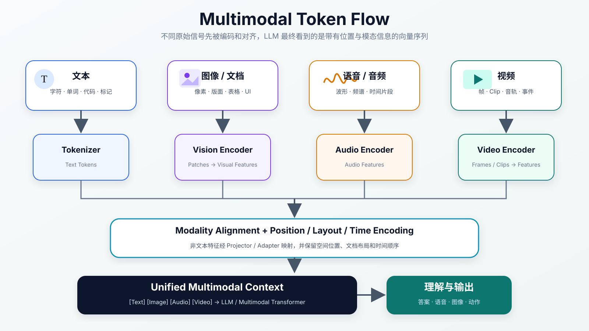
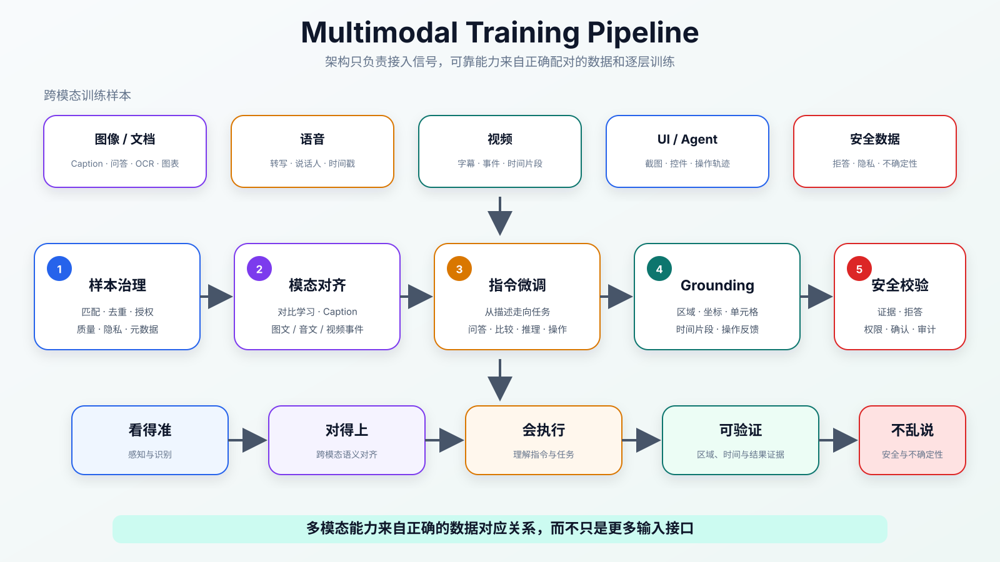

:::important[Problem]
真实信息不只存在于文字中：技术文档包含表格和架构图，软件排障依赖截图和监控曲线，会议包含语音和视频，Agent 还要理解界面位置与操作反馈。先把这些内容转成文字再交给 LLM，往往会丢失空间、时间和结构信息。

**核心问题：如何把图像、语音、视频等不同信号转成模型可处理的表示，并让它们与语言对齐、充分融合，最终支持可验证的理解、推理和行动？**
:::

## 1. 为什么需要多模态

Multimodal（多模态）指模型能够联合处理文本、图像、语音、视频、表格和界面等不同信息形态，并在它们之间建立对应关系。

早期系统常先把非文本信息转换成文字：

```text
图片 → OCR 文字
语音 → ASR 转写
视频 → 抽帧后生成描述
表格 → Markdown
```

其中 OCR（光学字符识别）负责识别图像中的文字，ASR（自动语音识别）负责把语音转成文本。这种路线可以复用纯文本 LLM，却会损失原始信息：

| 丢失的信息 | 示例                                         |
| ---------- | -------------------------------------------- |
| 空间关系   | 按钮在页面右下角，对象之间存在遮挡或相对位置 |
| 视觉细节   | 小字、颜色、图标、局部异常和图表趋势         |
| 时间过程   | 动作顺序、说话节奏、事件变化和视频因果关系   |
| 文档结构   | 表格行列、流程图连线、页面层级和版面布局     |
| 操作反馈   | 点击后的界面变化、错误提示和当前选中状态     |

~~把所有内容先转成一段文字~~只能保留转换器成功表达出来的信息。多模态模型的价值不是多支持一种文件格式，而是让模型能够直接利用语言难以完整描述的结构。

| 模态                  | 原始信号          | 模型需要理解什么                   |
| --------------------- | ----------------- | ---------------------------------- |
| 文本                  | 字符与 token 序列 | 语义、语法、逻辑和上下文           |
| 图像                  | 像素              | 对象、文字、颜色、位置和空间关系   |
| 语音                  | 连续波形          | 内容、时间、语气、说话人和环境声音 |
| 视频                  | 图像帧与音轨      | 对象变化、动作、事件顺序和长程关系 |
| 文档 / UI（用户界面） | 图文与二维布局    | 版面、表格、控件、状态和可操作位置 |

## 2. 多模态信息如何进入 LLM

LLM 最终处理的是一串向量表示。非文本信号不能直接进入语言模型，需要先完成两步：

1. **模态编码**：用 Encoder（编码器）把像素、波形或视频片段转换成一组特征向量；
2. **表示空间对齐**：用 Projector（投影层）或 Adapter（适配层）把特征映射到 LLM 的 Embedding（向量表示）空间。



_图 1：文本、图像、语音和视频分别经过对应的编码器，再被映射为统一上下文中的多模态 token，由 LLM 建立跨模态关系并生成答案或动作。_

### 2.1 不同模态如何变成 token

```text
文本 → Tokenizer → Text Tokens → Text Embeddings
图像 → Vision Encoder → Visual Tokens → Projector → LLM Space
语音 → Audio Encoder → Audio Tokens → Projector → LLM Space
视频 → Frame / Clip Encoder → Video Tokens → Projector → LLM Space
```

:::note[视觉 token 不是文字 token]
这里的 token 是广义的向量单元。文字 token 来自 Tokenizer（分词器）的离散切分；视觉、音频和视频 token 通常是编码器从图像区域、音频片段或视频片段中提取的向量表示。
:::

| 模态      | 常见切分方式                 | 编码器需要保留的信息         |
| --------- | ---------------------------- | ---------------------------- |
| 文本      | 子词或字符 token             | 词义、顺序和上下文关系       |
| 图像      | Patch（图像小块）            | 局部纹理、对象和二维位置     |
| 音频      | 波形窗口或频谱片段           | 发音、时间和声学特征         |
| 视频      | Frame（帧）或 Clip（短片段） | 空间内容、时间变化和动作     |
| 文档 / UI | 文字块、图像块与区域         | 二维布局、阅读顺序和控件关系 |

### 2.2 图像为什么会产生很多视觉 token

以基于 Patch 的 Vision Transformer（视觉 Transformer，ViT）为例，若图像尺寸为 $H\times W$，Patch 边长为 $P$，忽略额外特殊 token 时，视觉 token 数近似为：

$$
N_{\text{vision}}
=\frac{H}{P}\times\frac{W}{P}
$$

例如将 $448\times448$ 图像按 $14\times14$ Patch 切分：

$$
N_{\text{vision}}
=\frac{448}{14}\times\frac{448}{14}
=32\times32
=1024
$$

这只是便于理解的计算，真实模型可能动态切图、合并 token 或使用不同分辨率。它说明了一个关键关系：**分辨率越高，视觉细节通常越多，但 token、Attention（注意力）和 KV Cache（历史 K/V 缓存）成本也越高。** 视频包含多帧，成本还会进一步放大。

### 2.3 位置、布局和时间不能丢失

只把向量拼接起来还不够。模型还需要知道：

- 一个视觉 token 来自图像的哪个二维区域；
- 表格中的文字属于哪一行、哪一列；
- 视频帧和音频片段按照什么时间顺序出现；
- 多页文档中的页面、段落和阅读顺序；
- UI 控件的位置以及操作前后的状态变化。

因此多模态模型还会使用 2D Position（二维位置）、Layout Encoding（版面编码）和 Temporal Encoding（时间编码）等结构信息。

## 3. 四类主流架构

多模态架构需要分别解决表示、对齐和融合问题：原始信号怎样变成 token，非文本表示怎样进入语言空间，不同模态怎样深入交互。

### 3.1 Encoder + Projector + LLM

这是工程上常见的接入路线：

```text
图像
  → Vision Encoder
  → Visual Features
  → Projector
  → Visual Tokens
  → 与 Text Tokens 一起进入 LLM
```

它能够复用成熟 LLM，并可冻结部分视觉编码器或语言模型，只训练 Projector 和少量适配层，因此改造和训练成本较低。

它的限制也很直接：视觉信息在进入 LLM 前已经被编码和压缩，细粒度区域、复杂空间关系和图表结构的能力会受到 Encoder 与 Projector 的上限约束。

### 3.2 Cross-Attention：动态查询其他模态

Cross-Attention（交叉注意力）让文本 Hidden State（隐藏状态）在生成过程中主动关注视觉或音频特征，而不是只把不同 token 简单拼接。

```text
Text Hidden States  ⇄  Visual Features
```

这种方式能增强图文问答、文档理解和复杂图表推理中的模态交互，但需要更大的架构改动和额外计算，也更难直接复用纯文本 LLM 的标准推理优化。

### 3.3 原生多模态 Transformer

原生多模态路线尽量把文本、图像、语音和视频统一表示为 token，再由同一个 Transformer 建模：

```text
[Text Tokens, Image Tokens, Audio Tokens, Video Tokens]
  → Unified Transformer
  → Text / Audio / Image / Action
```

它面向 Any-to-any（任意输入模态到任意输出模态）能力，模态可以在更深层交互；但不同模态的 token 数量差异很大，数据配比、训练稳定性、上下文长度和推理成本都更难控制。

:::note[原生多模态是一种方向]
很多模型仍是混合架构：使用专用模态编码器，再通过统一模型进行语义融合。“原生多模态”更强调从设计和训练上统一多种信息流，不代表所有原始信号都完全共用同一套底层编码过程。
:::

### 3.4 多模态 MoE

第 04 章已经解释了 MoE（混合专家）的路由与稀疏激活。本章只关注它在多模态中的作用：不同 Expert（专家）可以按模态、任务或语义层级分工。

```text
Multimodal Tokens
  → Router
  → 视觉 / 语音 / OCR / 图表 / 推理等部分 Experts
  → 融合表示
```

它可以在扩大总容量时控制单次激活计算量，但会带来路由质量、专家负载、跨模态融合、训练通信和推理部署问题。

### 3.5 架构路线对比

| 架构                      | 主要解决的问题               | 优点                         | 主要限制                     |
| ------------------------- | ---------------------------- | ---------------------------- | ---------------------------- |
| Encoder + Projector + LLM | 低成本把非文本模态接入 LLM   | 改造小、容易复用和训练       | 融合较浅，受前置编码压缩限制 |
| Cross-Attention           | 增强语言与其他模态的动态交互 | 适合细粒度跨模态理解         | 架构和推理计算更复杂         |
| 原生多模态 Transformer    | 统一建模多种信息流           | 交互深、能力上限高           | 数据、训练和推理成本高       |
| 多模态 MoE                | 用专家分工扩展多任务容量     | 稀疏激活、容量与成本更易平衡 | 路由、通信和部署复杂         |

架构选择并不是越统一越好。任务范围有限、成本敏感时，成熟 Encoder 加 Projector 可能更合适；需要深层跨模态推理和多种输出时，统一架构的潜力更大。

## 4. 多模态能力如何训练出来

架构解决“不同信号如何进入模型”，训练则让模型学会不同模态之间的真实对应关系。



_图 2：多模态能力依次建立在样本治理、模态对齐、指令微调、Grounding 和安全校验上，目标从“能够编码”逐步提升到“看得准、对得上、会执行、可验证、不乱说”。_

### 4.1 数据工程：样本必须真正对应

| 数据类型                     | 建立的对应关系       | 主要检查项                     |
| ---------------------------- | -------------------- | ------------------------------ |
| 图像—Caption（图像文字描述） | 图像内容与文字描述   | 描述是否忠实、是否遗漏关键对象 |
| 图像—问答                    | 视觉证据与问题答案   | 答案能否在图中定位             |
| OCR 文档—文本                | 页面区域、文字与版面 | 识别准确率、阅读顺序和表格结构 |
| 图表—解释                    | 数据结构与趋势结论   | 数值、单位、图例和趋势是否一致 |
| 视频—字幕 / 描述             | 时间片段与事件       | 字幕同步、关键事件和顺序       |
| 语音—转写                    | 音频片段与语言       | 转写、说话人和时间戳           |
| UI 截图—操作轨迹             | 页面状态与动作       | 坐标、控件状态和动作结果       |

多模态数据不只要去重和过滤，还要检查跨模态匹配。图片与 Caption 错位、视频描述与时间片段不同步，会让模型学到错误的对应关系。

### 4.2 模态对齐：建立共同语义

模态对齐让模型理解某个视觉区域、音频片段或视频事件对应什么语言概念。常见训练任务包括：

| 训练任务      | 学习目标                             |
| ------------- | ------------------------------------ |
| 图文对比学习  | 匹配图文的表示更接近，不匹配样本更远 |
| Caption 生成  | 根据图像生成忠实描述                 |
| 图文问答      | 根据视觉证据回答文本问题             |
| 图文匹配      | 判断文字是否真的描述当前图片         |
| 语音—文本对齐 | 建立音频片段与转写文本的关系         |
| 视频—事件对齐 | 建立事件与视频时间片段的关系         |

这一阶段主要解决“看见的内容如何对应语言含义”，还不等于模型已经学会遵循复杂用户指令。

### 4.3 多模态指令微调：从描述到完成任务

模态对齐后，模型可能会描述图片；Instruction Tuning（指令微调）进一步教它根据用户目标选择和组合多模态信息，例如：

- 解释架构图中的数据流；
- 提取截图里的报错并分析原因；
- 根据图表总结趋势并指出异常点；
- 比较两个页面或两张图片的差异；
- 根据视频总结事件并定位发生时间；
- 判断 UI 下一步应该操作哪个控件。

能力变化可以概括为：

```text
能够编码 → 能够描述 → 能够按任务理解和推理
```

### 4.4 Grounding：把语言结论落到位置上

Grounding（定位与映射）建立语言和空间或时间位置之间的关系：

```text
对象 → 图像边界框
文字描述 → 图像区域
表格问题 → 单元格或行列
视频事件 → 时间片段
操作指令 → UI 控件或坐标
```

识别“页面中有一个提交按钮”还不够。UI Agent 需要知道按钮在哪里、当前状态能否点击，以及点击后界面是否发生了预期变化。

**Grounding 让模型的结论能够被定位和验证。** 没有它，多模态模型可能表现得像是理解了内容，却无法指出证据区域或把理解转成可靠动作。

### 4.5 安全对齐：证据不足时不要过度推断

多模态模型也会产生幻觉，例如看错对象、编造 OCR 文字、误读图表数值或遗漏视频事件。安全训练需要让模型：

- 无法辨认时明确表达不确定性；
- 对医学、法律、身份和地理位置等高风险判断保持谨慎；
- 区分图中真实证据与推测内容；
- 在回答中引用图像区域、文档位置或视频时间点；
- 在工具操作和敏感动作前请求确认；
- 对人脸、语音和屏幕中的隐私信息执行访问控制与脱敏。

## 5. 多模态应用解决什么任务

| 场景                       | 关键能力                       | 典型任务                       |
| -------------------------- | ------------------------------ | ------------------------------ |
| 文档理解                   | OCR、版面、表格和图表理解      | PDF 问答、合同审阅、财报分析   |
| 图表分析                   | 趋势、异常点和指标关系         | 监控曲线、实验结果和业务报表   |
| 截图问答                   | 页面元素和错误提示理解         | 软件排障、客服和产品支持       |
| UI Agent                   | 控件识别、Grounding 和反馈验证 | 自动填表、网页操作和移动端任务 |
| 视频理解                   | 帧理解、时间建模和事件抽取     | 会议总结、教学视频和监控片段   |
| 语音助手                   | ASR、语义理解和实时交互        | 会议纪要、客服录音和语音对话   |
| 多模态 RAG（检索增强生成） | 从图文、表格和视频检索证据     | 企业知识问答和研究资料分析     |

第 11 章中的 Agent 负责规划和行动，多模态能力则让 Agent 能够观察截图、文档、语音或视频环境。二者结合后，系统还必须在每次操作后重新读取环境状态，不能根据操作前的截图假设动作已经成功。

## 6. 多模态系统的主要挑战

| 挑战                 | 为什么发生                         | 解决方向                             |
| -------------------- | ---------------------------------- | ------------------------------------ |
| Token 成本高         | 高分辨率图片和视频产生大量 token   | 自适应分辨率、Token 压缩和关键帧抽取 |
| 小字与密集内容难识别 | 全图缩放后细节不足                 | OCR 增强、区域裁剪和高分辨率编码     |
| 空间推理不稳定       | 识别对象不等于理解相对位置         | Grounding、二维位置编码和区域监督    |
| 视频时间建模困难     | 动作跨帧发生，事件长度不同         | 时间编码、Clip 建模和事件标注        |
| 多模态幻觉隐蔽       | 回答流畅，但视觉或音频证据不存在   | 区域引用、时间戳和外部校验           |
| 模态不平衡           | 文本数据更多，模型可能忽略其他模态 | 数据配比、分阶段训练和专项评测       |
| 隐私与版权风险       | 图像、声音和视频包含身份与环境信息 | 授权、脱敏、权限控制和审计           |

第 10 章已经解释了长上下文的 Attention 和 KV Cache 压力。本章需要补充的是：一张图片可能对应数百到数千个视觉 token，一段视频还会包含大量帧，因此多模态会进一步放大上下文长度、首 token 延迟和推理成本。

## 7. 如何评估多模态能力

多模态评估不能只看最终文字是否自然，还要验证答案与原始证据是否对应。

| 评估维度   | 需要检查什么                                   |
| ---------- | ---------------------------------------------- |
| 感知识别   | 对象、文字、语音内容和事件是否识别正确         |
| 空间理解   | 位置、大小、方向、遮挡和相对关系是否正确       |
| 时间理解   | 事件顺序、时间点和跨片段关系是否正确           |
| 跨模态推理 | 是否真正联合使用图像、文本、音频或视频证据     |
| Grounding  | 结论能否对应区域、边界框、单元格、坐标或时间戳 |
| 抗幻觉     | 证据不足时是否拒绝编造并表达不确定性           |
| 操作成功率 | UI 或工具动作后，环境是否达到目标状态          |
| 系统成本   | 输入 token、延迟、显存和并发是否可接受         |
| 安全与隐私 | 是否泄露身份、位置、声音或屏幕中的敏感信息     |

评测时还要改变图片分辨率、对象位置、文字大小、图表样式、视频长度和干扰信息，避免模型只记住固定模板。

:::note[流畅解释可能掩盖感知错误]
文本答案语法正确，不代表模型看对了图。高风险任务应要求答案提供图像区域、文档段落或视频时间点，并对 OCR 数值、坐标和操作结果进行专项校验。
:::

## 8. 多模态的能力边界与演进

多模态模型把 LLM 从语言处理扩展到更完整的信息处理，但它并不等于真正理解整个物理世界。输入仍会经历采样、编码和压缩，模型看到的是经过表示后的信息，而不是无限精确的现实。

主要演进方向包括原生多模态建模、实时语音和视频交互、多模态 Agent、多模态 RAG、更精确的 Grounding、多模态 MoE，以及更严格的证据评估与安全控制。

**多模态的目标不是多支持几种输入格式，而是把不同信息统一到可理解、可推理、可生成、可行动并且可验证的表示空间中。**

## Summary

| 核心知识     | 需要记住的内容                                               |
| ------------ | ------------------------------------------------------------ |
| 多模态定位   | 联合处理文本、图像、语音、视频、文档和界面信息               |
| 信息损失     | 只做 OCR、ASR 或文字描述会丢失空间、时间和结构               |
| 输入过程     | 非文本信号先编码成向量，再映射到 LLM 表示空间                |
| 多模态 token | 视觉、音频和视频 token 是编码器生成的向量单元                |
| 架构路线     | Projector、Cross-Attention、统一 Transformer 和 MoE 各有权衡 |
| 数据质量     | 不仅要清洗单个样本，还要保证跨模态内容正确匹配               |
| 模态对齐     | 建立视觉区域、语音片段、视频事件与语言概念的对应             |
| 指令微调     | 让模型从描述内容升级到根据多模态信息完成任务                 |
| Grounding    | 把结论定位到图像区域、表格单元格、视频时间或 UI 坐标         |
| 主要挑战     | Token 成本、细节、空间和时间推理、幻觉、隐私与评估           |
| 可靠性       | 关键结论必须能追溯到原始多模态证据                           |
