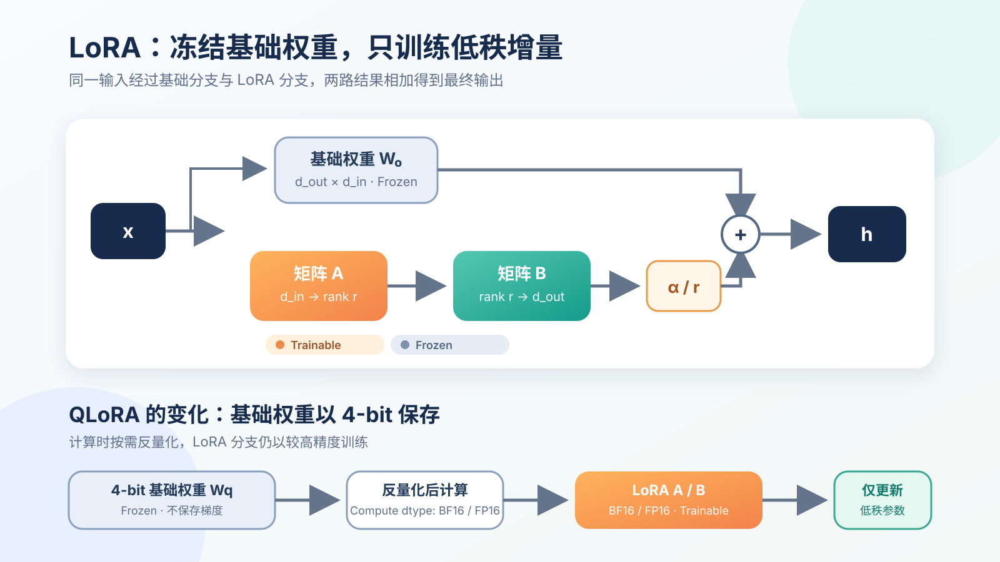

:::important[Problem]
通用大模型具备广泛能力，却不一定熟悉领域表达，也无法始终稳定地遵循业务格式和回答风格。RAG 可以向模型提供新的外部知识，但不能可靠地改变模型“如何完成任务”的行为模式。

**核心问题：如何根据数据、算力和任务目标选择 Full Fine-tuning、LoRA 或 QLoRA，在有限资源下完成行为适配，同时尽量保留模型原有的通用能力与安全边界？**
:::

## 1. 微调解决的是行为适配

Prompt、RAG 和 Fine-tuning（微调）解决的问题并不相同：

| 方法        | 主要改变             | 适合解决的问题                       | 典型局限                         |
| ----------- | -------------------- | ------------------------------------ | -------------------------------- |
| Prompt      | 当前请求中的任务说明 | 简单约束、角色设定、临时输出要求     | 复杂规则容易遗漏，稳定性有限     |
| RAG         | 当前上下文中的外部知识 | 私有资料、频繁更新的信息、可引用知识 | 不会直接改变模型的长期行为模式   |
| Fine-tuning | 模型完成任务的方式   | 领域表达、固定格式、任务风格和专门能力 | 需要训练数据、计算资源与回归评测 |

例如，企业制度经常变化并且回答必须引用原文时，更适合使用 RAG；若模型已经获得正确资料，却仍然无法稳定输出规定的 JSON、不会使用领域术语或不遵循任务流程，则可以考虑微调。

**RAG 更像给模型一本随时更新的参考书，微调则是在改变模型处理任务的习惯。** 两者也可以组合：先用微调固定行为，再用 RAG 提供最新事实。

:::note[SFT 与 LoRA 不在同一个维度]
SFT（监督微调）描述的是**用什么训练目标学习**；LoRA 描述的是**训练时更新哪些参数**。SFT 既可以更新全部参数，也可以只训练 LoRA 参数。第 06 章已经介绍过 SFT、RLHF 和 DPO，本章只讨论模型参数如何被高效更新。
:::

| 维度         | 常见选择                                      | 回答的问题               |
| ------------ | --------------------------------------------- | ------------------------ |
| 训练目标     | 继续预训练、SFT、偏好对齐                     | 模型通过什么信号学习     |
| 参数更新方式 | Full Fine-tuning、Adapter、LoRA、QLoRA        | 训练时哪些参数发生变化   |

## 2. Full Fine-tuning：更新全部参数

Full Fine-tuning（全量微调）会让基础模型中的所有可训练参数根据损失函数梯度发生变化：

$$
\theta_{t+1}=\theta_t-\eta\nabla_{\theta}\mathcal{L}(\theta_t)
$$

其中，$\theta$ 是全部模型参数，$\eta$ 是学习率，$\mathcal{L}$ 是当前训练目标的损失函数。

全量微调不只需要保存模型权重，还要保存梯度和优化器状态。以 Adam 为例，训练显存通常包含：

```text
模型参数 + 梯度 + 一阶动量 + 二阶动量 + 激活值 + 临时计算空间
```

因此，模型规模增大后，训练显存会远高于只做推理时加载模型所需的显存。

| 优点                         | 代价与风险                                 |
| ---------------------------- | ------------------------------------------ |
| 参数自由度最高，适合深度适配 | 显存、训练时间和存储成本高                 |
| 可以显著改变模型能力分布     | 小数据集上容易过拟合                       |
| 适合拥有充足数据和算力的团队 | 可能造成灾难性遗忘或破坏原有安全边界       |
| 每个任务可以得到独立完整模型 | 多任务部署时需要保存多份完整权重           |

全量微调并非一定优于参数高效微调。数据量不足或任务目标较窄时，更新全部参数反而可能让模型更快记住噪声。

## 3. PEFT：只训练少量新增参数

PEFT（Parameter-Efficient Fine-Tuning，参数高效微调）的核心思想是：**冻结大部分基础模型参数，只训练少量新增参数或少量选定参数。**

| 方法          | 核心做法                                 | 特点                                   |
| ------------- | ---------------------------------------- | -------------------------------------- |
| Adapter       | 在 Transformer 层中插入小型网络         | 结构直观，但会增加额外串行计算         |
| Prefix Tuning | 为各层注意力机制学习连续的虚拟前缀       | 参数少，但效果较依赖任务和模型规模     |
| LoRA          | 用两个低秩矩阵表示原权重的增量           | 训练稳定、易于切换或合并，应用最广     |
| QLoRA         | 量化冻结的基础模型，同时训练 LoRA        | 进一步降低基础权重占用，适合单卡训练   |

PEFT 的价值不只是节省训练成本。一个基础模型可以搭配多个很小的任务适配器，部署时按需加载，而不必为每个任务都保存一份完整模型。

## 4. LoRA：学习权重的低秩增量

设某个线性层原始权重为 $W_0$。LoRA 冻结 $W_0$，不直接学习一个与它同样大的增量矩阵，而是把增量拆成两个更小的矩阵：

$$
W_{\text{eff}}=W_0+\Delta W
=W_0+\frac{\alpha}{r}BA
$$

矩阵维度为：

$$
W_0\in\mathbb{R}^{d_{\text{out}}\times d_{\text{in}}},\quad
A\in\mathbb{R}^{r\times d_{\text{in}}},\quad
B\in\mathbb{R}^{d_{\text{out}}\times r}
$$

其中 $r$ 是 rank（秩，可理解为适配更新经过的低维通道数），通常远小于输入和输出维度；$\alpha/r$ 用于控制 LoRA 分支的更新强度。

对输入 $x$，线性层的输出变为：

$$
h=W_0x+\frac{\alpha}{r}B(Ax)
$$

训练时，基础权重 $W_0$ 保持冻结，梯度只更新 $A$ 和 $B$。先由 $A$ 把高维输入压缩到 $r$ 维，再由 $B$ 映射回输出维度。



_图 1：LoRA 将冻结的基础线性层与可训练的低秩增量相加；QLoRA 进一步以 4-bit 形式保存冻结的基础权重，只保留 LoRA 分支参与反向传播。_

### 4.1 为什么参数量会明显下降

假设原线性层为 $4096\times4096$：

$$
N_{\text{full}}=4096\times4096=16{,}777{,}216
$$

当 LoRA 的 $r=8$ 时：

$$
N_{\text{LoRA}}=4096\times8+8\times4096=65{,}536
$$

$$
\frac{N_{\text{LoRA}}}{N_{\text{full}}}\times100\%=0.390625\%
$$

因此，这个线性层只需要训练原参数量约 $0.39\%$ 的新增参数。整个模型的 LoRA 参数量还取决于选择了多少层和哪些 Target Modules（目标模块）。

LoRA 的经验假设是：特定下游任务需要的权重变化，往往可以由一个低维子空间近似表示。它并不意味着原权重本身是低秩矩阵，也不保证任何任务都能用极小的 $r$ 完整适配。

### 4.2 LoRA 通常加在哪里

| 模块       | 中文理解                     | 可能学习到的变化                   |
| ---------- | ---------------------------- | ---------------------------------- |
| `q_proj`   | 查询向量投影                 | 当前 token 应该关注什么            |
| `k_proj`   | 键向量投影                   | token 如何被其他位置匹配           |
| `v_proj`   | 值向量投影                   | 被关注后传递什么信息               |
| `o_proj`   | 注意力输出投影               | 多头注意力结果如何重新组合         |
| MLP 线性层 | Attention 后的逐 token 变换  | 领域知识表达与任务特征如何被加工   |

只训练 `q_proj` 和 `v_proj` 可以进一步减少参数；将 LoRA 加到所有主要线性层通常具有更强的适配能力，但也会增加显存、训练时间和过拟合风险。

:::note[LoRA 适配器如何部署]
训练完成后，可以保留独立的 LoRA 适配器，与同一个基础模型按任务动态组合；也可以将 $\Delta W$ 合并进基础权重，减少额外推理计算。适配器必须与训练时使用的基础模型版本、层名和维度严格匹配。
:::

## 5. QLoRA：量化基础模型后再训练 LoRA

QLoRA 并不是把所有训练计算都变成 4-bit，而是：

1. 使用 4-bit 保存**冻结的基础模型权重**；
2. 前向计算时按需反量化到合适的计算精度；
3. 使用 FP16 或 BF16 训练 LoRA 参数；
4. 反向传播只为 LoRA 参数保存梯度与优化器状态。

| 关键技术            | 中文理解                                   | 主要作用                       |
| ------------------- | ------------------------------------------ | ------------------------------ |
| NF4                 | 适合近似正态分布权重的 4-bit 数值格式      | 降低量化误差                   |
| Double Quantization | 再量化第一层量化过程中使用的缩放常数       | 进一步压缩量化元数据           |
| Paged Optimizer     | 在显存压力突增时分页管理优化器状态         | 降低长序列训练时的显存峰值     |

| 方式              | 基础权重           | 可训练参数     | 训练显存 | 适用情况                     |
| ----------------- | ------------------ | -------------- | -------- | ---------------------------- |
| Full Fine-tuning  | 高精度、可训练     | 全部参数       | 最高     | 数据与算力充分、需要深度适配 |
| LoRA              | 高精度、冻结       | 低秩矩阵       | 中等     | 常规参数高效微调             |
| QLoRA             | 4-bit 量化、冻结   | 高精度低秩矩阵 | 更低     | 显存有限、单卡或小规模训练   |

:::note[QLoRA 没有消除激活值显存]
QLoRA 显著减少了基础权重、梯度和优化器状态的显存占用，但前向传播产生的 Activations（激活值）仍然需要保存。上下文越长、Batch 越大、参与训练的层越多，激活值占用仍可能成为主要瓶颈。
:::

## 6. 数据与训练流程

微调不是把文档直接交给模型“学习”就结束。首先要明确希望改变的是知识表达、指令遵循、输出格式还是失败处理，然后选择与目标一致的数据形式。

| 数据类型       | 主要目的                           | 示例                         |
| -------------- | ---------------------------------- | ---------------------------- |
| 领域语料       | 继续学习领域语言与知识分布         | 技术文档、法规、论文         |
| 指令数据       | 学习输入到理想回答的映射           | 问答、摘要、分类、代码任务   |
| 格式数据       | 固定结构化输出                     | JSON、SQL、报告模板          |
| 失败案例       | 修复线上常见错误                   | 拒答错误、字段遗漏、流程跳步 |
| 偏好与安全数据 | 学习更合适的回答及行为边界         | chosen/rejected、安全样本    |

原始领域语料更适合继续预训练；指令—回答样本更适合 SFT。若目标是让模型稳定生成某种业务格式，仅堆积大量无指令的文档通常不会直接解决问题。

### 6.1 数据质量检查

训练前至少应处理：

- 去重，避免重复样本让某些表达被过度强化；
- 删除事实错误、指令与回答不匹配的样本；
- 统一模板、角色标记和特殊 token；
- 清理个人信息、密钥和其他敏感数据；
- 将相似样本划分到同一数据集，避免 Train/Test 泄漏；
- 保留困难样本、失败案例和安全边界样本；
- 单独建立验证集、测试集和业务回归集。

**错误数据不仅会让模型偶尔答错，还可能把错误行为训练得更加稳定。** 在多数垂直任务中，一小批高质量、覆盖真实分布的数据比大量低质量合成样本更有价值。

### 6.2 关键训练参数

| 参数                 | 控制什么                         | 设置不当的表现                         |
| -------------------- | -------------------------------- | -------------------------------------- |
| `rank (r)`           | LoRA 更新的表示容量              | 过小欠拟合，过大增加成本与过拟合风险   |
| `alpha`              | LoRA 分支的缩放强度              | 更新过弱或扰动过强                     |
| `target_modules`     | 哪些线性层参与适配               | 能力不足或训练参数过多                 |
| `learning_rate`      | 每步参数更新幅度                 | 收敛慢、震荡或遗忘                     |
| `batch_size`         | 单次统计的样本数量               | 梯度不稳或显存不足                     |
| `epochs`             | 数据被重复学习的次数             | 未学会或过拟合                         |
| `max_length`         | 训练样本最大上下文长度           | 截断信息或显存急剧增加                 |

LoRA 可训练参数少，常使用比全量微调更高的学习率，但没有适用于所有模型的固定值。应通过验证集损失、任务指标和业务回归结果共同选择参数，而不是只看训练损失持续下降。

### 6.3 一条完整训练链路

```text
明确行为目标
  → 构造并清洗数据
  → 划分 Train / Validation / Test
  → 选择基础模型与对话模板
  → 选择 Full FT / LoRA / QLoRA
  → 配置目标模块、rank、学习率与长度
  → 训练并监控验证集
  → 任务、通用能力与安全回归评测
  → 灰度部署、监控失败样本并回流
```

训练损失下降只说明模型更能拟合训练数据，不能证明它在真实请求中更正确，也不能证明原有通用能力与安全性没有退化。

## 7. 如何选择方案

| 真实需求                                     | 优先方案                 |
| -------------------------------------------- | ------------------------ |
| 只需临时改变角色或简单输出要求               | Prompt                   |
| 知识频繁变化、要求引用来源                   | RAG                      |
| 数据不多，需要稳定领域风格或输出格式         | LoRA                     |
| 训练显存有限，但仍需微调较大模型             | QLoRA                    |
| 数据和算力充足，需要大幅改变模型能力         | Full Fine-tuning         |
| 同时需要固定行为和动态知识                   | LoRA / QLoRA + RAG       |

上线前需要同时评估三类变化：

1. **目标能力**：垂直任务准确率、格式遵循率和任务完成率是否提高；
2. **通用能力**：常识、推理、代码、多语言等原有能力是否退化；
3. **安全边界**：拒答、隐私、越权和有害内容控制是否受到破坏。

还要注意基础模型许可证、训练数据版权与隐私、适配器版本管理，以及多个 LoRA 同时加载或合并时可能产生的能力冲突。

## Summary

- 微调主要改变模型完成任务的行为模式；RAG 主要为当前请求提供外部知识。
- SFT 是训练目标，LoRA 是参数更新方式；二者可以同时使用，并不是互斥方案。
- Full Fine-tuning 更新全部参数，适配自由度最高，但显存、存储和回归风险也最大。
- LoRA 冻结基础权重，用 $\Delta W=(\alpha/r)BA$ 学习低秩增量，以很少的参数完成任务适配。
- QLoRA 使用 4-bit 保存冻结的基础模型，并以较高精度训练 LoRA；它降低权重相关显存，但激活值仍可能成为瓶颈。
- 微调效果由数据质量、目标模块、rank、学习率、上下文长度和评测流程共同决定。
- 生产环境应根据任务选择 Prompt、RAG、LoRA、QLoRA 或全量微调，并在上线前检查目标能力、通用能力和安全回归。
