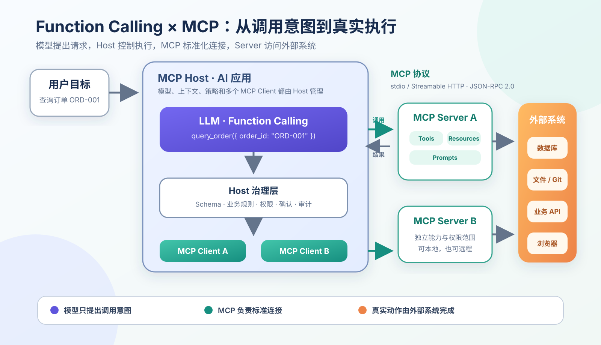

:::important[Problem]
LLM 可以理解意图和生成文本，却不能仅凭模型参数查询实时订单、读取本地文件或操作业务系统。直接为每个 AI 应用分别适配数据库、浏览器、代码仓库和企业 API，又会形成重复、封闭且难以治理的连接代码。

**核心问题：模型如何用可靠的结构表达“我要调用哪个工具、参数是什么”，应用又如何用统一协议发现并连接不同外部能力，同时保证参数、权限、结果和执行过程可控？**
:::

## 1. 先区分 Function Calling、MCP 与 Agent

三者都与“模型使用工具”有关，但位于不同层次：

| 概念             | 解决的问题                         | 典型产物                         |
| ---------------- | ---------------------------------- | -------------------------------- |
| Function Calling | 模型如何表达一次工具调用           | 函数名、结构化参数、调用 ID      |
| MCP              | 外部工具和资源如何标准化接入       | Host、Client、Server 和协议消息  |
| Agent            | 如何围绕目标持续规划和执行任务     | 多步调用、状态更新和反馈闭环     |

第 11 章已经介绍过 Agent 的任务循环。本章关注循环中的两个基础问题：**当前一步如何表达调用，以及工具从哪里来。**

```text
Agent：决定为了目标下一步做什么
  ↓
Function Calling：表达这一步调用哪个工具、参数是什么
  ↓
MCP：找到工具所在的 Server，并用统一协议完成调用
```

:::note[一句话区分]
**Function Calling 是调用表达，MCP 是能力接入协议，Agent 是任务执行循环。** Function Calling 不要求工具必须来自 MCP；MCP 也不负责替模型规划整个任务。
:::

## 2. Function Calling：模型提出结构化调用请求

普通 LLM 请求通常是：

```text
用户问题 → 模型生成文本 → 返回答案
```

但“查询订单 `ORD-001` 的实时状态”需要访问外部订单系统。Function Calling（函数调用）将流程改为：

```text
用户目标
  → 模型判断是否需要工具
  → 模型选择工具并生成参数
  → 应用校验参数与权限
  → 应用执行真实工具
  → 工具结果返回模型上下文
  → 模型基于结果回答
```

**模型输出的不是执行结果，而是一次候选调用请求。** 真正的代码、API 或数据库查询仍由应用系统执行。

### 2.1 Tool Schema：告诉模型有哪些工具

Tool Schema（工具结构定义）通常使用 JSON Schema 描述工具名称、用途和参数：

```json
{
	"name": "query_order",
	"description": "根据订单 ID 查询订单状态、失败原因和更新时间",
	"parameters": {
		"type": "object",
		"properties": {
			"order_id": {
				"type": "string",
				"description": "订单 ID，例如 ORD-001"
			}
		},
		"required": ["order_id"]
	}
}
```

| 字段          | 作用                                             |
| ------------- | ------------------------------------------------ |
| `name`        | 唯一标识工具，模型生成调用时引用                 |
| `description` | 说明什么时候应该使用，直接影响工具选择           |
| `parameters`  | 定义字段类型、枚举、嵌套结构和其他格式要求       |
| `required`    | 指定执行前必须存在的参数                         |

工具描述不仅是写给开发者看的接口文档，也是模型选择工具时的重要上下文。相似工具职责重叠、名称含糊或边界缺失，都会增加误调用概率。

### 2.2 模型如何决定调用工具

| 模式        | 含义                         | 适用场景                     |
| ----------- | ---------------------------- | ---------------------------- |
| Auto        | 模型自行判断是否及调用哪个工具 | 通用助手、客服和 Agent       |
| Forced Tool | 强制调用一个指定工具         | 固定查询、确定性业务流程     |
| No Tool     | 禁止调用，只生成文本         | 概念解释、总结和安全降级     |

例如，“退款规则是什么”可能只需读取已有资料；“查询退款 `RF-7782` 当前状态”则需要调用实时查询工具。稳定性不只取决于模型能否调用，还取决于它能否在**正确时机选择正确工具**。

### 2.3 从调用请求到结果回传

模型可能生成：

```json
{
	"tool_call_id": "call_001",
	"name": "query_order",
	"arguments": {
		"order_id": "ORD-001"
	}
}
```

应用完成参数校验、权限检查和真实查询后，将结果与原调用 ID 关联：

```json
{
	"tool_call_id": "call_001",
	"result": {
		"status": "failed",
		"reason": "payment_timeout",
		"updated_at": "2026-07-09T10:30:00+08:00"
	}
}
```

`tool_call_id` 用于区分并行或连续发生的多次调用，防止模型把订单结果、退款结果和日志结果混在一起。工具返回失败、空结果或证据不足时，失败状态也必须进入上下文，模型不能跳过失败继续编造答案。

:::note[结构合法不等于调用正确]
JSON Schema 可以检查字段、类型和枚举，却不能证明订单 ID 真实、用户有权查询、金额合理或操作安全。模型参数必须依次经过**结构校验、业务校验、权限校验和风险确认**。
:::

## 3. 为什么还需要 MCP

Function Calling 解决了模型如何表达一次调用，却没有统一回答这些问题：

- 工具定义从哪里获得；
- 应用如何发现新增或下线的工具；
- 文件、数据库和提示模板如何以统一方式读取；
- 本地工具和远程服务如何建立连接；
- 不同应用如何复用同一个外部能力。

如果 $N$ 个 AI 应用分别连接 $M$ 个外部系统，最坏情况下需要维护接近 $N\times M$ 组私有适配：

```text
代码助手 ─┬─ 文件系统
          ├─ Git
          └─ 数据库

企业助手 ─┬─ 文件系统
          ├─ Git
          └─ 数据库
```

MCP（Model Context Protocol，模型上下文协议）让外部系统实现标准 MCP Server，AI 应用只需支持统一协议：

```text
多个 AI 应用 → MCP 协议 → 多个标准 MCP Server → 外部系统
```

这样集成关系可以从大量点对点适配，收敛为应用侧和 Server 侧分别实现协议，工程复杂度趋向 $N+M$。真实系统仍要处理认证、权限和业务差异，因此这不是“接入后完全零适配”。

## 4. MCP 的 Host、Client 与 Server

MCP 的关键角色都位于应用系统中，而不是模型权重内部：

| 角色       | 位于哪里             | 负责什么                                                   |
| ---------- | -------------------- | ---------------------------------------------------------- |
| Host       | AI 应用               | 用户交互、模型调用、上下文组织、权限与调用策略             |
| MCP Client | Host 内部             | 与一个 Server 建立连接，发现能力、发送请求并接收结果        |
| MCP Server | 工具或数据源一侧       | 以标准方式暴露外部工具、资源和提示模板                     |

一个 Host 可以创建多个 MCP Client，每个 Client 通常维护与一个 Server 的连接。Server 可以运行在本机，也可以作为远程服务运行。



_图 1：模型通过 Function Calling 表达调用意图；Host 负责校验和路由；MCP Client 使用协议调用 Server；Server 再访问真实外部系统。结果沿原路径返回模型，模型本身不会直接执行工具。_

### 4.1 一次 MCP 连接经历什么

```text
1. Initialize：Client 与 Server 建立连接并协商能力
2. Discover：Client 获取 Tools / Resources / Prompts
3. Expose：Host 选择允许提供给模型的能力
4. Decide：模型生成 Function Call
5. Validate：Host 检查参数、权限与风险
6. Invoke：Client 将调用发送给 Server
7. Execute：Server 访问真实外部系统
8. Return：结果经 Client 和 Host 回到模型上下文
```

MCP 使用 JSON-RPC 2.0 组织协议消息。例如，Host 确认允许执行后，Client 可以向 Server 发送：

<details>
<summary>一个简化的 MCP <code>tools/call</code> 请求</summary>

```json
{
	"jsonrpc": "2.0",
	"id": 2,
	"method": "tools/call",
	"params": {
		"name": "query_order",
		"arguments": {
			"order_id": "ORD-001"
		}
	}
}
```

</details>

Function Calling 的结构由模型 API 决定，MCP 消息则用于 Client 与 Server 之间的协议通信。Host 需要在中间完成工具定义转换、调用路由和结果关联。

### 4.2 本地与远程通信

| 方式            | 适合场景                         | 特点                                   |
| --------------- | -------------------------------- | -------------------------------------- |
| stdio           | 本地 Server、桌面工具、代码助手  | Host 启动子进程，通过标准输入输出通信  |
| Streamable HTTP | 远程 Server、企业服务、共享工具  | 通过 HTTP 连接，便于远程部署与集中治理 |

Transport（传输方式）只负责消息如何到达，不自动解决身份认证、授权、网络隔离和高风险操作确认。

## 5. MCP Server 暴露的三类核心能力

MCP Server 不只暴露可以执行的函数，还可以提供 Resources 和 Prompts。

| 能力      | 中文理解             | 典型内容                                 | 是否可能改变外部状态 |
| --------- | -------------------- | ---------------------------------------- | -------------------- |
| Tools     | 可执行动作           | 查询订单、执行 SQL、创建工单、发送消息   | 可能                 |
| Resources | 可读取的外部上下文   | 文件、数据库 Schema、API 文档、应用状态  | 通常不需要           |
| Prompts   | 可复用任务模板       | 代码审查、故障排查、文档总结模板         | 本身不执行动作       |

### 5.1 Tools：做一件事

Tool 通常包含 `name`、`description`、`inputSchema` 和返回结果。模型可以请求调用 Tool，但 Host 仍然决定是否允许，并将调用路由到相应 Server。

查询类和写入类工具应拆开。例如：

```text
query_order      只读查询
cancel_order     改变订单状态
```

如果一个工具同时承担查询、取消和退款，模型生成错误 `action` 时可能直接造成业务影响。

### 5.2 Resources：读一份信息

Resource 通常由 URI 标识，例如：

```json
{
	"uri": "file:///project/README.md",
	"name": "README.md",
	"mimeType": "text/markdown"
}
```

:::note[MCP Resource 与 RAG 的区别]
RAG 关注如何从大量知识中检索、排序和引用相关内容；MCP Resource 关注如何通过协议描述并读取外部资源。RAG 可以被封装为 MCP Server，MCP 本身不会替代向量检索和召回策略。
:::

### 5.3 Prompts：复用任务模板

Prompt 可以把代码审查、事故复盘或 SQL 分析等任务经验沉淀成可获取的模板。它负责组织任务方式，不负责执行真实动作。

三类能力可以组合：

```text
Prompts 组织任务
  → Resources 提供事实与上下文
  → Tools 查询或改变外部系统
```

## 6. 从用户问题到真实结果

以“查询订单 `ORD-001`，失败时告诉我原因”为例：

| 步骤 | 发生的位置        | 发生的事情                                             |
| ---- | ----------------- | ------------------------------------------------------ |
| 1    | MCP Client/Server | 初始化连接，并发现 `query_order` Tool                  |
| 2    | Host              | 根据权限策略选择是否将该 Tool 暴露给模型               |
| 3    | LLM               | 根据用户问题生成 `query_order({order_id: "ORD-001"})` |
| 4    | Host              | 校验 ID 来源、参数结构和用户查询权限                   |
| 5    | MCP Client        | 发送 `tools/call` 请求                                 |
| 6    | MCP Server        | 调用真实订单 API，并返回成功或失败结果                 |
| 7    | Host              | 校验结果，将其与 `tool_call_id` 关联后放回上下文       |
| 8    | LLM               | 只根据真实工具结果组织最终回答                         |

在这个过程中：

- LLM 不直接连接订单数据库；
- Function Calling 不负责执行 API；
- MCP Server 不负责决定用户是否应该查询；
- Host 才是模型、协议、权限与真实执行之间的控制中心。

## 7. 生产环境的主要风险

| 问题             | 可能后果                         | 主要治理方式                               |
| ---------------- | -------------------------------- | ------------------------------------------ |
| 工具选错         | 查询接口变成取消或写入操作       | 清晰命名、职责拆分、工具选择 Eval          |
| 参数幻觉         | 编造 ID、金额、用户或操作对象    | 可信来源、Schema 与业务规则双重校验        |
| 工具失败         | 超时后模型继续编造结果           | 明确错误结构、有限重试、降级和终止         |
| 重复调用         | 重复发消息、创建工单或扣款       | 幂等键、调用去重、状态记录                 |
| Prompt Injection | 网页或文档中的恶意内容诱导调用   | 数据与指令隔离、最小权限、敏感动作确认     |
| 恶意 Server      | 工具描述投毒、数据泄露或危险执行 | Server 白名单、签名与来源审查、网络隔离    |
| 结果污染         | 错误或恶意结果影响后续推理       | 输出校验、来源标记和不可信内容隔离         |
| 版本漂移         | Schema 更新后 Agent 行为改变     | 协议、Server 和工具 Schema 版本管理        |
| 审计缺失         | 出错后无法还原调用链路           | 记录发起者、Server、Tool、参数、结果与确认 |

~~工具返回的内容来自系统，所以可以作为高优先级指令~~会让网页、邮件和文档中的 Prompt Injection 越过原有安全规则。外部内容只能作为不可信数据或观察结果，不能覆盖系统指令。

:::note[Host 是真正的安全边界]
生产系统不能把模型生成的 Function Call 直接转发给 MCP Server。Host 必须先决定工具是否可见，再执行参数校验、身份认证、授权、用户确认、结果过滤和审计。Schema 和 MCP 协议都不能替代这些控制。
:::

## 8. 什么时候直接使用 Function Calling，什么时候使用 MCP

| 场景                                       | 更合适的方式                         |
| ------------------------------------------ | ------------------------------------ |
| 应用只有少量固定内部函数                   | 直接 Function Calling                |
| 工具与应用强绑定，不需要跨应用复用         | 直接 Function Calling                |
| 多个 AI 应用需要共享同一批外部能力         | MCP + Function Calling               |
| 工具需要动态发现、独立升级或远程部署       | MCP + Function Calling               |
| 需要同时标准化 Tools、Resources、Prompts   | MCP                                  |
| 需要围绕目标连续调用并维护状态             | Agent + Function Calling，可结合 MCP |

MCP 不是 API Gateway（API 网关）的替代品。API Gateway 仍负责服务认证、限流、路由和审计；MCP 负责让 AI Host 以统一方式发现和调用适合模型使用的能力。

## Summary

- Function Calling 将自然语言意图转换为结构化工具调用请求，但模型不会直接执行真实函数。
- Tool Schema 影响工具选择和参数生成；合法 JSON 只能证明格式正确，不能证明业务正确或安全。
- MCP 解决外部能力的标准化接入问题，让 Host 通过 Client 连接本地或远程 Server。
- Host 负责模型调用、上下文和安全策略；Client 负责协议连接；Server 负责暴露并执行外部能力。
- MCP Server 的 Tools 用于执行动作，Resources 用于读取上下文，Prompts 用于复用任务模板。
- 一次完整调用需要经过能力发现、模型决策、参数与权限校验、Server 执行、结果关联和模型续答。
- 生产系统必须处理误调用、参数幻觉、失败重试、幂等、Prompt Injection、恶意 Server、版本漂移和审计。
- **Function Calling 是调用表达，MCP 是工具协议，Agent 是任务循环。**
