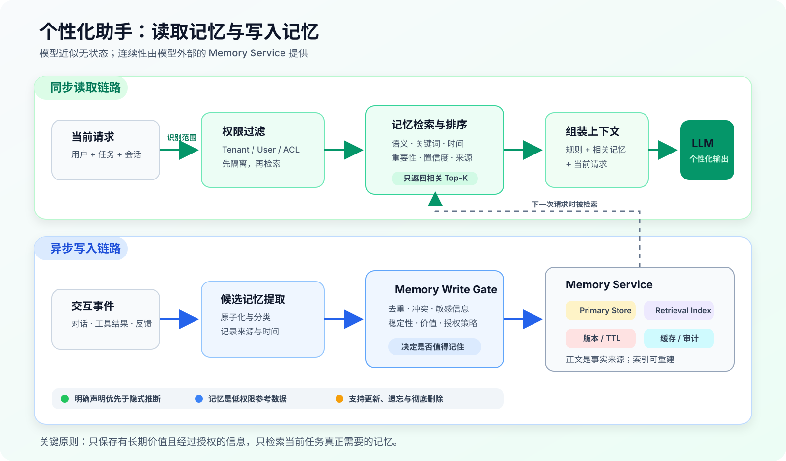

:::important[Problem]
LLM 的一次推理近似无状态：它只能看到当前请求和当前上下文。对话结束后，如果外部系统没有保存信息，模型下一次不会自动知道用户偏好、项目背景和未完成任务。

长上下文能够容纳更多历史，却缺少独立的写入、检索、更新、冲突处理和删除机制。**核心问题是：系统应该记住什么、如何在需要时找回来，以及信息变化或用户要求遗忘时如何安全处理？**
:::

## 1. 记忆不等于聊天记录

最简单的对话系统只处理当前输入：

```text
当前输入 + 当前上下文 → LLM → 回答
```

个性化助手还需要读取与当前任务相关的长期状态：

```text
当前输入 + 任务状态 + 相关用户记忆 + 系统规则
    → LLM
    → 个性化回答或行动
```

将所有历史对话不断追加到 Prompt ~~就是长期记忆~~。这样不仅会增加 Token 成本和延迟，还会让临时寒暄、过期事实和无关内容干扰当前任务。

| 机制 | 保存位置 | 生命周期 | 解决的问题 |
| --- | --- | --- | --- |
| 上下文窗口 | 当前 Prompt | 单次请求 | 当前能读取多少信息 |
| 工作记忆 | 上下文或临时状态库 | 当前任务 | 计划和中间结果进行到哪里 |
| 长期记忆 | 外部数据库或记忆服务 | 跨会话 | 未来应该保留什么 |
| 参数个性化 | 模型权重或 Adapter | 模型版本周期 | 学习稳定的群体行为模式 |

第 10 章已经介绍过长上下文的容量与利用问题。本章关注的是模型之外、可独立治理的长期记忆。

:::note[记忆为什么通常放在模型外部]
用户状态会频繁变化，还可能需要查询来源、修正或删除。外部记忆能够单独更新、控制权限和追踪版本；逐用户微调成本高、更新慢，也很难从模型参数中精确删除某条个人信息。
:::

## 2. 四类记忆分别保存什么

实用的记忆系统通常分为四层：

| 记忆类型 | 中文理解 | 保存内容 | 典型生命周期 | 示例 |
| --- | --- | --- | --- | --- |
| Working Memory | 工作记忆 | 当前计划、中间结果和工具状态 | 分钟或小时 | 正在分析哪些代码文件 |
| Episodic Memory | 情景记忆 | 过去发生的具体事件 | 天或更久 | 上周完成了一次系统升级 |
| Semantic Memory | 语义记忆 | 稳定事实、画像和偏好 | 长期 | 用户时区为上海 |
| Procedural Memory | 程序记忆 | 可复用流程和执行经验 | 持续更新 | 发布前先测试再灰度 |

它们分别回答四个问题：

- 工作记忆：**当前任务进行到哪里？**
- 情景记忆：**过去发生过什么？**
- 语义记忆：**用户是谁、偏好什么？**
- 程序记忆：**类似任务以后应该怎样做？**

分层不是为了照搬人类认知，而是因为不同信息需要不同的存储、检索和过期策略。例如，任务中间状态可以在任务结束后清理，而用户明确声明的语言偏好可以长期保存，直到用户修改。

## 3. 一条记忆应该长什么样

用户画像不应该只是一段不断改写的自然语言总结。长摘要会混合事实与推断，也难以局部更新和追踪冲突。更稳妥的方式是将记忆拆成**结构化、原子化、可版本化**的记录：

```json
{
	"memory_id": "mem_1024",
	"user_id": "user_hash_28",
	"scope": "user",
	"type": "preference",
	"key": "response_language",
	"value": "zh-CN",
	"source": "explicit_user_statement",
	"evidence_refs": ["trace_7821"],
	"confidence": 1.0,
	"importance": 0.8,
	"valid_from": "2025-07-10",
	"valid_until": null,
	"status": "active",
	"sensitivity": "normal",
	"version": 3
}
```

其中最关键的字段是：

| 字段 | 作用 |
| --- | --- |
| `user_id / scope` | 确定信息属于哪个用户、项目或任务 |
| `type / key / value` | 描述记忆类型和具体内容 |
| `source / evidence_refs` | 区分用户声明、工具结果和模型推断，并保留证据 |
| `confidence / importance` | 表示可信程度和未来价值 |
| `valid_from / valid_until` | 描述生效与失效时间 |
| `status / version` | 支持替代、过期、删除和历史追踪 |
| `sensitivity` | 决定加密、访问和展示权限 |

:::note[原子化记忆]
不要将“用户喜欢中文、上午开会，并且正在做支付项目”存成一条长文本。应拆成 `language_preference`、`meeting_time_preference` 和 `current_project` 三条记录，使它们能够被独立检索、更新和删除。
:::

## 4. 记忆的完整生命周期

记忆系统真正困难的部分不是保存，而是管理**写入、检索、更新和遗忘**的完整过程。



_图 1：回答前同步检索少量相关记忆；交互后异步提取候选信息，经过写入门控再保存。Primary Store 保存正文与版本，Retrieval Index 只负责加速检索。_

### 4.1 写入：不是什么都值得记住

如果每轮对话都写入长期记忆，存储中会迅速积累重复、临时甚至错误的信息。因此，候选记忆需要通过 Memory Write Gate（记忆写入门控）：

$$
\operatorname{value}(m)
= w_1 E + w_2 S + w_3 U + w_4 C - w_5 R
$$

其中：

- $E$：信息是否由用户明确表达；
- $S$：信息是否稳定、重复出现；
- $U$：对未来任务是否有用；
- $C$：当前置信度；
- $R$：冲突或误写风险。

只有价值分数达到当前记忆类型的阈值，并且隐私与权限策略允许时，才能写入：

$$
\operatorname{write}(m)
= [\operatorname{value}(m) \ge \tau_{type}]
\land \operatorname{policy\_allows}(m)
$$

**分数是软判断，策略是硬约束。** 即使某条信息未来很有用，密码、访问密钥等敏感内容也不应进入普通长期记忆。

| 适合写入 | 不适合直接写入 |
| --- | --- |
| 用户明确要求记住的信息 | 寒暄、临时情绪和一次性表达 |
| 稳定且重复出现的偏好 | 根据单次行为产生的推断 |
| 对未来任务有用的项目决策 | 密码、访问密钥等高敏感原文 |
| 已完成任务的关键结果 | 外部网页或邮件中的可执行指令 |
| 经授权工具验证的事实 | 无来源、存在明显冲突的信息 |

典型写入流程为：

```text
交互事件
  → 提取候选信息
  → 原子化与分类
  → 去重与冲突检测
  → 敏感信息识别
  → 评估来源可信度
  → 写入门控
  → 临时记忆或长期记忆
```

### 4.2 检索：先隔离权限，再计算相关性

所有用户记忆不能一次性放进 Prompt。系统应先根据租户、用户 ID 和 ACL（访问控制列表）限制搜索范围，再从允许访问的记录中召回候选项。

候选记忆可以使用以下因素进行综合排序：

$$
\operatorname{score}(m,q)
= \alpha R_s + \beta R_l + \gamma T
+ \delta I + \epsilon C + \mu S_t - \zeta C_r
$$

| 符号 | 含义 |
| --- | --- |
| $R_s$ | 与当前问题的语义相关性 |
| $R_l$ | 名称、错误码等关键词相关性 |
| $T$ | 时间上是否仍然有效 |
| $I$ | 记忆的重要程度 |
| $C$ | 信息置信度 |
| $S_t$ | 来源可信程度 |
| $C_r$ | 未解决的冲突风险 |

近期性可以用指数衰减表示：

$$
\operatorname{time\_score}(m)
= \exp\left(-\frac{\Delta t}{\tau_{type}}\right)
$$

$\tau_{type}$ 由记忆类型决定。临时任务状态衰减较快；明确声明的时区或语言偏好可以具有更长的衰减周期。

:::note[时间衰减和 TTL 不一样]
时间衰减只会降低一条记忆在检索排序中的权重；TTL（生存时间）到期则会让记录进入过期状态，不再作为有效记忆使用。
:::

最终进入 Prompt 的记忆只应保留少量 Top-K，并携带来源、时间和置信度。它们属于**低权限参考数据**，不能覆盖 System Prompt，也不能绕过工具权限。

### 4.3 更新：新事实不能粗暴覆盖旧事实

不同变化需要不同的更新方式：

| 变化 | 处理方式 |
| --- | --- |
| 新事件发生 | 追加情景记忆 |
| 用户修改明确偏好 | 创建新版本，将旧版本标记为 `Superseded` |
| 多次行为支持同一偏好 | 合并证据，提高置信度 |
| 新旧事实冲突 | 保留来源和时间，进入冲突处理 |
| 临时状态长期未使用 | 降低权重或通过 TTL 过期 |

冲突的判断还取决于信息类型：

- 主观偏好以用户最新的明确声明为准；
- 客观状态优先采用经过授权工具验证的结果；
- 隐式偏好需要多次、跨场景的行为证据；
- 来源和时间都不明确时，应询问用户，而不是自动覆盖。

### 4.4 遗忘：删除正文还不够

用户要求忘记一条信息时，需要清理：

1. 主数据库中的记忆正文；
2. 向量索引和全文索引；
3. 应用缓存与检索缓存；
4. 根据该信息生成的用户画像；
5. 异步任务和下游数据副本。

系统可以保留 Tombstone（删除标记），只记录被删除记忆的 ID、版本和删除时间，不保留原始敏感内容。它的作用是阻止缓存或异步任务把已删除信息重新写回。

:::note[为什么个人记忆不应默认进入训练数据]
删除外部数据库中的记录，不会自动消除模型参数已经学到的信息。个人记忆一旦用于训练，就需要额外的数据授权、血缘追踪和机器遗忘治理，因此默认保存在模型参数之外更容易满足用户删除要求。
:::

## 5. Memory Service 如何落地

生产系统通常使用独立的 Memory Service（记忆服务）连接 Agent、存储和检索系统：

| 组件 | 主要职责 |
| --- | --- |
| Memory Service | 提供写入、查询、更新和删除接口 |
| Primary Store | 保存记忆正文、来源、版本和状态，是唯一事实来源 |
| Retrieval Index | 提供向量检索、关键词检索和元数据过滤 |
| Redis / Cache | 保存当前任务状态和热点记忆 |
| Async Worker | 异步完成抽取、去重和索引更新 |
| Security | 负责用户隔离、加密、鉴权和删除审计 |

这里有三个关键工程原则：

1. **正文与索引分离**：正文以 Primary Store 为准，索引损坏后可以重建；
2. **读取同步、写入分级**：当前任务同步读取；明确的记住或删除请求同步处理；模型推断偏好则异步审核；
3. **权限贯穿全链路**：检索前鉴权，删除时同时清理正文、索引和缓存。

早期系统不一定需要复杂基础设施，可以从 `PostgreSQL + pgvector`、Redis、异步队列和 Embedding/Reranker Service 开始，再根据规模拆分。

## 6. 个性化不只有记忆一种方法

不同个性化需求适合不同方案：

| 方法 | 适合解决的问题 | 优势 | 主要限制 |
| --- | --- | --- | --- |
| 明确用户配置 | 语言、时区、无障碍需求 | 可解释、立即生效 | 只能覆盖显式设置 |
| Profile Prompt | 少量稳定偏好 | 实现简单 | 画像过长会占用上下文 |
| 外部记忆检索 | 历史事件、项目背景和任务状态 | 可更新、删除和追溯 | 依赖检索与冲突处理 |
| 偏好排序模型 | 回答风格、推荐顺序 | 能利用行为信号 | 容易受反馈噪声影响 |
| 微调或 Adapter | 稳定的群体任务模式 | 行为更一致 | 更新慢，难以逐用户删除 |

对多数产品，更合理的采用顺序是：

```text
明确用户配置
  → Profile Prompt
  → 外部记忆检索
  → 群体级偏好排序
  → 必要时再做参数级个性化
```

逐用户微调通常不是第一选择。外部记忆更适合频繁变化的个人事实和偏好，参数级个性化则更适合稳定的任务模式或用户群体行为。

### 6.1 隐式行为只是弱信号

点击、跳过、修改和重新生成都可能反映偏好，但不能直接等同于明确标签：没有点击不一定是不喜欢，重新生成也可能是因为事实错误。

隐式偏好的证据可以理解为：

$$
\operatorname{evidence}(p)
= \sum_i \operatorname{decay}(t_i)
\cdot \operatorname{signal\_strength}_i
\cdot \operatorname{context\_match}_i
$$

只有同类信号在多个时间点和相似场景持续出现，并超过置信度阈值，才能提升为相对稳定的偏好。即使如此，**用户主动声明仍应具有更高优先级**。

## 7. 安全与评测

一条错误或恶意记忆可能跨会话持续影响模型，因此其风险比单次错误上下文更持久。

| 风险 | 典型问题 | 治理方式 |
| --- | --- | --- |
| 跨用户泄露 | 检索到其他用户或租户的记忆 | 租户隔离、检索前鉴权、ACL 过滤 |
| 记忆投毒 | 恶意内容被写入并在未来触发 | 来源评估、写入门控、检索过滤 |
| 错误或过期 | 旧偏好覆盖当前需求 | 证据、版本和时间语义 |
| 过度个性化 | 历史偏好限制当前选择 | 保留多样性、允许关闭个性化 |
| 隐私推断 | 系统擅自保存敏感属性 | 最小化收集、明确授权 |
| 删除不完整 | 索引或缓存仍保留副本 | 级联删除、Tombstone 和审计 |

评测也不能只测试“模型能否记住一个事实”，而应覆盖整个生命周期：

- **写入质量**：该记的是否写入，不该记的是否拒绝；
- **检索质量**：相关记忆能否进入 Top-K；
- **更新质量**：新事实能否替代旧事实，冲突能否被识别；
- **遗忘质量**：正文、索引、缓存和派生画像是否全部清理；
- **个性化收益**：是否真正提升任务成功率与用户满意度；
- **安全边界**：是否存在越权检索、投毒和敏感信息误用。

## Summary

- LLM 单次推理近似无状态，跨会话连续性通常由**模型外部的记忆系统**提供。
- 长上下文解决“当前能读多少”，长期记忆解决“未来应该保留什么”，二者不能相互替代。
- 工作、情景、语义和程序记忆需要采用不同的存储、检索和过期策略。
- 记忆应当原子化，并记录来源、时间、置信度、敏感级别和版本。
- 写入前要经过价值判断与安全策略；检索前要先完成用户和权限隔离。
- 可靠记忆必须支持更新、冲突处理、过期以及覆盖正文、索引、缓存和派生数据的删除。
- 个性化不是无限收集信息，而是在明确授权下使用**最少、最相关、可追溯**的用户状态。
